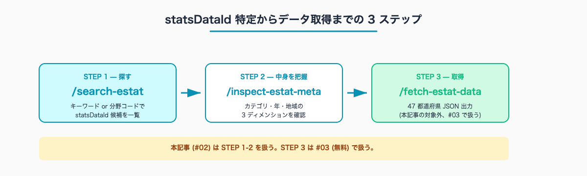
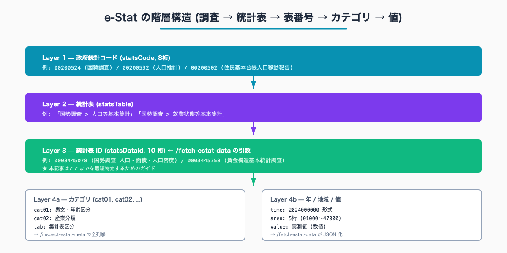
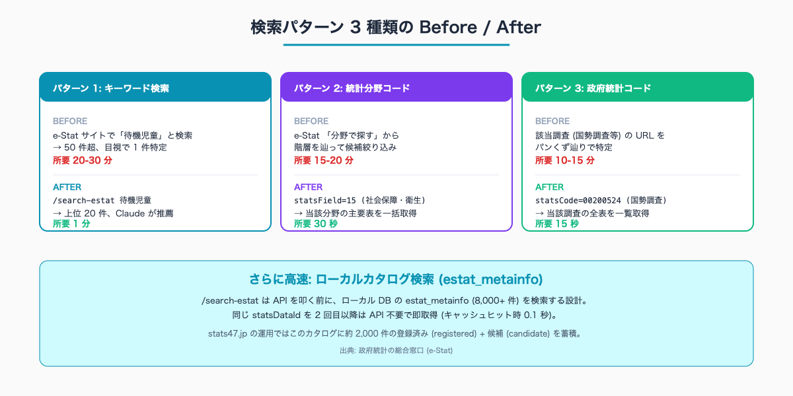

# e-Stat の統計表 ID を最短で特定する — search-estat スキルで政府統計を 1 分で見つける

## はじめに

「待機児童数の都道府県別データを e-Stat から取りたい」「県民所得の最新値を 47 都道府県で比較したい」——統計担当・企画課でこの種の依頼を受けた職員が、最初の 20-30 分を消費するのが「目的のデータがどの統計表に入っているか分からない」という状況だ。

e-Stat には膨大な統計表が登録されており、同じ「人口」でも「国勢調査」「人口推計」「住民基本台帳人口移動報告」など複数の調査に分かれている。さらに各調査の中で「総人口」「年齢別」「男女別」「世帯別」と表が分かれ、目的のデータに辿り着く前にブラウザのタブが 5-10 個に膨れる。

本記事では、Claude Code の `/search-estat` スキルを使って **e-Stat の統計表 ID (statsDataId) を 1 分で特定するワークフロー** を扱う。執筆者は元自治体職員。現在は Claude Code で 47 都道府県の統計サイト stats47.jp (約 2,000 のランキングを毎日自動更新) を個人で開発・運用しており、本記事の検索手順はその実運用で日々動いているものだ。

> **📌 この記事の読み方** — 本記事にはコマンド・設定例・プロンプト例など、やや専門的な記述も出てきます。ですが Claude Code の本質は「それらを自分で覚えること」ではなく、「**やってほしいことを言葉で頼めば、専門的な部分は AI が代わりに用意してくれる**」点にあります。掲載するコマンドや設定は丸暗記の対象ではなく「こう頼めば、こういうものが返ってくる」という地図として読んでください。

人口 10-30 万人規模の自治体では、企画課・統計担当が月 5-10 件の「データ取得依頼」を受けるが、その半分以上の時間が「該当する統計表 ID を探す」段階に消えるケースが少なくない。本記事はこの探索時間を月単位で 5-10 時間圧縮することを目的とする。

e-Stat 利用規約上、商用・非商用を問わずデータ利用は自由 (出典: 政府統計の総合窓口 e-Stat 利用規約、出典明記必須)。本記事の検索パターンは庁内資料・対外説明資料の両方で使える。

## TL;DR

- e-Stat の統計表は **政府統計コード → 統計表 → statsDataId → カテゴリ → 値** の 4 層構造
- 統計担当の業務で本当に必要なのは **statsDataId (10 桁)** を特定すること
- `/search-estat` スキルがキーワード・分野コード・政府統計コードの 3 ルートで検索する
- 「探す → 中身を把握する → データ取得」の 3 ステップ workflow が標準形
- ローカルカタログ (estat_metainfo, 8,000+ 件) を併用すると 2 回目以降は API 不要
- 初回 20-30 分 → 月次 1 分以下に短縮可


<!-- SVG: flow | /search-estat → /inspect-estat-meta → /fetch-estat-data -->

## 背景: なぜ e-Stat の検索 UI は複雑か

e-Stat のサイトを開いて検索ボックスに「待機児童」と入力すると、50 件以上の候補が返ってくる。職員が必要としているのは多くの場合 1 件なのに、その 1 件を絞り込むために職員は何をしているか。

具体的には次のような目視確認を繰り返している。

1. 結果一覧から各統計表のリンクをクリック (新タブで開く)
2. 「統計表名」「調査機関」「調査年」「都道府県別か否か」を確認
3. ダウンロードボタンが「都道府県別」になっているか確認
4. 元のタブに戻って次の候補を確認 (1-3 を繰り返す)

これを 5-10 件分やって、ようやく「これが目的の表だ」と確定する。所要 20-30 分。

検索 UI が複雑になる構造的な理由は次の 3 つ。

- **e-Stat には約 80 の政府統計が登録されている**: 国勢調査 / 人口推計 / 経済センサス / 学校基本調査 / 賃金構造基本統計調査 など。同じテーマでも調査が複数あり、調査ごとに調査年・対象範囲・集計方法が違う
- **1 つの調査に統計表が数十〜数百ある**: 「国勢調査」だけでも「人口等基本集計」「就業状態等基本集計」「世帯構造等基本集計」など多数
- **統計表内で「集計表区分 (tab)」「カテゴリ (cat01, cat02)」「年 (time)」「地域 (area)」の 4 次元が独立している**: どの組み合わせが必要かは利用目的による

この構造を「e-Stat の癖」として職員が暗記するのは現実的ではない。Claude Code の `/search-estat` スキルは、この癖を AI 側に肩代わりさせる設計になっている。

## e-Stat の階層構造を理解する

検索を効率化する前に、e-Stat の構造を 1 度だけ整理しておく。


<!-- SVG: structure | 4 階層の階層図 -->

業務で本当に必要なのは **Layer 3 の statsDataId (10 桁)** を特定すること。これさえ分かれば、`/inspect-estat-meta` で中身を確認し、`/fetch-estat-data` で 47 都道府県データを取得できる。

逆に言うと、ここから先の処理 (`inspect` と `fetch`) は機械的なので、本記事は「statsDataId を最短で特定する」一点に絞る。

ここから先は有料部分:

## /search-estat の基本操作

### スキルの呼び出し方

Claude Code のターミナルで次を実行する。

```
/search-estat 待機児童
```

これだけ。背景では `EstatStatsListFetcher.searchByKeyword("待機児童", { limit: 20 })` が走り、上位 20 件の候補が返る。

出力例 (一部):

```
検索結果: 134 件中 20 件表示

[0003445078] 国勢調査 / 平成27年国勢調査 / 人口等基本集計
  題名: 待機児童数 都道府県別
  機関: 厚生労働省
  周期: 年次 | 調査: 2023 | 更新: 2024-04-15
  分野: 社会保障・衛生 > 児童福祉
----------------------------------------------------------------
[0003123456] 待機児童解消加速化プラン / 都道府県別実績
  ...
```

各候補に `statsDataId` (10 桁) が付くので、目的に合うものを 1 つ選んで `/inspect-estat-meta` に渡す。

### 検索パターン 3 種類

`/search-estat` には 3 つの検索ルートがある。

| パターン | 用途 | 引数例 |
|---|---|---|
| **キーワード検索** | テーマが言語化できるとき | `keyword=待機児童` |
| **統計分野コード** | 分野で絞り込みたいとき | `statsField=15` (社会保障・衛生) |
| **政府統計コード** | 該当調査が分かっているとき | `statsCode=00200524` (国勢調査) |

これらは併用可能で、例えば「労働・賃金分野で『最低賃金』をキーワード検索」のように絞り込める。

```
/search-estat keyword=最低賃金 statsField=03
```

`statsField` の 2 桁コードは次の通り (主要なものを抜粋)。

| コード | 分野 |
|---|---|
| 02 | 人口・世帯 |
| 03 | 労働・賃金 |
| 07 | 企業・家計・経済 |
| 08 | 住宅・土地・建設 |
| 10 | 運輸・観光 |
| 12 | 教育・文化・スポーツ・生活 |
| 13 | 行財政 |
| 15 | 社会保障・衛生 |

すべての分野コードは公式ドキュメント (https://www.e-stat.go.jp/api/api-info/api-spec) に掲載されている。


<!-- SVG: infographic | 3 パターン × Before/After -->

## 「探す → 中身を把握する → 取得する」の 3 ステップ workflow

### Step 1: /search-estat で候補リストを得る

例として「県民所得 (都道府県別)」を探すケースを考える。

```
/search-estat 県民所得
```

Claude Code が候補を 10-20 件返す。所要 5 秒。

### Step 2: /inspect-estat-meta で中身を確認

候補から最有力の statsDataId (例: `0003445758`) を選び、メタデータを確認する。

```
/inspect-estat-meta 0003445758
```

出力例:

```
--- tab: 集計表区分 (3 items) ---
  001 | 総額
  002 | 1 人当たり
  003 | 名目 / 実質

--- cat01: 区分 (4 items) ---
  J250502 | 県民所得
  J250503 | 県民総生産
  ...

--- time: 年 (15 items) ---
  2009000000 | 平成 21 年度
  ...
  2023000000 | 令和 5 年度

--- area: 地域 (47 items) ---
  01000 | 北海道
  02000 | 青森県
  ...
  47000 | 沖縄県
```

これで「県民所得 1 人当たり」を取りたい場合のパラメータが確定する: `tab=002`, `cdCat01=J250502`, `time=2023000000` (最新)。

ちなみに **地域コードは 5 桁 (01000〜47000) に統一する** のが本マガジンの規約。2 桁 (`01`) と 5 桁 (`01000`) が混在する場面があるが、5 桁を使う方が後工程 (#06 で扱う都道府県コードマージ) がスムーズになる。これは CLAUDE.md の e-Stat API 規約 (`.claude/rules/estat-api.md`) でも明示されている。

### Step 3: /fetch-estat-data で 47 都道府県データを取得

パラメータが確定したら 1 コマンドで取得できる。

```
/fetch-estat-data statsDataId=0003445758 cdCat01=J250502 tab=002
```

47 都道府県分の県民所得 1 人当たりが JSON で返ってくる。詳細は #03 (無料記事) で扱う。

## 実例: 3 つのケーススタディ

### ケース 1: 待機児童数 (社会保障・衛生)

依頼: 「県内主要市と全国平均を比較した待機児童数の資料を、明日までに作りたい」

```
/search-estat keyword=待機児童 statsField=15
```

候補が 3-5 件に絞られる。所管が厚生労働省で年次更新のものを選ぶ。所要 1 分。

### ケース 2: 人口移動 (人口・世帯)

依頼: 「県外への人口流出を、近隣 4 県と比較してほしい」

```
/search-estat keyword=人口移動 statsCode=00200502
```

`00200502` は「住民基本台帳人口移動報告」の政府統計コード。statsCode で絞ると当該調査の主要表が一覧で返る。所要 1 分。

### ケース 3: 県民所得 (企業・家計・経済)

依頼: 「県民所得の 10 年推移を 47 都道府県で見たい」

```
/search-estat keyword=県民所得 statsField=07
```

候補は内閣府の「県民経済計算」に集約される。statsDataId が確定したら `/inspect-estat-meta` で年系列の構造を確認する (時間軸が `2014` 〜 `2023` の 10 年分あるか等)。所要 1 分。

## 高速化: ローカルカタログ (estat_metainfo) の併用

`/search-estat` には実は **ローカルカタログ検索フェーズ** が組み込まれている。仕組みは次の通り。

```
/search-estat <keyword>
  ↓
Phase 0: ローカル D1 の estat_metainfo を LIKE 検索 (0.1 秒)
  ↓ ヒットなし
Phase 1: e-Stat API に searchByKeyword リクエスト (1-2 秒)
  ↓
結果を Claude Code が要約して返す
```

`estat_metainfo` はローカル SQLite (本マガジンでは Cloudflare D1) に 8,000+ 件の統計表メタデータが蓄積されており、`status='candidate'` (候補) と `status='registered'` (本登録) の 2 種類で管理されている。

stats47.jp の運用では、過去に検索した statsDataId は `registered` として蓄積され、2 回目以降のキーワード検索ではローカルカタログから即座に返る (API 不要)。同じテーマを定期的に扱う統計担当業務では、この仕組みが効率化に直結する。

ローカルカタログを直接検索する場合は次のクエリも使える。

```ts
// scripts/temp-search-catalog.mts (CLAUDE.md の search-estat スキル参照)
import BetterSqlite3 from "better-sqlite3";
import { drizzle } from "drizzle-orm/better-sqlite3";
import { like } from "drizzle-orm";
import * as schema from "../packages/database/src/schema";

const DB_PATH = ".local/d1/v3/d1/miniflare-D1DatabaseObject/baffe56c6b0173e34c63a5333065bcdb6642a01b4c2cfecd70ad3607b00c9972.sqlite";
const sqlite = new BetterSqlite3(DB_PATH, { readonly: true });
const db = drizzle(sqlite, { schema });

const rows = await db.select({
  statsDataId: schema.estatMetainfo.statsDataId,
  title: schema.estatMetainfo.title,
  govOrg: schema.estatMetainfo.govOrg,
})
  .from(schema.estatMetainfo)
  .where(like(schema.estatMetainfo.title, "%県民所得%"))
  .limit(20);

for (const r of rows) {
  console.log(`[${r.statsDataId}] ${r.title} (${r.govOrg})`);
}
sqlite.close();
```

このカタログ DB の構築方法は #10 (Claude Skills でルーチン化) と #11 (MCP sqlite で社内検索) で扱う。

## stats47 で運用されている検索パターンの例

stats47.jp 側で日々使われている statsDataId のうち、自治体業務でそのまま転用しやすいものを挙げる。

| テーマ | statsDataId | stats47 公開 URL |
|---|---|---|
| 人口 (国勢調査) | 0003445078 | https://stats47.jp/ranking/population |
| 世帯当たり年収 (家計調査) | 別表 | https://stats47.jp/ranking/annual-income-per-household |
| 介護職年収 (賃金構造基本統計調査) | 0003445758 | https://stats47.jp/ranking/care-worker-annual-income |
| 昼間人口 (国勢調査) | 別表 | https://stats47.jp/ranking/day-time-population |

これらの statsDataId は本記事の手順をなぞるだけで職員側でも特定できる。「すでに stats47 で公開されているデータ」なら、stats47 のページを見てから検索するという最短経路もある。

## よくあるつまずきと回避策

- ⚠️ **検索結果が 100 件超で絞れない** → `statsField` または `statsCode` を併用する。両方を併用すると 5-10 件に絞れることが多い
- ⚠️ **statsDataId が見つかったが古いデータしかない** → 同じ調査の最新表を `/search-estat keyword=<テーマ> updatedDate=2026-01-01` のように更新日で絞る
- ⚠️ **同じテーマで複数調査がヒット** → 所管省庁・調査周期 (年次/月次) で判断。年次比較なら国勢調査、月次トレンドなら人口推計、というように使い分け
- ⚠️ **「市区町村別」しかない** → 検索結果に `collectArea=3` (市区町村) と `collectArea=2` (都道府県) が混在する場合がある。引数で `collectArea=2` を指定すれば 47 都道府県データに絞れる
- ⚠️ **statsCode が分からない** → 該当調査の e-Stat 公式ページ URL の末尾に 8 桁コードが含まれている (例: `/info/00200524/`)
- ⚠️ **/inspect-estat-meta の出力が長すぎる** → `cat01` の項目数が 100 を超える表は対象範囲が広い。`tab` で集計表区分を絞ってから再実行する

## 応用 / 次に読むべき記事

- statsDataId を確定したらまず動かす: [#03 47 都道府県ランキングを 1 コマンドで取得する](../03-fetch-prefecture-ranking/draft.md) (無料)
- Excel ダウンロード経由 (API 未公開データ) は: [#04 Excel ダウンロードを解析して縦持ち CSV に変換](../04-excel-download-and-parse/draft.md)
- 検索ノウハウを Claude Skills として組織内に展開: [#10 Claude Skills で月次ルーチンを 1 行コマンド化](../10-claude-skills-routinize/draft.md)

stats47 側の検索で「すでに公開されているデータ」を確認する例:

- 人口: https://stats47.jp/ranking/population
- 入港船舶総トン数 (神奈川 1 位、最下位と 124 倍格差)
- 県民所得: https://stats47.jp/ranking/annual-income-per-household

## まとめ

- e-Stat の検索 UI は構造的に複雑だが、`/search-estat` スキルが 3 つの検索ルート (キーワード / 分野コード / 政府統計コード) を 1 コマンドに集約する
- 「探す → 中身を把握する → 取得する」の 3 ステップは workflow として再利用可能
- ローカルカタログ (estat_metainfo) を併用すると 2 回目以降は API 不要で即時検索
- 統計担当の月 5-10 件のデータ取得依頼に対し、検索時間を月単位で 5-10 時間圧縮できる

<!-- circulation-footer:v2 -->

## このシリーズについて

「公務員のための e-Stat × Claude Code 実務ガイド」全 12 本のシリーズ第 02 回。e-Stat 業務の効率化に関心がある方は、マガジン購読がお得です。

▶️ マガジン: 公務員のための e-Stat × Claude Code 実務ガイド
🔗 {{ESTAT_MAGAZINE_URL}}

姉妹マガジン「公務員 × Claude Code 実務活用ガイド (全 33 本)」では議事録・議会答弁・条例レビューなど統計以外の業務効率化を扱っています。

▶️ stats47.jp: 本記事で紹介した手順で運用している 47 都道府県統計サイト (約 2,000 のランキングを毎日自動更新)。動いている実例として参考にどうぞ。
🔗 https://stats47.jp
