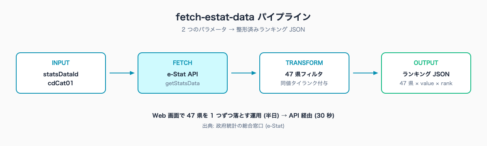
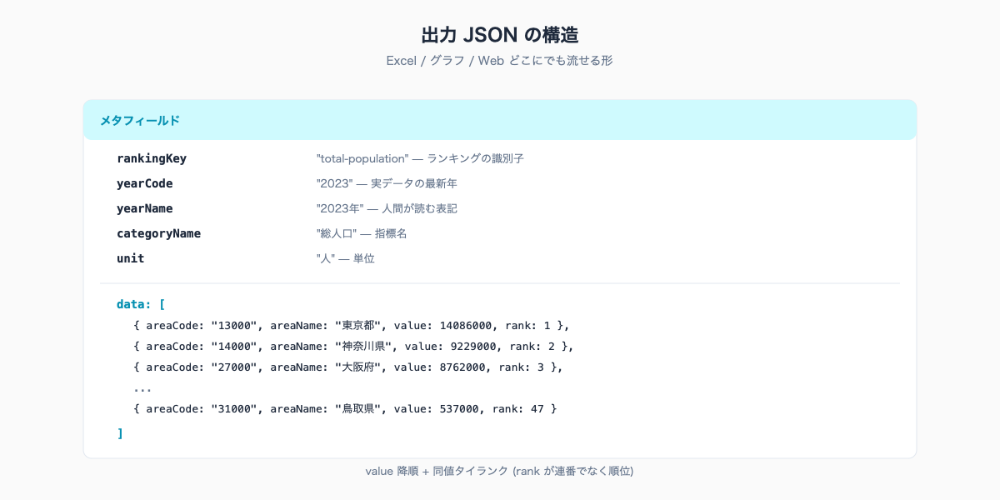
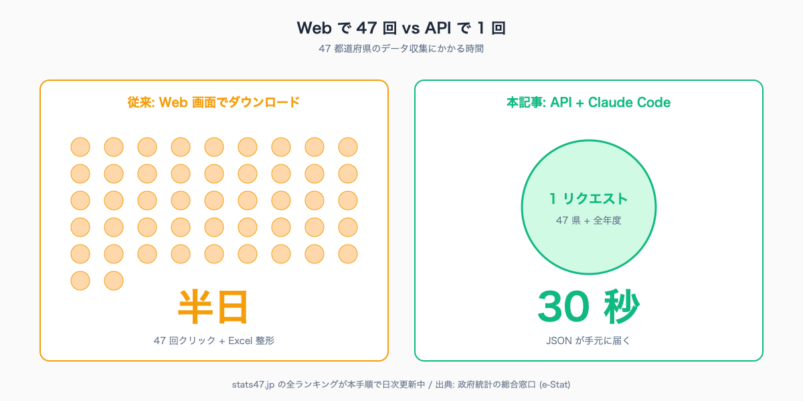

# 47 都道府県データを 1 コマンドで取得する — fetch-estat-data スキルの使い方

## はじめに

企画課が「全国の市町村合併後の人口推移を他県と比較したい」と依頼してくる。統計担当は e-Stat の Web 画面から都道府県ごとに 47 回ダウンロードし、Excel に貼り付けて整形する。気付けば半日が消えている。10〜30 万人規模の自治体では、こうした「データ収集だけで終わる業務」が月 20〜40 時間発生していると、自治体 DX に関する複数の調査で報告されている。

Claude Code に e-Stat を任せると、この半日が 30 秒になる。statsDataId と cdCat01 という 2 つのパラメータを伝えるだけで、47 都道府県分のランキング JSON が手元に届く。Web 画面の往復は不要。整形済みなのでそのまま Excel に貼ることも、グラフ生成スクリプトに渡すこともできる。

本記事の執筆者は元自治体職員。Claude Code で 47 都道府県の統計サイト [stats47.jp](https://stats47.jp) (約 2,000 のランキングを毎日自動更新) を個人で開発・運用している。サイト内のすべての都道府県ランキングは、本記事で扱う手順とまったく同じ流れで生成されている。

## TL;DR

- e-Stat API は `statsDataId` + `cdCat01` を指定すれば 47 都道府県データが 1 リクエストで取れる
- 取得後にメモリ上で `yearCode` と `areaCode` をフィルタする (キャッシュ統一のため)
- 出力 JSON は `{ areaCode, areaName, value, rank }` の配列。Excel / グラフ / Web どこにでも流せる
- Web 画面で 47 県を 1 つずつ落とすと半日。本手順なら初回 30 分・月次運用 30 秒
- stats47.jp の全ランキングがこの手順で日次自動更新されている (実運用済みの方法)


<!-- SVG: flow | statsDataId と cdCat01 → fetch-estat-data → 整形済 JSON → ランキング表 -->

## 背景: なぜ自治体職員にこの課題があるか

民間企業はデータ基盤を中央集約する。自治体は基幹システム + Excel + 紙の三層構造で、統計データは「ダウンロードしてきて Excel に貼る」運用が主流になっている。e-Stat (政府統計の総合窓口) は API を提供しているが、自治体の研修カリキュラムに API が含まれていないため、Web 画面からの CSV ダウンロードが事実上の標準になる。

人事異動が 2〜3 年で回るため、せっかく作った VBA マクロや Power Query は引き継がれず、新任担当者がまた一からダウンロードを始める。属人化と再発明が同時に起きる構造になっている。

e-Stat API はこの構造を変える起点になる。Web 画面と同じデータが、Web 画面より速く、整形済みの形で取れる。利用規約上、商用利用も二次配布も可 (出典「政府統計の総合窓口 (e-Stat)」を明記すれば OK)。Claude Code は API のリクエスト URL の組み立てとレスポンスの整形を全部引き受けるため、職員が覚えるべきは「何を取りたいか」だけで済む。

## 手順 / 解説

### Step 1: 取得対象を 2 つのパラメータに分解する

e-Stat API でランキングデータを取るのに必要な情報は、突き詰めると 2 つしかない。

- `statsDataId`: 統計表の ID (例: `0003448243` = 社会・人口統計体系)
- `cdCat01`: その統計表の中の「指標」コード (例: `#A03101` = 総人口)

例: 「47 都道府県の総人口ランキング」を取りたい → `statsDataId=0003448243` + `cdCat01=#A03101`。

statsDataId の探し方は `/search-estat`、cdCat01 の確認方法は `/inspect-estat-meta` が担当する (本マガジン #02 で詳細解説)。

### Step 2: 一時スクリプトを書く (Claude Code に頼む)

Claude Code に「e-Stat の `0003448243` から `#A03101` の都道府県ランキングを取って」と頼めば、以下のようなスクリプトを `scripts/temp-fetch-ranking.mjs` に置いてくれる。

```js
// scripts/temp-fetch-ranking.mjs
import fs from "fs";
import path from "path";
import { config } from "dotenv";
import { ProxyAgent } from "undici";

config({ path: path.resolve(process.cwd(), ".env.local") });

const appId = process.env.NEXT_PUBLIC_ESTAT_APP_ID;
const proxyUrl = process.env.HTTPS_PROXY || process.env.HTTP_PROXY;
const fetchOpts = proxyUrl ? { dispatcher: new ProxyAgent(proxyUrl) } : {};

async function fetchEstat(params) {
  const sp = new URLSearchParams({ appId, lang: "J", ...params });
  const url = `https://api.e-stat.go.jp/rest/3.0/app/json/getStatsData?${sp}`;
  const res = await fetch(url, fetchOpts);
  const json = await res.json();
  return json.GET_STATS_DATA?.STATISTICAL_DATA;
}

const statData = await fetchEstat({
  statsDataId: "0003448243",
  cdCat01: "#A03101",
  lvArea: "2",
});
```

ポイントを 4 つ押さえれば動く形になる。

1. **`appId`**: `.env.local` に `NEXT_PUBLIC_ESTAT_APP_ID=xxxx` の形で API キーを置く (マガジン #01 で発行手順を解説)
2. **`ProxyAgent`**: 企業ネットワークで HTTPS_PROXY 経由のときに必須。環境変数が空ならスキップされるため自宅 PC でも動く
3. **`lvArea: "2"`**: 都道府県粒度を指定するキー。`1`=全国 / `2`=都道府県 / `3`=市区町村 という階層がある
4. **`cdArea` は指定しない**: 47 県分を一括取得して、後でメモリ上でフィルタする (理由は後述)

### Step 3: 47 都道府県を抽出してランク付けする

レスポンスに含まれる `CLASS_INF` (構造情報) と `DATA_INF.VALUE` (実データ) を組み合わせて、47 県分の配列を作る。

```js
const classObjs = [].concat(statData.CLASS_INF.CLASS_OBJ);
const values = [].concat(statData.DATA_INF.VALUE);

// 地域コード → 県名の対応表
const areaMap = new Map();
for (const obj of classObjs) {
  if (obj["@id"] === "area") {
    for (const c of [].concat(obj.CLASS)) areaMap.set(c["@code"], c["@name"]);
  }
}

// 実データに含まれる最新年を取る
const times = [...new Set(values.map((v) => v["@time"]))].sort().reverse();
const latestTime = times[0];
const yearCode = latestTime.slice(0, 4);

// 都道府県のみ抽出 (areaCode が XX000 形式かつ全国の 00000 を除く)
const prefData = values
  .filter(
    (v) =>
      v["@time"] === latestTime &&
      /^\d{2}000$/.test(v["@area"]) &&
      v["@area"] !== "00000",
  )
  .map((v) => ({
    areaCode: v["@area"],
    areaName: areaMap.get(v["@area"]),
    value: Number(v.$),
  }))
  .filter((v) => !isNaN(v.value))
  .sort((a, b) => b.value - a.value);

// 同値タイランク
let rank = 1;
for (let i = 0; i < prefData.length; i++) {
  if (i > 0 && prefData[i].value !== prefData[i - 1].value) rank = i + 1;
  prefData[i].rank = rank;
}
```

地域コードを「5 桁の `XX000` 形式」に統一しているのが要点。2 桁コードと 5 桁コードが混在する e-Stat の取り回しを避け、stats47 でも全データを 5 桁に揃える運用にしている。

### Step 4: JSON として書き出す

最後に整形済みの結果を JSON で保存する。

```js
const result = {
  rankingKey: "total-population",
  yearCode,
  yearName: yearCode + "年",
  categoryName: "総人口",
  unit: "人",
  data: prefData,
};

const outputPath = path.join("data", "total-population.json");
fs.mkdirSync(path.dirname(outputPath), { recursive: true });
fs.writeFileSync(outputPath, JSON.stringify(result, null, 2));
console.log(`Saved: ${outputPath} (${prefData.length} prefectures)`);
```

実行は 1 コマンド。

```bash
node scripts/temp-fetch-ranking.mjs
# → Saved: data/total-population.json (47 prefectures)
```

出力される JSON の中身はこんな形になる (上位 3 県と最下位を抜粋)。

```json
{
  "rankingKey": "total-population",
  "yearCode": "2023",
  "yearName": "2023年",
  "categoryName": "総人口",
  "unit": "人",
  "data": [
    { "areaCode": "13000", "areaName": "東京都", "value": 14086000, "rank": 1 },
    { "areaCode": "14000", "areaName": "神奈川県", "value": 9229000, "rank": 2 },
    { "areaCode": "27000", "areaName": "大阪府", "value": 8762000, "rank": 3 },
    { "areaCode": "31000", "areaName": "鳥取県", "value": 537000, "rank": 47 }
  ]
}
```

出典: 政府統計の総合窓口 (e-Stat) 社会・人口統計体系。


<!-- SVG: structure | 出力 JSON の構造 (rankingKey / yearCode / data 配列) -->

### Step 5: なぜ全年度・全県を一括取得するのか

e-Stat API には年度を絞る `cdTimeFrom` / `cdTimeTo`、地域を絞る `cdArea` というパラメータも用意されている。だが stats47.jp の本番運用では、これらを **使わない方針** を取っている。

理由は 1 つ。「API レスポンスを R2 (Cloudflare のオブジェクトストレージ) にキャッシュしているが、リクエストパラメータが少しでも違うと別キャッシュになる」ためだ。

- 2023 年だけ取った JSON、2024 年だけ取った JSON、全年取った JSON が 3 種類できる
- 13 都(東京) だけ取った JSON、47 県分取った JSON が 2 種類できる
- 同じデータの断片が増殖し、キャッシュヒット率が落ち、API 呼び出し回数が増える

全年・全県を一括取得して、必要な年と県は **メモリ上でフィルタする** 方が、キャッシュは 1 種類に統一でき、API 呼び出しは最小化される。1 リクエストで返ってくるデータ量も、47 県 × 数十年でも数 MB に収まる。

この方針は CLAUDE.md (このリポジトリの規約) と [.claude/rules/estat-api.md](https://github.com/) にも明記されている。


<!-- SVG: infographic | 47 県グリッド + 「Web で 47 回 = 半日」「API なら 1 回 = 30 秒」 -->

### Step 6: stats47.jp での実運用例

stats47.jp のランキング詳細ページ (例: [/ranking/total-population](https://stats47.jp/ranking/total-population)) は、ここまでの手順で作った JSON をそのまま静的配信している。

公開している主なランキング (本記事の手順で取得・更新されているデータ):

- 総人口 / 世帯当たり年収 / 介護職年収
- 昼間人口比率 / 製造品出荷額
- 入港船舶総トン数 (神奈川 1 位、47 県中 40 県のみデータあり、124 倍格差)
- 健康寿命 / 待機児童数

「世帯当たり年収」のような派生指標は本マガジン #05 で計算手順を解説する。

### Step 7: ファイルを残さない (一時スクリプトは消す)

`scripts/temp-fetch-ranking.mjs` は Claude Code が毎回その場で書き直す前提の使い捨て。本番の業務スクリプトに昇格させる場合は、Claude Code の「スキル化」機能 (`.claude/skills/` 配下に SKILL.md として登録) を使う。本マガジン #10 で詳細を解説する。

## よくあるつまずきと回避策

- ⚠️ **`appId` を渡し忘れる** → 「getStatsData の error_msg が `appId is required`」と返る。`.env.local` のパスが間違っているケースが多い。`dotenv` の `path` を `process.cwd()` 基準で明示する
- ⚠️ **`lvArea` を指定しないと 1,800 行返る** → 市区町村単位まで全部展開される。47 県だけ欲しいなら `lvArea: "2"` を必ず付ける
- ⚠️ **企業ネットワークで `fetch` が固まる** → HTTPS_PROXY 経由になっていない。`undici` の `ProxyAgent` を必ず使う (本記事のテンプレが対応済み)
- ⚠️ **「全国」が含まれて 48 件になる** → `areaCode === "00000"` (全国) は除外フィルタを忘れがち。正規表現 `/^\d{2}000$/` で都道府県だけ取り出す
- ⚠️ **取得した年が古い** → e-Stat の都道府県別データは更新ラグが大きい統計がある (給与構造統計の都道府県別など)。年度を確認してから記事や資料に使う

## 応用 / 次に読むべき記事

- 取得した JSON を Excel に貼れる形式に変換する手順: [../04-excel-download-and-parse/draft.md](../04-excel-download-and-parse/draft.md)
- 人口当たり指標・順位・偏差値の計算: [../05-pandas-duckdb-derived-metrics/draft.md](../05-pandas-duckdb-derived-metrics/draft.md)
- statsDataId を探す手順: [../02-search-estat-statsdataid/draft.md](../02-search-estat-statsdataid/draft.md)
- 出来上がったランキングの実例 (本手順で日次更新中): [stats47.jp/ranking/total-population](https://stats47.jp/ranking/total-population)

<!-- circulation-footer:v2 -->

## このシリーズについて

「公務員のための e-Stat × Claude Code 実務ガイド」全 12 本のシリーズ第 03 回。e-Stat 業務の効率化に関心がある方は、マガジン購読がお得です。

▶️ マガジン: 公務員のための e-Stat × Claude Code 実務ガイド
🔗 {{ESTAT_MAGAZINE_URL}}

姉妹マガジン「公務員 × Claude Code 実務活用ガイド (全 33 本)」では議事録・議会答弁・条例レビューなど統計以外の業務効率化を扱っています。

▶️ stats47.jp: 本記事で紹介した手順で運用している 47 都道府県統計サイト (約 2,000 のランキングを毎日自動更新)。動いている実例として参考にどうぞ。
🔗 https://stats47.jp
