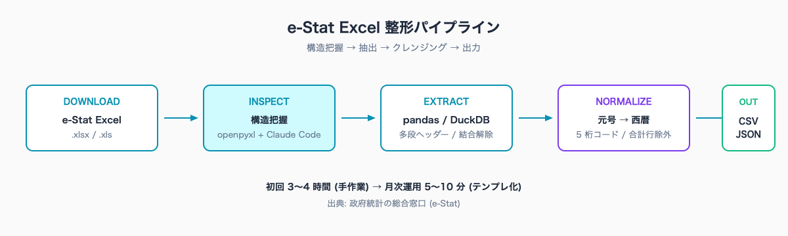
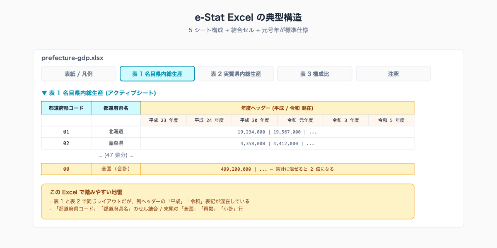
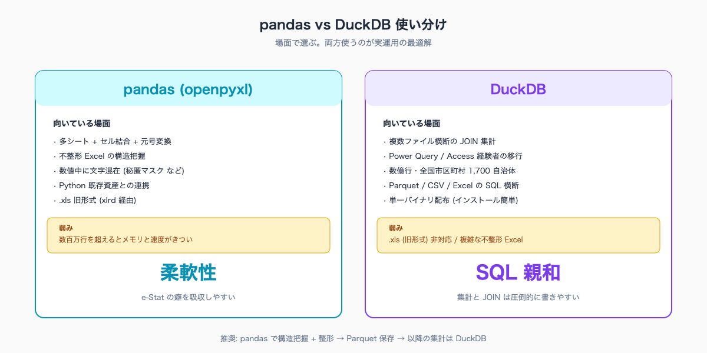

# e-Stat の Excel/CSV を Claude Code で整形する — 多シート・セル結合・元号西暦の処理

## はじめに

財政課が補助金申請の根拠資料を求めてきます。「過去 10 年分の県内総生産推移を、令和換算と西暦両方で並べてくれ」。e-Stat から該当の Excel を落とすと、シートが 8 個あります。1 枚目は注釈、2 枚目は単位の説明、3 枚目から本表で、コード列と名称列が結合セルになっています。年度欄は「平成 28 年度」「令和 5 年度」が混在しています。

統計担当が Power Query でこれを開いて、結合解除、コード列分離、元号変換マスタとの突き合わせをやると、3〜4 時間が消えます。資料が完成して数値検算したら、合計行を本文と一緒に集計してしまっていた、というミスも珍しくありません。

> **📌 この記事の読み方** — 本記事にはコマンド・設定例・プロンプト例など、やや専門的な記述も出てきます。ですが Claude Code の本質は「それらを自分で覚えること」ではなく、「**やってほしいことを言葉で頼めば、専門的な部分は AI が代わりに用意してくれる**」点にあります。掲載するコマンドや設定は丸暗記の対象ではなく「こう頼めば、こういうものが返ってくる」という地図として読んでください。

本記事の執筆者は元自治体職員です。Claude Code で 47 都道府県統計サイト [stats47.jp](https://stats47.jp) (約 2,000 のランキングを毎日自動更新) を個人で開発・運用しています。掲載している製造品出荷額や県内総生産などのランキングは、e-Stat の Excel データを本記事と同じ手順で整形して作っています。

## TL;DR

- e-Stat の Excel は多シート + 結合セル + 元号年が標準仕様です。手作業前提では作られていません
- pandas (openpyxl エンジン) と DuckDB (`read_xlsx`) を場面で使い分けます
- 構造把握 (シート一覧 → 中身サマリ → 集計対象シート特定) を Claude Code に任せます
- 元号 → 西暦変換は「令和 5 年 = 2023」を 4 行のマッピング関数で処理します
- 初回手作業 3〜4 時間 → 月次運用 5〜10 分。テンプレを残せば次の担当者も同じ品質で再現できます


<!-- SVG: flow | e-Stat Excel → 構造把握 → pandas/DuckDB → 整形済 CSV/JSON -->

## 背景: なぜ自治体職員にこの課題があるか

民間のデータ基盤は「機械可読」が前提で設計されています。e-Stat の Excel は逆で、「人間が印刷して綴じる」前提のレイアウトを残したまま、API ではなくダウンロードファイルとして配布されています。これは官民の文化的な差というより、e-Stat が長年「白書・報告書の配布チャネル」だった歴史的経緯によるものです。

結果として:

- 1 ブックに **複数の調査結果** が同居します (1 シート 1 調査ではありません)
- 表の上に **タイトル・調査概要・凡例** が 5〜10 行入ります
- コード列と名称列が **セル結合** されます
- 年度欄に **「平成」「令和」** が混在します
- 末尾に **合計行・小計行** が本文と同じテーブル内に置かれます

自治体の統計担当は、これを Excel の手作業で処理することを前提に研修を受けています。ですが Claude Code を使えば、構造把握から整形まで自然言語で指示できます。e-Stat の利用規約上、ダウンロードした Excel の機械加工も商用利用も可です (出典「政府統計の総合窓口 (e-Stat)」を明記すれば OK)。

## 手順 / 解説

### Step 1: Excel をダウンロードする

e-Stat の統計表ページ右上に「DB」「EXCEL」「CSV」「PDF」のアイコンがあります。「EXCEL」をクリックすると `<statsDataId>.xlsx` 形式のファイルが落ちてきます。

```bash
# 例: 県民経済計算の Excel (URL は statsDataId に依存)
# https://www.e-stat.go.jp/stat-search/files?page=1&toukei=00100403
# → 表ごとに DL リンクがある
```

CSV ダウンロードもありますが、e-Stat の CSV は **コード列と名称列が別の行** に出力される独特な形式で、Excel よりむしろ取り回しが難しいです。本記事では Excel を扱う方針で進めます。

ダウンロードしたファイルを `data/raw/` に置きます。

```bash
mkdir -p data/raw
mv ~/Downloads/FEH_00100403_*.xlsx data/raw/prefecture-gdp.xlsx
```

### Step 2: 構造把握を Claude Code に任せる

Excel を開かずに、Claude Code に「`data/raw/prefecture-gdp.xlsx` のシート構成と各シートの先頭 10 行を見せて」と頼みます。以下のスクリプトが生成されます。

```python
# scripts/inspect-xlsx.py
import sys
from openpyxl import load_workbook

wb = load_workbook(sys.argv[1], read_only=True, data_only=True)
print(f"シート数: {len(wb.sheetnames)}")
for name in wb.sheetnames:
    ws = wb[name]
    print(f"\n--- {name} (rows: {ws.max_row}, cols: {ws.max_column}) ---")
    for i, row in enumerate(ws.iter_rows(min_row=1, max_row=10, values_only=True)):
        cells = [str(c) if c is not None else "" for c in row[:8]]
        print(f"  L{i+1}: {' | '.join(cells)}")
```

```bash
python scripts/inspect-xlsx.py data/raw/prefecture-gdp.xlsx
```

出力例:

```
シート数: 5

--- 表紙 (rows: 12, cols: 4) ---
  L1: 県民経済計算 |  |  |
  L2: 平成23年度~令和3年度 |  |  |
  L3:  | (出典) 内閣府 |  |
...

--- 表1 名目県内総生産 (rows: 58, cols: 13) ---
  L1: 名目県内総生産 |  | 平成23年度 | 平成24年度 | 平成25年度 ...
  L2: 都道府県コード | 都道府県名 | 値(百万円) | 値(百万円) ...
  L3: 01 | 北海道 | 19,234,000 | 19,567,000 ...
```

これだけで「表 1 が本表」「L1-L2 がヘッダー」「データは L3 以降」「年度欄に元号」というのが一目で分かります。Claude Code に「表 1 の本表だけ抽出して、年度を西暦に変換した CSV を作って」と次の指示を出します。

### Step 3: pandas (openpyxl) で読み込む

pandas は柔軟性が高く、e-Stat のような不整形 Excel に強いです。

```python
# scripts/parse-prefecture-gdp.py
import pandas as pd

df = pd.read_excel(
    "data/raw/prefecture-gdp.xlsx",
    sheet_name="表1 名目県内総生産",
    header=[0, 1],     # 2 行ヘッダー
    skiprows=0,
)

# 多段ヘッダーを 1 行に圧縮
df.columns = [
    f"{a}_{b}" if "Unnamed" not in str(b) else str(a)
    for a, b in df.columns
]

# 都道府県コードを 5 桁の文字列に正規化 (CLAUDE.md 規約)
df["areaCode"] = df["都道府県コード"].astype(str).str.zfill(2) + "000"

# 全国行と空行を除去
df = df[df["areaCode"].str.match(r"^\d{2}000$") & (df["areaCode"] != "00000")]

print(df.head())
print(f"行数: {len(df)}")  # → 47 になるはず
```

ポイントは 3 つです。

1. `header=[0, 1]` で **多段ヘッダーを正しく解釈** します
2. `astype(str).str.zfill(2) + "000"` で **2 桁コードを 5 桁に統一** します
3. 全国 (`00000`) を除外して 47 行に絞ります

### Step 4: 元号年を西暦に変換する

「平成 23 年度」を `2011`、「令和 5 年度」を `2023` に変換する関数を入れます。

```python
import re

ERA_BASE = {
    "令和": 2018,  # 令和 1 年 = 2019 → base + N
    "平成": 1988,  # 平成 1 年 = 1989
    "昭和": 1925,  # 昭和 1 年 = 1926
    "大正": 1911,
    "明治": 1867,
}

def to_seireki(label: str) -> int | None:
    m = re.match(r"^(令和|平成|昭和|大正|明治)\s*(\d+|元)\s*年", str(label))
    if not m:
        return None
    era, num = m.group(1), m.group(2)
    n = 1 if num == "元" else int(num)
    return ERA_BASE[era] + n
```

`to_seireki("平成23年度")` → `2011`、`to_seireki("令和元年度")` → `2019`、`to_seireki("令和5年度")` → `2023`。

これを年度カラム名に適用して、出力時にはきれいな西暦カラムにします。

```python
year_cols = {col: to_seireki(col) for col in df.columns if to_seireki(col)}
df_long = df.melt(
    id_vars=["areaCode", "都道府県名"],
    value_vars=list(year_cols.keys()),
    var_name="era_year",
    value_name="value",
)
df_long["year"] = df_long["era_year"].map(year_cols)
df_long = df_long[["areaCode", "都道府県名", "year", "value"]]
df_long.to_csv("data/prefecture-gdp.csv", index=False, encoding="utf-8")
```

出力 CSV はこんな形になります。

```csv
areaCode,都道府県名,year,value
01000,北海道,2011,19234000
01000,北海道,2012,19567000
...
13000,東京都,2023,115420000
```

長形式 (long format) にしておくと、後段の集計・グラフ生成がどちらも楽になります。


<!-- SVG: structure | e-Stat Excel の典型 (メタ / コード / 値 / 注釈) -->

ここから先は有料部分:

### Step 5: DuckDB の `read_xlsx` で SQL を直接書く

pandas に慣れていない統計担当でも、SQL は触ったことがある人が多いです。DuckDB は単一バイナリで動く高速な分析 DB で、Excel を直接 SQL から読めます。

```sql
-- query.sql
INSTALL excel;
LOAD excel;

SELECT
  LPAD(CAST(都道府県コード AS VARCHAR), 2, '0') || '000' AS areaCode,
  都道府県名,
  *
FROM read_xlsx('data/raw/prefecture-gdp.xlsx', sheet = '表1 名目県内総生産', header = true)
WHERE 都道府県コード IS NOT NULL
  AND CAST(都道府県コード AS INTEGER) BETWEEN 1 AND 47;
```

```bash
duckdb -c ".read query.sql"
```

DuckDB のメリットは 3 点です。

1. **SQL ベースなので Power Query / Access 経験者の学習コストが低い** です
2. **数億行でもインメモリで集計可能** です (pandas より速い場面が多いです)
3. **CSV / Parquet / JSON / Excel をクロス JOIN できる** ので、人口データと県内総生産を結合して人口当たり GDP を作るなどが SQL 1 本で書けます

注意点: DuckDB の `read_xlsx` は **`.xls` (旧形式) には対応していません**。e-Stat の古い統計表は `.xls` で配布されている場合があり、その場合は openpyxl (Python 経由) で `.xlsx` に変換するか、pandas を使う必要があります。

```python
# .xls → .xlsx 変換 (一度だけ)
import pandas as pd
xls = pd.ExcelFile("data/raw/legacy.xls", engine="xlrd")
with pd.ExcelWriter("data/raw/legacy.xlsx", engine="openpyxl") as w:
    for name in xls.sheet_names:
        xls.parse(name).to_excel(w, sheet_name=name, index=False)
```

### Step 6: セル結合・合計行・小計行を排除する

e-Stat の Excel で最大の地雷は、結合セルと合計行が見た目に区別できないことです。表の最後に「合計」「小計」「再掲」「再掲計」のような行が紛れていて、これを集計に含めると数値が 2 倍になります。

セル結合は openpyxl が自動でばらしてくれます (結合セルの値は左上に入り、他は `None` になります)。

```python
# 結合セルを左上の値で埋める
df = df.fillna(method="ffill", axis=0)
```

合計行・小計行は **キーワードで除外** します。

```python
EXCLUDE_KEYWORDS = ["合計", "小計", "計", "再掲", "再掲計", "総数", "全国"]
df = df[~df["都道府県名"].astype(str).str.contains("|".join(EXCLUDE_KEYWORDS), na=False)]
```

`"計"` だけだと「会計」や「設計」を含む行も落ちます。そのため `都道府県名` カラムが「47 都道府県名のいずれか」と一致するもののみ残す方が安全な場合もあります。Claude Code に「47 都道府県名のホワイトリストでフィルタする関数を書いて」と頼めば、5 行で実装してくれます。

### Step 7: pandas vs DuckDB 使い分け早見

| 場面 | 推奨 | 理由 |
|---|---|---|
| 多シート + 結合セル + 元号変換 | pandas | 柔軟性。openpyxl の細かい制御が効く |
| 複数ファイル横断の集計 (人口 + GDP + 出生数) | DuckDB | SQL の JOIN が圧倒的に書きやすい |
| 47 都道府県 × 数十年の中規模 | どちらでも | 10 万行以下なら速度差なし |
| 数億行・全国市区町村 1,700 自治体 | DuckDB | pandas はメモリに乗らない |
| `.xls` (旧形式) | pandas (xlrd) | DuckDB は非対応 |
| 1 シート 1 表のシンプル Excel | DuckDB | 1 行で読める |

実運用では「最初に pandas で構造把握 + 整形 → 結果を Parquet に保存 → 以降の集計は DuckDB」というハイブリッドが効率的になります。


<!-- SVG: infographic | pandas と DuckDB の比較表 -->

### Step 8: 失敗事例と回避策

実運用で踏みやすい地雷を 4 つ挙げます。

1. **`pd.read_excel` で数値が文字列になる** → セルに `"-"` `"…"` `"X"` (秘匿マスク) が混在しているケースです。`na_values=["-", "…", "X", "..."]` を指定して数値変換を強制します
2. **多段ヘッダーが壊れる** → ヘッダー行が 3 段以上ある場合、`header=[0, 1, 2]` で明示的に段数を指定します
3. **元号変換で「平成 31 年度 = 2019 年度」を「令和 1 年度」に統一したい** → 4 月始まりの会計年度ベースか、暦年ベースかで取り扱いが変わります。改元日 (令和は 2019-05-01) を超えるかで判定する関数を用意します
4. **Excel の数値が `1.9234e+07` のような指数表記** → `pd.options.display.float_format = "{:,.0f}".format` で出力フォーマットを整えます

### Step 9: stats47.jp での実運用例

stats47.jp が公開している製造品出荷額や県内総生産は、本記事で扱った pandas + 元号変換のパイプラインで日次更新されています。具体例:

- [製造品出荷額ランキング](https://stats47.jp/ranking/manufacturing-shipment-value)
- 県内総生産 (内閣府 県民経済計算より)
- 介護職年収 (賃金構造基本統計調査より)
- 入港船舶総トン数 (港湾統計より) — 40 県のみデータあり、神奈川 1 位で 124 倍格差

これらすべてが「元号 → 西暦」「コード正規化」「合計行除外」のセットを通って JSON 化されています。

### Step 10: 初回 3 時間 → 月次運用 5 分のためのテンプレ化

ここまでのスクリプトを `scripts/parse-estat-excel.py` のように汎用化して残しておけば、次回以降は引数を変えるだけで動かせます。さらに `.claude/skills/` 配下にスキルとして登録すれば、Claude Code から「parse-estat-excel で `data/raw/foo.xlsx` を整形して」と呼び出せます (詳細は本マガジン #10 で解説)。

初回 3〜4 時間の作業が、テンプレ + スキル化で月次運用 5〜10 分まで圧縮できます。人事異動で担当が変わってもスキル定義は引き継がれるため、属人化も解消します。

## よくあるつまずきと回避策

- ⚠️ **`pd.read_excel` でシート名が日本語だと文字化け** → `engine="openpyxl"` を明示し、ファイル保存時は UTF-8 (`encoding="utf-8-sig"`) で BOM 付き出力にします
- ⚠️ **DuckDB の `read_xlsx` が「sheet not found」** → 大小文字とスペースに敏感です。`SHOW TABLES FROM read_xlsx(...)` で正確なシート名を取得してから指定します
- ⚠️ **「令和」が `R5` `R5年度` `令和5年度` で表記揺れ** → 正規表現に `[Rr]` パターンも追加するか、Claude Code に「表記揺れを吸収する `to_seireki` 関数を作って」と頼みます
- ⚠️ **コード列が空白セルで終わる** → e-Stat の Excel は表の末尾に空行 + 注釈が入ります。`df.dropna(subset=["都道府県コード"])` で先に空行を落とします
- ⚠️ **「秘匿マスク」が数値カラムに混入** → 集計値が極端に小さい場合に `X` `…` `-` で秘匿されます。`na_values` 指定で `NaN` に倒し、用途に応じて 0 埋めか除外かを選択します

## 応用 / 次に読むべき記事

- 整形済みデータから人口当たり指標・順位・偏差値を計算: [../05-pandas-duckdb-derived-metrics/draft.md](../05-pandas-duckdb-derived-metrics/draft.md)
- API でデータを取る (Excel 不要の場合): [../03-fetch-prefecture-ranking/draft.md](../03-fetch-prefecture-ranking/draft.md)
- 自治体コード結合・人口データマージ: [../06-prefecture-code-and-merge/draft.md](../06-prefecture-code-and-merge/draft.md)
- 整形済みデータの公開例 (本手順で日次更新中): [stats47.jp/ranking/manufacturing-shipment-value](https://stats47.jp/ranking/manufacturing-shipment-value)

<!-- circulation-footer:v2 -->

## このシリーズについて

「公務員のための e-Stat × Claude Code 実務ガイド」全 12 本のシリーズ第 04 回。e-Stat 業務の効率化に関心がある方は、マガジン購読がお得です。

▶️ マガジン: 公務員のための e-Stat × Claude Code 実務ガイド
🔗 https://note.com/stats47/m/m1b836e4c8dce

姉妹マガジン「公務員 × Claude Code 実務活用ガイド (全 33 本)」では議事録・議会答弁・条例レビューなど統計以外の業務効率化を扱っています。

▶️ stats47.jp: 本記事で紹介した手順で運用している 47 都道府県統計サイト (約 2,000 のランキングを毎日自動更新)。動いている実例として参考にどうぞ。
🔗 https://stats47.jp
