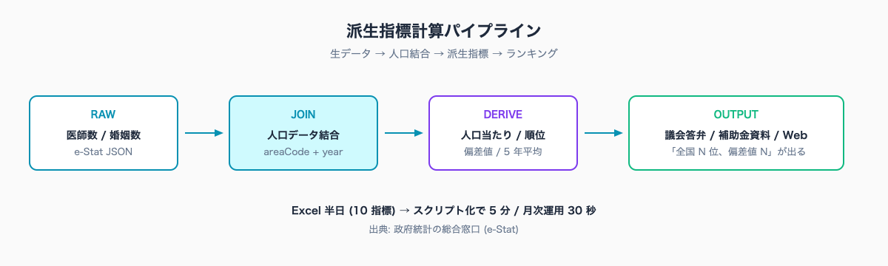
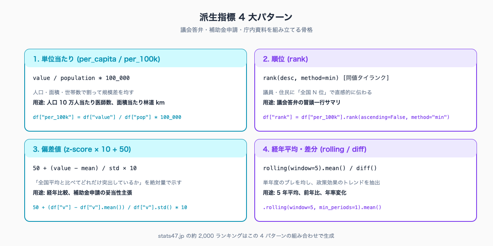

# 人口当たり指標・順位・偏差を計算する — pandas / DuckDB で派生指標を 5 行で出す

## はじめに

議会で「医師不足が他県と比べてどの程度深刻か、人口 10 万人当たりで示してくれ」と質問が来る。生の医師数を並べるだけでは答えにならない。人口の多い都道府県は医師数も多くて当たり前で、住民から見た医療アクセスを比較するには「人口 10 万人当たり」「順位」「全国平均との差」「偏差値」のような **派生指標** が必要になる。

統計担当が Excel で人口データと医師数データを VLOOKUP で結合し、割り算カラムを作り、順位を RANK 関数で出して、平均と標準偏差を計算して偏差値カラムを作る。1 指標あたり 30 分〜1 時間。10 指標分の資料となると、半日が消える。

> **📌 この記事の読み方** — 本記事にはコマンド・設定例・プロンプト例など、やや専門的な記述も出てきます。ですが Claude Code の本質は「それらを自分で覚えること」ではなく、「**やってほしいことを言葉で頼めば、専門的な部分は AI が代わりに用意してくれる**」点にあります。掲載するコマンドや設定は丸暗記の対象ではなく「こう頼めば、こういうものが返ってくる」という地図として読んでください。

本記事の執筆者は元自治体職員。Claude Code で 47 都道府県統計サイト [stats47.jp](https://stats47.jp) (約 2,000 のランキングを毎日自動更新) を個人で開発・運用している。サイトに掲載している「人口 10 万人当たり医師数」「年齢調整死亡率」「世帯当たり年収」などはすべて本記事の派生指標計算ロジックを通って生成されている。

## TL;DR

- 派生指標 (人口当たり / 順位 / 偏差値 / 5 年平均) は pandas / DuckDB で 5 行ずつ書ける
- pandas は `.rank()` `.std()` `.rolling()` の組み合わせ。DuckDB は `RANK() OVER` `STDDEV` `LAG` で SQL に直接出せる
- e-Stat の「総数 / 男女別 / 年齢階級別」の分岐は `cdCat01` の切替で対応する
- Excel で半日 → スクリプト化で 5 分。テンプレが残るので次の担当者も同品質
- stats47.jp では本ロジックで約 2,000 のランキングを派生指標として日次計算している


<!-- SVG: flow | 生データ → 人口結合 → 派生指標 → ランキング -->

## 背景: なぜ自治体職員にこの課題があるか

生データ (人口 / 医師数 / 婚姻数 / 製造業出荷額) はそのまま並べると、人口規模で結果が決まってしまう。「東京は何でも 1 位、鳥取は何でも 47 位」というランキングしか作れず、政策の議論にならない。

そこで「人口 10 万人当たり」「年齢調整」「順位」「偏差値」のような **派生指標** が登場する。が、Excel ではこれらを 1 つずつ手作業で組み立てる必要があり、計算式の入れ間違い・行ずれ・参照元シートの切れ・四捨五入の桁数違いなどミスが入り込みやすい。

Claude Code を使うと、派生指標のパターンが pandas / DuckDB のスニペット 1 つで決まる。同じロジックを 10 指標、20 指標に展開しても結果がブレない。e-Stat (政府統計の総合窓口) の生データに対して、再現性のある加工を施せる。

## 手順 / 解説

### Step 1: 派生指標の 4 大パターンを整理する

自治体業務で頻出する派生指標は、ほぼ以下の 4 パターンに収まる。

| パターン | 計算式 | 用途例 |
|---|---|---|
| 単位当たり | 値 ÷ 母集団 (人口・面積・世帯数) | 人口 10 万人当たり医師数、面積当たり林道 km |
| 順位 | 47 県で並べた rank | 議会答弁の「全国 N 位」 |
| 偏差 (z-score) | (値 − 平均) ÷ 標準偏差 | 「全国比でどれだけ突出しているか」 |
| 経年平均・差分 | 5 年平均、前年比、年率変化 | 政策効果のトレンド検証 |

この 4 つを組み合わせれば、ほとんどの議会答弁・補助金申請資料が組み立てられる。

### Step 2: pandas で書く (4 パターン × 5 行)

医師数 (生データ) と人口 (母集団) を結合した DataFrame `df` が手元にある前提。

```python
import pandas as pd

# df: columns = [areaCode, areaName, year, doctors, population]

# パターン 1: 人口 10 万人当たり
df["per_100k"] = df["doctors"] / df["population"] * 100_000

# パターン 2: 順位 (値が大きい順、同値タイランク)
df["rank"] = df["per_100k"].rank(ascending=False, method="min").astype(int)

# パターン 3: 偏差値 (50 + (値 − 平均) ÷ 標準偏差 × 10)
mean = df["per_100k"].mean()
std = df["per_100k"].std()
df["deviation"] = (50 + (df["per_100k"] - mean) / std * 10).round(1)

# パターン 4: 5 年平均 (時系列がある場合)
df["rolling_5yr"] = (
    df.groupby("areaCode")["per_100k"]
    .transform(lambda s: s.rolling(window=5, min_periods=1).mean())
)
```

これだけで 4 つの派生指標カラムが出来る。1 指標 5 行程度。Excel で 30 分かかっていた作業が、テンプレを置けば数秒で終わる。

### Step 3: DuckDB で同じことを SQL で書く

DuckDB なら CSV を直接 SQL で読んで派生指標を計算できる。

```sql
-- query.sql
WITH base AS (
  SELECT
    d.areaCode,
    d.areaName,
    d.year,
    d.doctors,
    p.population,
    d.doctors * 100000.0 / p.population AS per_100k
  FROM read_csv_auto('data/doctors.csv') d
  JOIN read_csv_auto('data/population.csv') p
    USING (areaCode, year)
)
SELECT
  *,
  RANK() OVER (PARTITION BY year ORDER BY per_100k DESC) AS rank,
  ROUND(
    50 + (per_100k - AVG(per_100k) OVER (PARTITION BY year))
       / STDDEV(per_100k) OVER (PARTITION BY year) * 10,
    1
  ) AS deviation,
  AVG(per_100k) OVER (
    PARTITION BY areaCode
    ORDER BY year
    ROWS BETWEEN 4 PRECEDING AND CURRENT ROW
  ) AS rolling_5yr
FROM base
ORDER BY year DESC, rank;
```

```bash
duckdb -c ".read query.sql" > data/doctors-derived.csv
```

ポイントは 3 つ。

1. **`PARTITION BY year`** で「年度ごとに集計する」を表現する (年度横断にしない)
2. **`RANK()`** は同値タイランク。`DENSE_RANK()` だと飛ばさず連番。`ROW_NUMBER()` だと同値でも別順位
3. **`ROWS BETWEEN 4 PRECEDING AND CURRENT ROW`** で 5 年平均 (現在含む)


<!-- SVG: structure | 主要な派生指標の計算式一覧 -->

### Step 4: 47 都道府県データの読み込み (e-Stat から取得した JSON が前提)

本マガジン #03 で取得した JSON を pandas に読み込む。

```python
import json
import pandas as pd

with open("data/doctors.json") as f:
    raw = json.load(f)

df = pd.DataFrame(raw["data"])
df["year"] = int(raw["yearCode"])
# df.columns = [areaCode, areaName, value, rank, year]
```

複数年データを扱いたい場合、年度ごとの JSON を連結する。

```python
years = ["2018", "2019", "2020", "2021", "2022", "2023"]
dfs = []
for y in years:
    with open(f"data/doctors-{y}.json") as f:
        raw = json.load(f)
    d = pd.DataFrame(raw["data"])
    d["year"] = int(raw["yearCode"])
    dfs.append(d)
df = pd.concat(dfs, ignore_index=True)
```

これで `(areaCode, year)` をキーにした long format の DataFrame ができ、派生指標計算の入力になる。

### Step 5: 人口データを結合する (1 つの母集団に依存しない設計)

派生指標の核は「何で割るか」。人口で割るのか、世帯数で割るのか、就業者数で割るのか、面積で割るのかで意味が変わる。

```python
# 人口データ (e-Stat 社会・人口統計体系から取得)
pop = pd.read_csv("data/population.csv")  # columns = [areaCode, year, population]

# 母集団テーブルを左 JOIN
df = df.merge(pop, on=["areaCode", "year"], how="left")
df["per_capita"] = df["value"] / df["population"]
df["per_100k"] = df["per_capita"] * 100_000
```

母集団を切り替えやすい設計にしておくと、「人口当たり」「就業者当たり」「世帯当たり」を選択肢として並列に出せる。stats47.jp の世帯当たり年収はこの仕組みで計算されている。

ここから先は有料部分:

### Step 6: e-Stat の「総数」「男女別」「年齢階級別」を切り替える

e-Stat の同じ統計表に「総数」「男」「女」「0〜14 歳」「15〜64 歳」「65 歳以上」などのカテゴリが入っていることが多い。これらは **同じ `statsDataId` の中で `cdCat01` を切り替える** ことで取り分ける。

```python
# 一つの statsDataId から複数カテゴリを引く例
CATEGORIES = {
    "total":        "#A03101",    # 総人口
    "male":         "#A03102",    # 男性人口
    "female":       "#A03103",    # 女性人口
    "age_0_14":     "#A03301",    # 年少人口
    "age_15_64":    "#A03302",    # 生産年齢人口
    "age_65_plus":  "#A03303",    # 老年人口
}

# 1 リクエストで全カテゴリ取らず、必要なものだけ fetch
def fetch_category(key: str) -> pd.DataFrame:
    code = CATEGORIES[key]
    # /fetch-estat-data スキルで取得した JSON を読み込む
    with open(f"data/population-{key}.json") as f:
        raw = json.load(f)
    df = pd.DataFrame(raw["data"])
    df["year"] = int(raw["yearCode"])
    df["category"] = key
    return df

dfs = [fetch_category(k) for k in ["total", "age_65_plus"]]
df = pd.concat(dfs, ignore_index=True)

# 老年人口比率 (年齢調整に使う)
wide = df.pivot_table(
    index=["areaCode", "areaName", "year"],
    columns="category",
    values="value",
).reset_index()
wide["elderly_ratio"] = wide["age_65_plus"] / wide["total"]
```

`cdCat01` を切り替えるだけで「年齢階級別人口」「男女別給与」「業種別事業所数」がそのまま取れる構造になっている。これを Claude Code に頼むときは「`0003448243` から `#A03101` と `#A03303` を別々に fetch して、`(areaCode, year)` で結合してくれ」と頼めば、上記スクリプトが返ってくる。

### Step 7: 年齢調整死亡率を作る (応用編)

「老年人口比率が高い県は死亡率が高く見える」というバイアスを除くために、**年齢調整死亡率** を計算する。基準人口 (e.g. 平成 27 年モデル人口) の年齢構成に合わせて重み付けする。

```python
# 基準人口 (平成 27 年モデル人口、年齢階級ごとの重み)
STANDARD_POP = {
    "0_14": 0.135,
    "15_39": 0.317,
    "40_64": 0.355,
    "65_plus": 0.193,
}

# 県別 × 年齢階級別の死亡率があるとして
# df: columns = [areaCode, year, age_group, deaths, population]
df["mortality_rate"] = df["deaths"] / df["population"]

# 年齢階級ごとに STANDARD_POP の重みで加重平均
df["weight"] = df["age_group"].map(STANDARD_POP)
df["weighted"] = df["mortality_rate"] * df["weight"]
adjusted = df.groupby(["areaCode", "year"])["weighted"].sum().reset_index()
adjusted.rename(columns={"weighted": "age_adjusted_mortality"}, inplace=True)
```

これで「老年人口比率の影響を除いた、純粋な医療水準・健康水準の比較指標」ができる。stats47.jp の健康関連ランキングはこの方式で計算されている。

### Step 8: 偏差値・順位を組み合わせて「総合スコア」を作る

議会・補助金申請の資料では、複数指標を組み合わせた「総合スコア」を要求されることがある。偏差値ベースで合成すると、桁数の違う指標も対等に並べられる。

```python
# 例: 医療水準スコア = 人口 10 万人当たり医師数 + 病床数 + 健康寿命 の偏差値平均
indicators = ["doctors_per_100k", "beds_per_100k", "healthy_life"]
for col in indicators:
    mean, std = df[col].mean(), df[col].std()
    df[f"{col}_z"] = 50 + (df[col] - mean) / std * 10

df["medical_score"] = df[[f"{c}_z" for c in indicators]].mean(axis=1)
df["medical_rank"] = df["medical_score"].rank(ascending=False, method="min").astype(int)
```

注意: 偏差値合成はあくまで「ベンチマーク用の参考値」。各指標の重み付けや因果関係を主張する用途には向かない。資料化するときは「単純合成のため傾向把握に限る」など注記を入れる。

### Step 9: 順位 vs 偏差値 — どう使い分けるか

両者は似て非なるもの。場面で使い分ける。

| 場面 | 推奨指標 | 理由 |
|---|---|---|
| 議会答弁「全国何位か」 | 順位 (rank) | 議員・住民に直感的に伝わる |
| 上位 / 下位の差を比較 | 偏差値 (z-score) | 1 位と 2 位の差、46 位と 47 位の差を絶対量で見られる |
| 経年変化を比較 | 偏差値 | 全国平均が動いても自県の相対位置が分かる |
| 補助金申請のエビデンス | 順位 + 偏差値の併記 | 「順位は 35 位、偏差値は 38」のように両方提示する |


<!-- SVG: infographic | 順位 vs 偏差値の比較ビジュアル -->

### Step 10: stats47.jp で実運用されている派生指標

stats47.jp は本記事のロジックを使って、約 2,000 のランキングを毎日自動計算している。代表例:

- 人口 10 万人当たり医師数 (人口当たり指標)
- 健康寿命 (年齢調整済み)
- 介護職年収 (賃金構造基本統計から取得・整形)
- 世帯当たり年収 (世帯数を母集団に取った派生指標)
- 昼間人口比率 (昼間人口 ÷ 常住人口)
- 入港船舶総トン数 (40 県のみデータあり、神奈川 1 位で 124 倍格差)

これらすべて、本記事の派生指標計算スニペットの組み合わせで実装されている。Claude Code に「県別の医師数と人口を結合して、人口 10 万人当たりのランキングと偏差値を出して」と頼めば、ここまでのコードがそのまま返ってくる。

### Step 11: 初回 30 分 → 月次運用 30 秒のための関数化

10 指標、20 指標と数を増やすなら、上記スニペットを汎用関数にまとめておく。

```python
def add_derived_metrics(
    df: pd.DataFrame,
    value_col: str,
    population_col: str = "population",
    group_cols: list[str] = ["year"],
) -> pd.DataFrame:
    df = df.copy()
    df["per_capita"] = df[value_col] / df[population_col]
    df["per_100k"] = df["per_capita"] * 100_000

    g = df.groupby(group_cols)
    df["rank"] = g["per_100k"].rank(ascending=False, method="min").astype(int)
    df["deviation"] = (
        50 + (df["per_100k"] - g["per_100k"].transform("mean"))
           / g["per_100k"].transform("std") * 10
    ).round(1)
    return df
```

呼び出し側は 1 行。

```python
df = add_derived_metrics(df, value_col="doctors")
```

新しい指標を追加するときも 1 行。テンプレが残るので、人事異動があっても次の担当者が同じロジックで再現できる。

## よくあるつまずきと回避策

- ⚠️ **`std()` が `nan` を返す** → 47 県のうち欠損が多い指標 (入港船舶総トン数のように 40 県しかデータがない等)。`std(ddof=0)` で母分散ベースに切り替えるか、欠損県を除外する
- ⚠️ **順位が `1.0` `2.0` の float になる** → pandas の `.rank()` はデフォルト float。`.astype(int)` で整数化する。同値タイで小数点が出る場合は `method="min"` で揃える
- ⚠️ **DuckDB の `STDDEV` が標本標準偏差** → `STDDEV_SAMP` と `STDDEV_POP` がある。Excel の `STDEV` は標本、`STDEVP` は母分散。資料の表記に合わせる
- ⚠️ **5 年平均が初年度に偏る** → `min_periods=1` を付けると初年度から平均が計算されるが、本来 5 年に満たない。資料には「3 年以上のデータがある県のみ」など限定を入れる
- ⚠️ **偏差値の桁数で結果がブレて見える** → 小数 1 桁に丸める (`.round(1)`)。Excel と DuckDB と pandas で四捨五入挙動が微妙に違うため、丸め後の値を CSV に書き出して固定する

## 応用 / 次に読むべき記事

- 派生指標の元になる生データを e-Stat API で取得: [../03-fetch-prefecture-ranking/draft.md](../03-fetch-prefecture-ranking/draft.md)
- Excel 形式のソースデータを整形: [../04-excel-download-and-parse/draft.md](../04-excel-download-and-parse/draft.md)
- 計算結果のチャート化と議会答弁資料への組込: [../09-assembly-chart-generation/draft.md](../09-assembly-chart-generation/draft.md)
- 派生指標の公開例 (本ロジックで日次更新中): [stats47.jp/ranking/doctors-per-100k](https://stats47.jp/ranking/doctors-per-100k)

<!-- circulation-footer:v2 -->

## このシリーズについて

「公務員のための e-Stat × Claude Code 実務ガイド」全 12 本のシリーズ第 05 回。e-Stat 業務の効率化に関心がある方は、マガジン購読がお得です。

▶️ マガジン: 公務員のための e-Stat × Claude Code 実務ガイド
🔗 https://note.com/stats47/m/m1b836e4c8dce

姉妹マガジン「公務員 × Claude Code 実務活用ガイド (全 33 本)」では議事録・議会答弁・条例レビューなど統計以外の業務効率化を扱っています。

▶️ stats47.jp: 本記事で紹介した手順で運用している 47 都道府県統計サイト (約 2,000 のランキングを毎日自動更新)。動いている実例として参考にどうぞ。
🔗 https://stats47.jp
