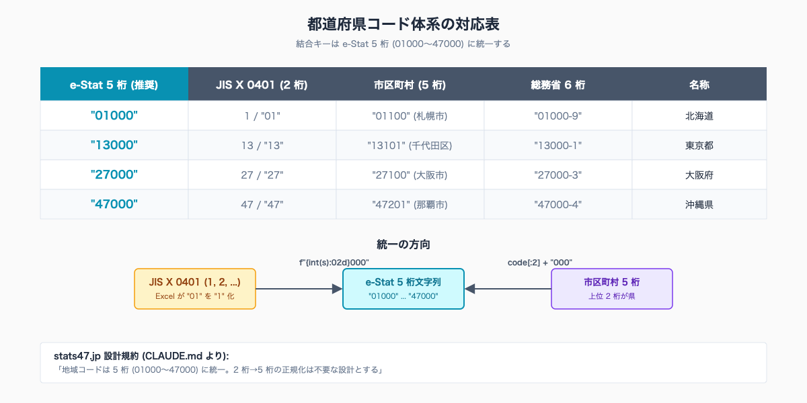
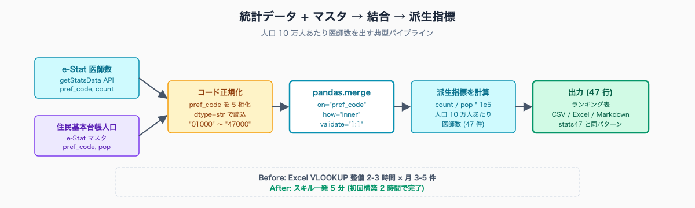
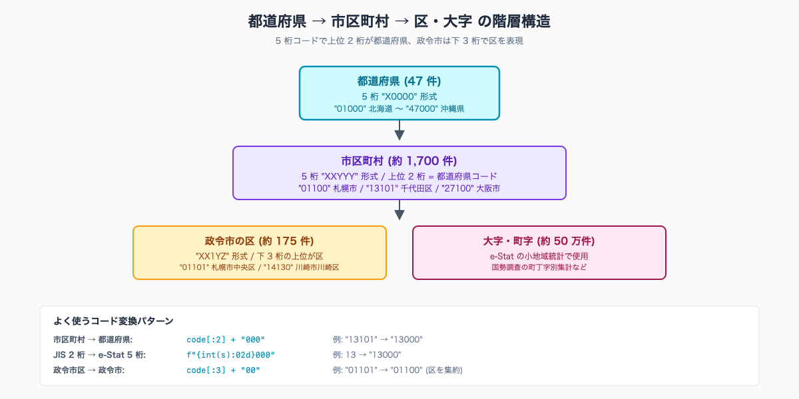

# 都道府県コードと地域階層を扱う — JIS X 0401・e-Stat 5 桁・市区町村コード変換

## はじめに

統計担当・企画課で日常的に発生する作業に「複数の統計を県別・市別に結合して人口当たり指標を出す」というものがある。たとえば e-Stat の医師数と総務省統計局の住民基本台帳人口を結合して「人口 10 万人あたり医師数」を計算する、農林水産省のデータと面積データを結合して「耕地面積あたり収穫量」を計算する、といった場面だ。

ここで詰まるのは ETL のロジックではなく **コードの不一致** である。e-Stat は 5 桁 (01000〜47000)、JIS X 0401 は 2 桁 (01〜47)、市区町村コードは 5 桁 (上位 2 桁が都道府県)、財務省や厚生労働省の一部統計は独自の番号体系を使う。値が同じ「北海道」でも、結合キーの型が違うと SQL は何も返さない。

執筆者は元自治体職員。Claude Code で 47 都道府県の統計サイト stats47.jp（約 2,000 のランキングを毎日自動更新）を個人で開発・運用している。stats47 ではコードを **5 桁 (01000〜47000) に統一** する設計を採り、結合時の事故を構造的に潰している。本記事はその実装規約をそのまま自治体実務に持ち込む手順だ。

人口 30 万人規模の市役所では、企画課・統計担当が「県内市町村別の指標を 1 枚にまとめてほしい」という依頼を月 3-5 件抱える典型例だ。1 件あたり Excel での VLOOKUP 整備に 2-3 時間を費やす職場は珍しくない。Claude Code にコード変換を任せると、**初回構築 2 時間 → 月次運用は 5 分** に収まる。

> **📌 この記事の読み方** — 本記事にはコマンド・設定例・プロンプト例など、やや専門的な記述も出てきます。ですが Claude Code の本質は「それらを自分で覚えること」ではなく、「**やってほしいことを言葉で頼めば、専門的な部分は AI が代わりに用意してくれる**」点にあります。掲載するコマンドや設定は丸暗記の対象ではなく「こう頼めば、こういうものが返ってくる」という地図として読んでください。


<!-- SVG: structure | JIS X 0401・e-Stat 5 桁・市区町村コードの対応表 -->

## TL;DR

- 都道府県コードは **5 桁 (01000〜47000) に統一** する。e-Stat / 市区町村コードと整合する
- JIS X 0401 (2 桁) は表示用に残し、結合キーは 5 桁に正規化する
- 市区町村コードは 5 桁、上位 2 桁が都道府県コード。`SUBSTR(city_code, 1, 2) || '000'` で県コードを取り出せる
- 統計データに人口・面積マスタを結合して「人口当たり」「面積あたり」の派生指標を作るのが定番パターン
- 廃止された旧市町村コードは「変換テーブル」で吸収。総務省「全国地方公共団体コード」改訂履歴が出典

## 背景: なぜ自治体職員にこの課題があるか

自治体の統計実務では、データ源ごとに地域コードの体系が異なるという構造的な問題がある。

- **e-Stat (政府統計の総合窓口)**: API レスポンスの `@code` は 5 桁文字列 (`"01000"` 〜 `"47000"`、市区町村は `"01100"` 等)
- **JIS X 0401 (都道府県コード)**: 2 桁数値 (`1` 〜 `47`)。古い Excel 帳票では「`1`」「`01`」が混在する
- **総務省「全国地方公共団体コード」**: 6 桁 (5 桁 + チェックデジット 1 桁)。`01100-2` のような表記
- **国土交通省・農林水産省の一部統計**: 旧住所体系の独自コード

これに加え、市町村合併でコードが廃止される事例が頻発する。**平成の大合併 (1999-2010)** だけで市町村数は 3,232 → 1,727 と約半減した。旧コードを保持したまま結合すると、新しいコード側にレコードがなく `NULL` が返る。

公的データを商用利用する場合の出典表記も実務上の論点になる。e-Stat のデータは **「政府統計の総合窓口 (e-Stat)」と出典明記すれば商用利用可** (e-Stat 利用規約 https://www.e-stat.go.jp/api/ アクセス日 2026-05-26)。総務省「全国地方公共団体コード」も同様にオープンデータとして公開されている。

## 手順 / 解説

### Step 1: 都道府県コードを 5 桁に正規化する

e-Stat の地域コードは 5 桁文字列が正規。CSV や Excel で `1, 2, 3, ...` の数値で持っているデータは、結合前に必ず 5 桁に揃える。

```python
import pandas as pd

# JIS X 0401 (2 桁数値) → e-Stat 5 桁文字列
def normalize_pref_code(code) -> str:
    """1 or "1" or "01" or "01000" → "01000" """
    s = str(code).strip()
    # 既に 5 桁
    if len(s) == 5 and s.isdigit():
        return s
    # 1-2 桁数値 → 0 埋め 2 桁 → 末尾 "000" 付与
    return f"{int(s):02d}000"

df = pd.read_csv("input.csv", dtype={"pref_code": str})
df["pref_code"] = df["pref_code"].apply(normalize_pref_code)
```

逆方向 (5 桁 → JIS X 0401 2 桁) は単純に `code[:2]` で取り出せる。

```python
# e-Stat 5 桁 → JIS X 0401 2 桁
df["jis_code"] = df["pref_code"].str[:2]
```

### Step 2: 市区町村コードから都道府県コードを取り出す

市区町村コードは 5 桁、上位 2 桁が都道府県コードだ。

| コード | 意味 |
|---|---|
| `01000` | 北海道 (県) |
| `01100` | 北海道 札幌市 |
| `01101` | 北海道 札幌市 中央区 |
| `13000` | 東京都 (都) |
| `13101` | 東京都 千代田区 |

```python
# 市区町村コードから都道府県コードを抽出
df["pref_code"] = df["city_code"].str[:2] + "000"

# 政令市の区まで含むデータの市レベル抽出 (区を捨てる)
def to_city_level(code: str) -> str:
    # 札幌市中央区 01101 → 札幌市 01100
    if code.endswith("1") or code.endswith("2"):
        # 政令市区の最後 1 桁は区番号
        return code[:4] + "0"
    return code
```

実際の政令市の区コード体系はやや複雑なので、Claude Code に「総務省全国地方公共団体コードの政令市区コード一覧を整理して」と頼むのが速い。

### Step 3: 人口マスタと結合して人口当たり指標を出す

e-Stat から取得した医師数データに住民基本台帳人口を結合する例。両方とも事前に `pref_code` を 5 桁化しておく。

```python
import pandas as pd

# 医師数 (e-Stat 取得済み、整形済み CSV)
df_doctor = pd.read_csv("doctors_2024.csv")  # pref_code, doctor_count

# 住民基本台帳人口 (e-Stat 取得済み、整形済み CSV)
df_pop = pd.read_csv("population_2024.csv")  # pref_code, population

# 結合
df = df_doctor.merge(df_pop, on="pref_code", how="inner", validate="1:1")

# 人口 10 万人あたり医師数
df["doctors_per_100k"] = df["doctor_count"] / df["population"] * 100_000
df = df.sort_values("doctors_per_100k", ascending=False)

print(df[["pref_code", "doctors_per_100k"]].head(10))
```

`validate="1:1"` をつけると、結合キーがどちらかで重複していたときに例外を投げる。コード正規化の失敗を早期に発見できる。

stats47 では「人口当たり医師数」「世帯当たり年収」「面積あたり耕地」「昼夜間人口比率」「入港船舶トン数」など、約 2,000 のランキングを同様の結合パターンで生成している。具体例は https://stats47.jp/ranking/doctors-per-100k や https://stats47.jp/ranking/household-income で公開している。


<!-- SVG: flow | 統計データ + マスタ → 結合 → 派生指標 -->

### Step 4: 都道府県マスタを作る

47 都道府県の名称・コードは固定なので、CSV または JSON 形式で 1 つマスタを作って使い回す。

```csv
pref_code,jis_code,pref_name,pref_kana,region
01000,01,北海道,ホッカイドウ,北海道
02000,02,青森県,アオモリケン,東北
03000,03,岩手県,イワテケン,東北
13000,13,東京都,トウキョウト,関東
27000,27,大阪府,オオサカフ,近畿
47000,47,沖縄県,オキナワケン,沖縄
```

Claude Code に「47 都道府県の `pref_code`, `jis_code`, `pref_name`, `pref_kana`, `region` を CSV で作って」と頼めば 1 発で出る。

ここから先は有料部分:

### Step 5: 市町村合併で廃止されたコードを吸収する

平成の大合併で廃止された市町村コードを新コードに変換する処理は、過去データを使う限り避けて通れない。

```python
# 廃止コード → 後継コード の変換テーブル (一部抜粋)
MERGE_MAP = {
    # 旧コード: (新コード, 合併年月)
    "20208": ("20210", "2005-10"),  # 中野市 (長野県) は旧コード 20208 → 20210
    "08221": ("08220", "2006-03"),  # 旧 茨城県岩井市 → 坂東市
    "40610": ("40229", "2005-10"),  # 旧 福岡県前原町 → 糸島市
    # 全件は総務省「市町村合併資料集」参照
}

def resolve_city_code(old_code: str) -> str:
    if old_code in MERGE_MAP:
        return MERGE_MAP[old_code][0]
    return old_code

df["city_code_current"] = df["city_code"].apply(resolve_city_code)
```

変換テーブルは総務省「市町村合併資料集」(https://www.soumu.go.jp/gapei/) を出典として年度別に管理する。Claude Code には「総務省の市町村合併データから変換テーブルの JSON を作って」と頼めば下書きが出る。**最終的なコード対応の正誤確認は総務省一次資料に当たること** (合併は本来 1:1 ではなく N:1 や境界変更を伴うため、機械生成のテーブルは要人手レビュー)。

### Step 6: 地域区分 (8 地方区分) で集約する

47 都道府県を 8 地方 (北海道・東北・関東・中部・近畿・中国・四国・九州・沖縄) で集約するケースも頻出する。前項のマスタに `region` 列を含めておけば、結合 1 回で集約できる。

```python
df_merged = df.merge(df_pref_master[["pref_code", "region"]], on="pref_code")
df_by_region = df_merged.groupby("region")["doctor_count"].sum().reset_index()
```

地方区分の定義は組織によって揺れる (沖縄を九州に含めるか別建てか、新潟を関東・中部・北陸のどこに置くか)。**マスタ側で 1 つに決めて統一する** のが事故を防ぐ最良の手段だ。


<!-- SVG: infographic | 都道府県 → 市区町村 → 大字 の階層図 -->

### Step 7: 結合エラーを早期検出するチェックリスト

結合処理を運用化する前に、以下のチェックを `.claude/skills/<skill>/run.sh` に組み込む。

```python
def validate_merge(df_left, df_right, on: str) -> None:
    """結合キーの整合性をチェック"""
    left_keys = set(df_left[on])
    right_keys = set(df_right[on])

    only_left = left_keys - right_keys
    only_right = right_keys - left_keys

    if only_left:
        print(f"⚠️ 左テーブルのみに存在するキー ({len(only_left)} 件): "
              f"{sorted(only_left)[:5]}...")
    if only_right:
        print(f"⚠️ 右テーブルのみに存在するキー ({len(only_right)} 件): "
              f"{sorted(only_right)[:5]}...")

    # 47 都道府県データなら 47 件揃っているはず
    if len(left_keys) != 47 or len(right_keys) != 47:
        print(f"⚠️ 47 県揃っていない: 左 {len(left_keys)}, 右 {len(right_keys)}")
```

実務では「東京都 (13000) が片方のテーブルでは `'13'` で持たれていた」「岐阜県 (21000) が誤って `21001` で記録されていた」といったケースが頻発する。**結合前にキーの集合差を出力する** だけで、原因不明の `NULL` を 9 割減らせる。

## よくあるつまずきと回避策

- ⚠️ JIS X 0401 の数値型 (1, 2, 3, ...) を文字列化せずに e-Stat の `'01000'` と結合 → 必ず文字列で正規化
- ⚠️ Excel が `01` を `1` に自動変換する → CSV 読み込み時 `dtype={"pref_code": str}` を必ず指定
- ⚠️ 政令市区コードと市コードが混在 → どのレベルで集計するか先に決め、変換関数で揃える
- ⚠️ 合併で廃止された旧コードが新しいマスタにない → 変換テーブルで吸収、または旧コードのレコードを除外
- ⚠️ 地方区分が組織で違う → マスタの `region` 列で 1 つに決め打ちする
- ⚠️ `.diff()` や `.merge()` で行数が想定外に増減 → `validate="1:1"` で早期検出

## 応用 / 次に読むべき記事

- [#05 pandas / DuckDB で派生指標を作る](../05-pandas-duckdb-derived-metrics/draft.md) — 結合した後の派生指標計算の本格パターン
- [#07 e-Stat 統計の前年比較・5 年トレンド](../07-year-on-year-diff/draft.md) — コード正規化済みデータで時系列処理
- [#08 他自治体ベンチマーク表を 5 分で作る](../08-benchmark-table-5min/draft.md) — コード変換を前提とした実務出力例

stats47.jp の実例:

- https://stats47.jp/ranking/doctors-per-100k — 人口 10 万人あたり医師数 (結合パターンの典型)
- https://stats47.jp/ranking/household-income — 世帯当たり年収 (結合 + 派生指標)
- https://stats47.jp/areas/13000 — 東京都プロフィール (各種指標の県別ダッシュボード)

<!-- circulation-footer:v2 -->

## このシリーズについて

「公務員のための e-Stat × Claude Code 実務ガイド」全 12 本のシリーズ第 06 回。e-Stat 業務の効率化に関心がある方は、マガジン購読がお得です。

▶️ マガジン: 公務員のための e-Stat × Claude Code 実務ガイド
🔗 https://note.com/stats47/m/m1b836e4c8dce

姉妹マガジン「公務員 × Claude Code 実務活用ガイド (全 33 本)」では議事録・議会答弁・条例レビューなど統計以外の業務効率化を扱っています。

▶️ stats47.jp: 本記事で紹介した手順で運用している 47 都道府県統計サイト (約 2,000 のランキングを毎日自動更新)。動いている実例として参考にどうぞ。
🔗 https://stats47.jp
