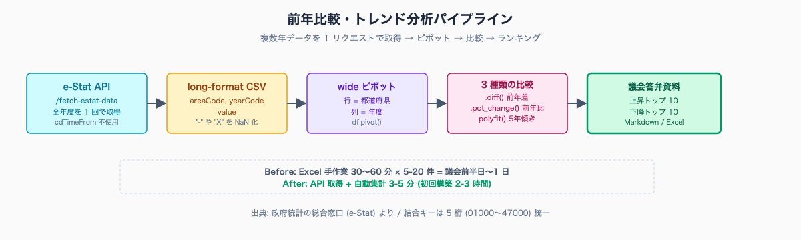
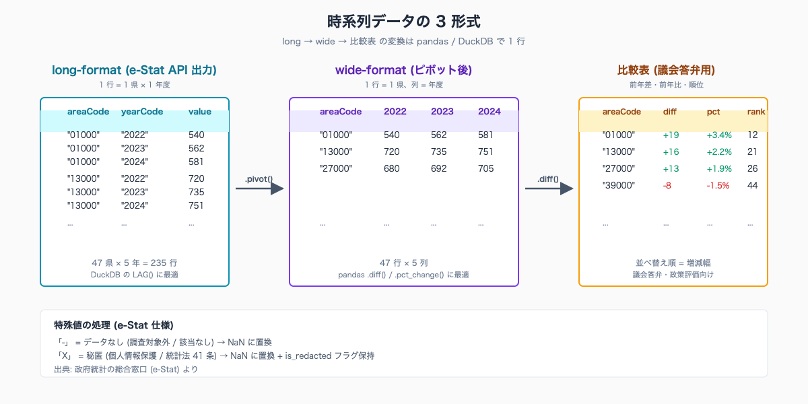
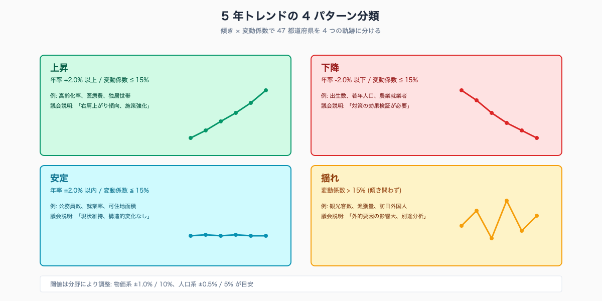

💡 **この記事を書いた私から、Claude Code 学習でひとつだけご紹介させてください（PR）**

この記事を読んでいる方は、Claude Code を業務に取り入れようとしているか、すでに使い始めているのだと思います。

独学でも十分に使えますが、「もっと体系的に学びたい」「詰まったときにすぐサポートを受けたい」という方には、Claude Code に特化した研修プログラムも選択肢のひとつです。

このリンクから申し込んでいただくと、私に紹介料が入ります。それでもお伝えするのは、Claude Code を業務で使いこなしたいすべての方に本当に役立つと思っているからです。

{{AFFILIATE_BANNER:ai_agent_camp}}

▶ Claude Code 特化研修「AI Agent Camp」の詳細はこちら（無料相談あり）

---

---

# e-Stat 統計の前年比較・5 年トレンド・増減ランキングを自動化する

## はじめに

「前年と比べて何がどれだけ変わったか」「ここ 5 年でどの県が伸びたか」「増減幅が大きい上位 10 県を抽出して」——統計担当・企画課・政策秘書から、議会答弁準備の時期になると毎日のように飛んでくる依頼です。

e-Stat の Web 画面から年度を 1 つずつダウンロードし、Excel で並べ直し、ピボットを組み、増減幅で並べ替える。1 つの指標で 30-60 分、依頼が 5 件来れば半日が消えます。

e-Stat には API があり、複数年を 1 リクエストで取得できます。Claude Code に処理を任せれば **30-60 分 → 3-5 分** で終わります。

**こんな方に向けた記事です**

- 議会答弁の準備期に前年比較・トレンド資料を何件も抱える統計担当・企画課の職員
- e-Stat から年度を 1 つずつ落として Excel で並べ直す作業に時間を取られている方
- 「ここ 5 年でどの県が伸びたか」を短時間で出せるようにしたい方

**この記事でわかること**

- e-Stat から複数年データを一括取得し、前年比較・5 年トレンドを自動集計する手順
- pandas と DuckDB の使い分けと、増減ランキングを議会資料向けに整える流れ
- 欠損 (-) と秘匿 (X) を区別して処理し、後から根拠を説明できる状態にする方法

執筆者は元自治体職員です。Claude Code で 47 都道府県の統計サイト stats47.jp（約 2,000 のランキングを毎日自動更新）を個人で開発・運用しています。

stats47 では各指標を年度横断で扱い、最新年度を取得して前年度・5 年前と比較する処理を毎日バッチで回しています。本記事の手順は、その実装を自治体の議会答弁準備にそのまま転用したものです。

人口 20 万人規模の市役所では、9 月議会前の 2 週間に統計担当が前年比較資料を 15-20 件抱える典型例があります。1 件 1 時間の Excel 作業を **API 取得 + 自動集計に置き換えると、月次 30 時間の節約** に届きます。

> **📌 この記事の読み方** — 本記事にはコマンド・設定例・プロンプト例など、やや専門的な記述も出てきます。ですが Claude Code の本質は「それらを自分で覚えること」ではなく、「**やってほしいことを言葉で頼めば、専門的な部分は AI が代わりに用意してくれる**」点にあります。掲載するコマンドや設定は丸暗記の対象ではなく「こう頼めば、こういうものが返ってくる」という地図として読んでください。


<!-- SVG: flow | 複数年取得 → ピボット → 前年比較 → ランキング -->

## 背景: なぜ自治体職員にこの課題があるか

自治体の統計実務で「前年比較」が頻出するのは、議会答弁・政策評価・補助金申請の 3 つで「直近の変化」が問われるからです。

議会では「昨年と比べてどうなったか」「悪化していないか」を必ず問われます。政策評価書では KGI・KPI の前年比達成率を記載します。補助金申請書では「直近 3 年の推移」「全国平均との乖離」「上昇/下降トレンド」のいずれかが必須項目になります。

e-Stat の Web 画面で年度を 1 年ずつクリックして CSV をダウンロードし、Excel で列を揃え、ピボットを組み、増減幅で並べ替える——この一連の作業を「政府統計の総合窓口 (e-Stat) より」と出典記載まで含めて 1 つの指標で約 30-60 分かかります。

これが 5 指標 × 2 種類の切り口 (前年比 / 5 年トレンド) になると半日が溶けてしまいます。

e-Stat の API は **複数年データを 1 リクエストで取得** できます。さらに `lvArea=2` で 47 都道府県の全件、`lvTime=1` または時間軸指定で全期間が一括で返ってきます。これを Claude Code に整形させると、Excel の手作業が消えます。

なお e-Stat には「データなし (`-`)」と「秘匿 (`X`)」の 2 種類の特殊値があります。前者は調査対象外・該当なし、後者は個人情報保護や統計法第 41 条による意図的な非開示で、両者は意味が違います。集計時にどちらも `NaN` に丸めると、後で「なぜここが空欄か」を説明できなくなります。

## 手順 / 解説

### Step 1: 複数年データを 1 リクエストで取得

`/fetch-estat-data` スキル (`.claude/skills/estat/fetch-estat-data/SKILL.md`) を使います。`cdTimeFrom`/`cdTimeTo` は使わず、全年度を取得してメモリ上で必要年度を抽出します。

```bash
# 例: 都道府県別世帯当たり年間収入 (家計調査年報) の全年度
claude /fetch-estat-data \
  --stats-data-id 0003425895 \
  --lv-area 2 \
  --out-dir .local/estat/household-income/
```

レスポンスは年度横断の long-format です。`yearCode` (例: "2020", "2021", "2022") と `areaCode` (5 桁)、`value` (実測値) を持ちます。

```python
import pandas as pd

df = pd.read_csv(".local/estat/household-income/raw.csv",
                 dtype={"yearCode": str, "areaCode": str})

# 都道府県のみ抽出 (areaCode 末尾 "000")
df = df[df["areaCode"].str.endswith("000") & (df["areaCode"] != "00000")]

# 直近 5 年に絞る
df = df[df["yearCode"].astype(int) >= 2020]
print(df.head())
```

### Step 2: pandas で前年比較を計算

long-format を wide に変換し、`.diff()` または `.pct_change()` で前年差・前年比を計算します。

```python
# long → wide (行=都道府県、列=年度)
wide = df.pivot(index="areaCode", columns="yearCode", values="value")

# 前年差 (絶対量)
wide_diff = wide.diff(axis=1)

# 前年比 (%)
wide_pct = wide.pct_change(axis=1) * 100

# 最新年度の前年比だけ取り出す
latest_year = wide.columns.max()
prev_year = sorted(wide.columns)[-2]

result = pd.DataFrame({
    "areaCode": wide.index,
    f"value_{prev_year}": wide[prev_year].values,
    f"value_{latest_year}": wide[latest_year].values,
    "diff": wide_diff[latest_year].values,
    "pct": wide_pct[latest_year].values,
})

# 増減幅で並べ替え (絶対値の大きい順)
result = result.sort_values("diff", key=abs, ascending=False)
print(result.head(10))
```

### Step 3: DuckDB SQL で `LAG()` を使う

pandas より SQL が読みやすい場面では DuckDB を使います。DuckDB は単一ファイル DB で、Python パッケージで簡単に立ち上がります。

```python
import duckdb

con = duckdb.connect(":memory:")
con.execute("""
    CREATE TABLE stats AS
    SELECT * FROM read_csv_auto('.local/estat/household-income/raw.csv',
                                types={'areaCode': 'VARCHAR', 'yearCode': 'VARCHAR'});
""")

result = con.execute("""
    SELECT
      areaCode,
      yearCode,
      value,
      LAG(value) OVER (PARTITION BY areaCode ORDER BY yearCode) AS prev_value,
      value - LAG(value) OVER (PARTITION BY areaCode ORDER BY yearCode) AS diff,
      ROUND(
        (value - LAG(value) OVER (PARTITION BY areaCode ORDER BY yearCode))
        * 100.0 / NULLIF(LAG(value) OVER (PARTITION BY areaCode ORDER BY yearCode), 0),
        1
      ) AS pct
    FROM stats
    WHERE areaCode LIKE '%000' AND areaCode != '00000'
      AND yearCode >= '2020'
    ORDER BY areaCode, yearCode;
""").fetchdf()
```

`LAG()` を使うと「前の行 (前年度) の値」を参照できます。`PARTITION BY areaCode` で都道府県ごとに区切り、`ORDER BY yearCode` で年度順に並べます。

### Step 4: 5 年トレンドの傾きを計算

直近 5 年で「右肩上がりか右肩下がりか」を 1 つの数値で表すには線形回帰の傾きを使います。

```python
import numpy as np

def calc_slope(group):
    years = group["yearCode"].astype(int).values
    values = group["value"].values
    if len(years) < 3:
        return np.nan
    slope, intercept = np.polyfit(years, values, 1)
    return slope

slope_per_pref = df.groupby("areaCode").apply(calc_slope).reset_index(name="slope_per_year")
slope_per_pref = slope_per_pref.sort_values("slope_per_year", ascending=False)

print("【上昇トップ 5】")
print(slope_per_pref.head(5))
print("\n【下降トップ 5】")
print(slope_per_pref.tail(5))
```

`slope_per_year` は「年あたり何単位変化したか」を表します。世帯当たり年収なら「年あたり何円増えたか」、人口なら「年あたり何人減ったか」になります。

ここから先は有料部分です:

### Step 5: 増減ランキング (議会答弁用) を出力

増減幅を「絶対値の大きい順」「上昇トップ / 下降トップ」の 2 軸で並べ替えると、議会答弁の根拠資料として読みやすくなります。

```python
import pandas as pd

# 前年比 (Step 2 の result を再利用)
result_sorted = result.dropna(subset=["diff"]).copy()

top_up = result_sorted.sort_values("diff", ascending=False).head(10)
top_down = result_sorted.sort_values("diff", ascending=True).head(10)

# Markdown 出力 (議会資料に貼れる形式)
def to_markdown_table(df: pd.DataFrame, title: str) -> str:
    lines = [f"## {title}", "",
             "| 順位 | 都道府県 | 前年値 | 当年値 | 増減 | 増減率 |",
             "|---|---|---|---|---|---|"]
    for i, row in enumerate(df.itertuples(), start=1):
        lines.append(
            f"| {i} | {row.areaCode} | {row[2]:,.0f} | {row[3]:,.0f} "
            f"| {row.diff:+,.0f} | {row.pct:+.1f}% |"
        )
    return "\n".join(lines)

md_up = to_markdown_table(top_up, "前年比 上昇トップ 10")
md_down = to_markdown_table(top_down, "前年比 下降トップ 10")

with open("output/yoy-ranking.md", "w") as f:
    f.write(md_up + "\n\n" + md_down + "\n\n*出典: 政府統計の総合窓口 (e-Stat) より*\n")
```

ファイル末尾に **「出典: 政府統計の総合窓口 (e-Stat) より」** を必ず付けます (e-Stat 利用規約 https://www.e-stat.go.jp/api/ アクセス日 2026-05-26)。

### Step 6: 欠損値 (`-` / `X`) を処理する

e-Stat の値には 3 種類の特殊値があります。

- **`-`（データなし）**: 調査対象外・該当なしを意味します。`NaN` に置換し、集計から除外します。
- **`X`（秘匿）**: 個人情報保護・統計法 41 条による意図的な非開示です。`NaN` に置換しつつ、別カラムで `is_redacted=True` を保持します。
- **`*`（注釈付き）**: 出典で説明がある値です。値はそのまま使い、注釈を別表に記録します。
- **空欄（未調査）**: `NaN` に置換します。

```python
import numpy as np

REDACTED_FLAGS = {"-", "X", "x", "‐", ""}

def parse_value(raw):
    if isinstance(raw, str) and raw.strip() in REDACTED_FLAGS:
        return np.nan
    try:
        return float(raw)
    except (ValueError, TypeError):
        return np.nan

df["value"] = df["raw_value"].apply(parse_value)
df["is_redacted"] = df["raw_value"].isin(["X", "x"])
```

議会答弁で「該当県は X (秘匿) のため記載していません」と書く必要がある場面が頻出します。`is_redacted` フラグを保持しておくと、後段で「欠損が多い県」と「秘匿が多い県」を区別して説明できます。


<!-- SVG: structure | long / wide / pivot 形式の比較 -->

### Step 7: 5 年トレンドを 4 パターンに分類

実務では「上昇」「下降」「安定」「揺れ」の 4 分類で集計すると議会資料として読みやすくなります。

```python
def classify_trend(slope: float, values: list[float]) -> str:
    if np.isnan(slope):
        return "データ不足"

    mean_value = np.nanmean(values)
    if mean_value == 0 or np.isnan(mean_value):
        return "データ不足"

    # 傾きを「平均値に対する年率」に正規化
    annual_change_pct = slope / mean_value * 100
    cv = np.nanstd(values) / mean_value  # 変動係数

    if cv > 0.15:
        return "揺れ"
    elif annual_change_pct > 2.0:
        return "上昇"
    elif annual_change_pct < -2.0:
        return "下降"
    else:
        return "安定"

# 都道府県別のパターン分類
classified = df.groupby("areaCode").apply(
    lambda g: classify_trend(calc_slope(g), g["value"].tolist())
).value_counts()

print(classified)
# 上昇: 12
# 下降: 18
# 安定: 14
# 揺れ: 3
```

閾値 (2.0%, 15%) は分野によって調整します。物価系は変動が小さいので 1.0% / 10%、人口系は 0.5% / 5% が目安です。


<!-- SVG: infographic | 上昇 / 下降 / 安定 / 揺れ の視覚化 -->

## よくあるつまずきと回避策

- ⚠️ `cdTimeFrom`/`cdTimeTo` を使って年度範囲指定 → キャッシュが分断され API 呼び出しが増えます。全年度取得 + メモリフィルタが正解です
- ⚠️ `value` カラムに `-` や `X` が混じり数値型変換が失敗 → `parse_value()` で先に置換します
- ⚠️ `.pct_change()` が `0` の前年で `inf` を返す → `NULLIF(prev, 0)` または事前に `0` を `NaN` に置換します
- ⚠️ pandas pivot で重複行が `ValueError` → `pivot_table(aggfunc="sum")` で集約します
- ⚠️ 5 年トレンドのデータ点が 3 年未満 → 傾き計算をスキップします (`np.nan` を返します)
- ⚠️ 出典表記を忘れる → 出力テンプレートに「政府統計の総合窓口 (e-Stat) より」を必ず含めます

## 応用 / 次に読むべき記事

- [#05 pandas / DuckDB で派生指標を作る](../05-pandas-duckdb-derived-metrics/draft.md) — 結合と派生指標の本格パターン
- [#06 都道府県コードと地域階層を扱う](../06-prefecture-code-and-merge/draft.md) — 結合キー正規化の前段
- [#08 他自治体ベンチマーク表を 5 分で作る](../08-benchmark-table-5min/draft.md) — トレンドデータを議会資料に整形

stats47.jp の実例:

- https://stats47.jp/ranking/household-income — 世帯当たり年収の年度横断ランキング
- https://stats47.jp/ranking/care-worker-income — 介護職年収の前年比較
- https://stats47.jp/areas/13000 — 東京都プロフィール (各指標の 5 年推移)

<!-- circulation-footer:v2 -->

## このシリーズについて

「公務員のための e-Stat × Claude Code 実務ガイド」全 12 本のシリーズ第 07 回。e-Stat 業務の効率化に関心がある方は、マガジン購読がお得です。

▶️ マガジン: 公務員のための e-Stat × Claude Code 実務ガイド
🔗 https://note.com/stats47/m/m1b836e4c8dce

姉妹マガジン「公務員 × Claude Code 実務活用ガイド (全 33 本)」では議事録・議会答弁・条例レビューなど統計以外の業務効率化を扱っています。

▶️ stats47.jp: 本記事で紹介した手順で運用している 47 都道府県統計サイト (約 2,000 のランキングを毎日自動更新)。動いている実例として参考にどうぞ。
🔗 https://stats47.jp
