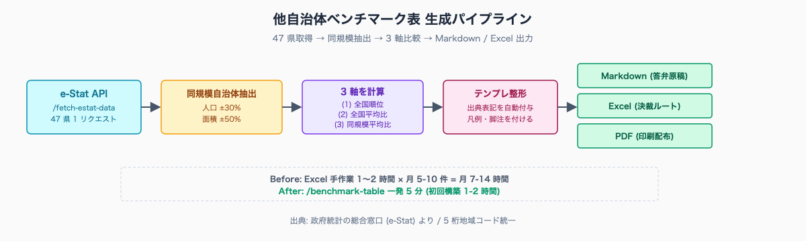
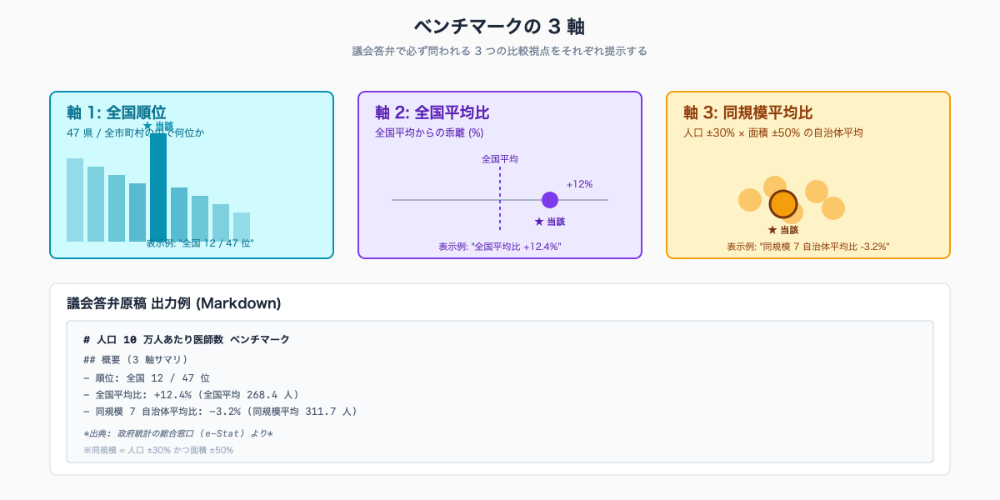
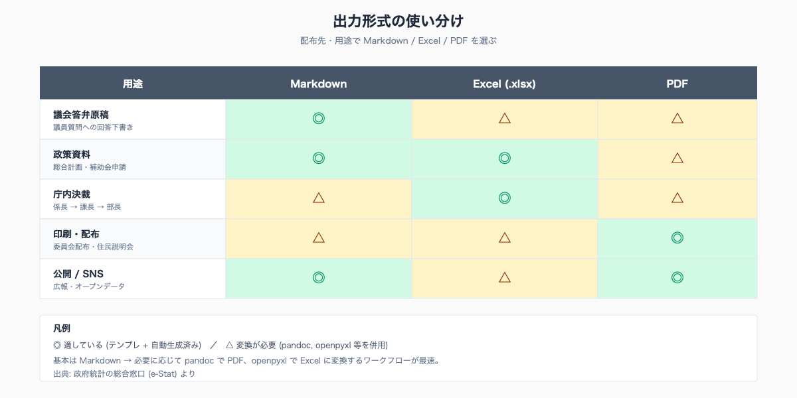

# 他自治体ベンチマーク表を 5 分で作る — 議会答弁・議事用の比較資料を自動生成

## はじめに

自治体職員にとって **「他自治体と比べてどうか」** は最頻出の問いだ。議会答弁では「県内 X 市と比べて高いのか低いのか」、政策資料では「同規模自治体の平均水準は」、補助金申請書では「全国平均との乖離は」。同じデータを異なる軸 (順位 / 全国平均比 / 同規模比) で何度も出し直す。

統計担当が Excel で「県内市町村を縦に並べ、当該指標を横に並べ、全国平均を計算し、人口規模の似た自治体を抽出してハイライト」を作る作業は 1 案件 1〜2 時間。これが議会前の繁忙期に 5-10 件並行で来ると、夜は溶ける。

執筆者は元自治体職員。Claude Code で 47 都道府県の統計サイト stats47.jp（約 2,000 のランキングを毎日自動更新）を個人で開発・運用している。stats47 では 47 県データの取得・整形・配信を毎日バッチで回しており、本記事の「ベンチマーク表 5 分生成」も同じ仕組みを応用したものだ。

人口 10-30 万人規模の市役所で、企画課・財政課・議会事務局が「ベンチマーク資料を翌朝までに」と頼む頻度は月 5-10 件が典型例。**1 件 1.5 時間 → 5 分** に短縮できれば、月 7-14 時間の節約になる。


<!-- SVG: flow | 47 県データ → 同規模抽出 → 比較表 → Markdown / Excel -->

## TL;DR

- ベンチマーク資料は「順位」「全国平均比」「同規模比」の **3 軸** で出す
- 47 県データの一括取得は `/fetch-estat-data` (e-Stat API 経由、`cdArea` は使わない)
- 同規模自治体の抽出は「人口 ±30%」「面積 ±50%」を組み合わせるとブレが少ない
- Markdown 表は議会答弁原稿に貼れる形式、Excel は決裁ルートに乗せる形式
- 「政府統計の総合窓口 (e-Stat) より」の出典表記を必ず付ける (商用利用可、出典明記必須)

## 背景: なぜ自治体職員にこの課題があるか

自治体の「他自治体比較」は、3 つの典型シーンで発生する。

1. **議会答弁準備**: 「X 市と比べて多いのか少ないのか」「同規模自治体の中で何位か」 — 議員が質問しそうな比較軸を先回りで全部出す
2. **政策エビデンス**: 「人口 N 万人規模の自治体で先行事例は」 — 補助金申請書・総合計画策定で必須
3. **議事・委員会資料**: 「ご近所の自治体ではどうしているか」 — 県内市町村の取り組み比較

これらは「同じ指標を違う軸で切り出す」作業の繰り返しだ。Excel で県内市町村のデータを縦に並べ、全国データを別シートに置き、自治体規模で並べ替えて該当行をハイライト——慣れていても 1 件 1〜2 時間かかる。

e-Stat の API は 47 県データを 1 リクエストで返す。市区町村レベルも同じ構造で取得できる。Claude Code に「人口 10 万人前後の自治体で当該指標が高い順 10 件、自分の自治体に赤いマーカー」と頼めば、表が 5 分で完成する。

e-Stat 利用規約では商用利用可、ただし **「出典を明記すること」が条件** (https://www.e-stat.go.jp/api/ アクセス日 2026-05-26)。議会資料の脚注に「政府統計の総合窓口 (e-Stat) より」を 1 行入れれば完了する。

## 手順 / 解説

### Step 1: 47 県データを 1 リクエストで取得

`/fetch-estat-data` スキルで対象指標を取得する。たとえば「都道府県別の人口 10 万人あたり医師数」なら、`statsDataId` を指定して 1 コマンドで取れる。

```bash
claude /fetch-estat-data \
  --stats-data-id 0003445078 \
  --lv-area 2 \
  --year 2024 \
  --out-dir .local/estat/doctors-per-100k/
```

`--lv-area 2` は都道府県レベル、`3` は市区町村レベル。`cdArea` で地域指定すると **キャッシュが分断され API 呼び出しが増える** ため、全件取得してメモリでフィルタする (CLAUDE.md 規約)。

レスポンスから当該指標を CSV で受け取り、`areaCode` を 5 桁で正規化しておく。

```python
import pandas as pd

df = pd.read_csv(".local/estat/doctors-per-100k/values.csv",
                 dtype={"areaCode": str})
df = df[df["areaCode"].str.endswith("000") & (df["areaCode"] != "00000")]
print(f"取得件数: {len(df)} 件")  # 47 件
```

### Step 2: 「同規模自治体」を定義する

同規模の判定基準は組織により揺れるが、実務では下記のいずれかで十分だ。

| 軸 | 範囲 | 出典 |
|---|---|---|
| 人口 | 対象自治体 ±30% | 住民基本台帳人口 (e-Stat) |
| 面積 | 対象自治体 ±50% | 国土地理院「全国都道府県市区町村別面積調」 |
| 人口密度 | 対象自治体 ±50% | 上記 2 つから派生 |
| 一般会計予算 | 対象自治体 ±30% | 総務省「市町村別決算状況調」 |

人口だけで絞ると都市/地方の構造差が混じる。**人口 ±30% かつ面積 ±50%** で絞ると、生活実態が近い自治体が残る。

```python
def find_similar_areas(df, target_code: str,
                       pop_tolerance: float = 0.30,
                       area_tolerance: float = 0.50):
    target = df[df["areaCode"] == target_code].iloc[0]

    pop_lo = target["population"] * (1 - pop_tolerance)
    pop_hi = target["population"] * (1 + pop_tolerance)
    area_lo = target["area_km2"] * (1 - area_tolerance)
    area_hi = target["area_km2"] * (1 + area_tolerance)

    similar = df[
        (df["population"].between(pop_lo, pop_hi)) &
        (df["area_km2"].between(area_lo, area_hi)) &
        (df["areaCode"] != target_code)
    ]
    return similar
```

### Step 3: 3 軸の比較指標を計算

「順位」「全国平均比」「同規模比」の 3 軸で当該指標を切り出す。

```python
def calc_3axis(df, target_code: str, value_col: str):
    target_value = df.loc[df["areaCode"] == target_code, value_col].iloc[0]

    # 軸 1: 順位 (大きい順)
    df_sorted = df.sort_values(value_col, ascending=False).reset_index(drop=True)
    rank = int(df_sorted[df_sorted["areaCode"] == target_code].index[0]) + 1
    total = len(df_sorted)

    # 軸 2: 全国平均比
    national_mean = df[value_col].mean()
    pct_vs_national = (target_value / national_mean - 1) * 100

    # 軸 3: 同規模自治体平均比
    similar = find_similar_areas(df, target_code)
    similar_mean = similar[value_col].mean() if len(similar) > 0 else None
    pct_vs_similar = ((target_value / similar_mean - 1) * 100
                      if similar_mean else None)

    return {
        "rank": f"{rank} / {total}",
        "national_mean": national_mean,
        "pct_vs_national": pct_vs_national,
        "similar_count": len(similar),
        "similar_mean": similar_mean,
        "pct_vs_similar": pct_vs_similar,
    }
```


<!-- SVG: infographic | 順位 / 全国平均比 / 同規模比 の 3 軸 -->

### Step 4: Markdown 表に整形

議会答弁原稿に貼れる形式で出力する。

```python
def to_markdown_benchmark(df, target_code: str, value_col: str,
                          label: str, unit: str) -> str:
    result = calc_3axis(df, target_code, value_col)
    similar = find_similar_areas(df, target_code)
    target_row = df[df["areaCode"] == target_code].iloc[0]

    lines = [
        f"# {label} ベンチマーク",
        "",
        "## 概要 (3 軸サマリ)",
        "",
        f"- **順位**: 全国 {result['rank']} 位",
        f"- **全国平均比**: {result['pct_vs_national']:+.1f}% "
        f"(全国平均 {result['national_mean']:,.1f}{unit})",
        f"- **同規模 {result['similar_count']} 自治体平均比**: "
        f"{result['pct_vs_similar']:+.1f}% "
        f"(同規模平均 {result['similar_mean']:,.1f}{unit})",
        "",
        "## 同規模自治体との比較",
        "",
        "| 順位 | 自治体 | " + label + " | 当該自治体比 |",
        "|---|---|---|---|",
    ]
    target_value = target_row[value_col]
    similar_sorted = similar.sort_values(value_col, ascending=False)
    for i, row in enumerate(similar_sorted.itertuples(), start=1):
        diff_pct = (getattr(row, value_col) / target_value - 1) * 100
        lines.append(
            f"| {i} | {row.areaName} | "
            f"{getattr(row, value_col):,.1f}{unit} | {diff_pct:+.1f}% |"
        )
    lines.append("")
    lines.append("*出典: 政府統計の総合窓口 (e-Stat) より*")
    return "\n".join(lines)
```

ファイル末尾の **出典表記を忘れない**。e-Stat 利用規約で必須項目になっている。

### Step 5: Excel / PDF 出力に変換

Markdown を渡せば、Claude Code がそのまま Excel に変換するスクリプトも書ける。`openpyxl` で書き出すか、`pandoc` で PDF にする。

```python
# Excel 出力
import openpyxl

wb = openpyxl.Workbook()
ws = wb.active
ws.title = "ベンチマーク"

# ヘッダー行
ws.append(["順位", "自治体", "値", "当該自治体比"])
for i, row in enumerate(similar_sorted.itertuples(), start=1):
    diff_pct = (getattr(row, value_col) / target_value - 1) * 100
    ws.append([i, row.areaName, getattr(row, value_col), f"{diff_pct:+.1f}%"])

# 出典行
ws.append([])
ws.append(["出典: 政府統計の総合窓口 (e-Stat) より"])
wb.save("output/benchmark.xlsx")
```

PDF にしたい場合は `pandoc benchmark.md -o benchmark.pdf --pdf-engine=lualatex -V documentclass=ltjarticle` (日本語 LaTeX 環境が必要)。簡易には Word から PDF 保存でも構わない。


<!-- SVG: structure | Markdown / Excel / PDF の使い分け表 -->

### Step 6: スキル化して再利用

毎回コマンドを打つ代わりに `.claude/skills/benchmark-table/SKILL.md` としてスキル化しておくと、`/benchmark-table` で呼び出せる。

```markdown
# /benchmark-table

他自治体ベンチマーク表を生成する。

## 使い方

```bash
claude /benchmark-table \
  --indicator <stats-data-id> \
  --target <area-code (5 桁)> \
  --pop-tolerance 0.30 \
  --area-tolerance 0.50 \
  --output md
```

## 出力

- output/benchmark-<indicator>-<area>.md (Markdown)
- output/benchmark-<indicator>-<area>.xlsx (Excel)
```

詳しいスキル化の手順は [#10 Claude Code スキル化で月次定型業務を自動化する](../10-claude-skills-routinize/draft.md) に書いた。

## stats47 で動いている実例

本記事の手順は stats47.jp で毎日動いている。

- https://stats47.jp/ranking/doctors-per-100k — 人口 10 万人あたり医師数の 47 県ランキング
- https://stats47.jp/ranking/household-income — 世帯当たり年収
- https://stats47.jp/ranking/care-worker-income — 介護職年収
- https://stats47.jp/ranking/daytime-population-ratio — 昼夜間人口比率
- https://stats47.jp/areas/13000 — 東京都の都道府県プロフィール (各指標 + 強み・弱み + 5 年推移)

47 県分のデータ取得 → 整形 → 配信を毎日バッチで自動化している。同じ仕組みを「自分の自治体周辺だけ」「県内市町村だけ」に縮小して回すと、本記事のベンチマーク表になる。

## よくあるつまずきと回避策

- ⚠️ `cdArea` で地域指定 → キャッシュ分断、全国取得 + メモリフィルタが正解 (CLAUDE.md 規約)
- ⚠️ Excel が `01000` を `1000` に丸める → CSV 読み込み時 `dtype={"areaCode": str}` を必ず指定
- ⚠️ 同規模の閾値が緩すぎて 30 件返る / 厳しすぎて 1 件しか返らない → 人口 ±30% / 面積 ±50% から開始し調整
- ⚠️ 「全国平均」が `NaN` を含むデータで歪む → `.mean(skipna=True)` (pandas デフォルト)、`-` や `X` は事前に `NaN` 化
- ⚠️ 出典表記を忘れる → 出力テンプレートに「政府統計の総合窓口 (e-Stat) より」を必ず含める
- ⚠️ 議会答弁で「同規模自治体」を聞かれて定義を答えられない → 「人口 ±30%、面積 ±50%」を資料末尾に明記

## 応用 / 次に読むべき記事

- [#03 /fetch-estat-data で 47 都道府県データを 1 コマンド取得](../03-fetch-prefecture-ranking/draft.md) — 取得の基本
- [#06 都道府県コードと地域階層を扱う](../06-prefecture-code-and-merge/draft.md) — 結合キー正規化
- [#09 議会答弁向けチャート生成](../09-assembly-chart-generation/draft.md) — 表だけでなくグラフも自動生成
- [#10 Claude Code スキル化で月次定型業務を自動化する](../10-claude-skills-routinize/draft.md) — スキル化で月次運用に乗せる

stats47.jp で本記事の仕組みが動いている実例:

- https://stats47.jp/areas/13000 — 都道府県プロフィール (3 軸比較の県版)
- https://stats47.jp/category/medical — 医療系ランキング一覧

<!-- circulation-footer:v2 -->

## このシリーズについて

「公務員のための e-Stat × Claude Code 実務ガイド」全 12 本のシリーズ第 08 回。e-Stat 業務の効率化に関心がある方は、マガジン購読がお得です。

▶️ マガジン: 公務員のための e-Stat × Claude Code 実務ガイド
🔗 {{ESTAT_MAGAZINE_URL}}

姉妹マガジン「公務員 × Claude Code 実務活用ガイド (全 33 本)」では議事録・議会答弁・条例レビューなど統計以外の業務効率化を扱っています。

▶️ stats47.jp: 本記事で紹介した手順で運用している 47 都道府県統計サイト (約 2,000 のランキングを毎日自動更新)。動いている実例として参考にどうぞ。
🔗 https://stats47.jp
