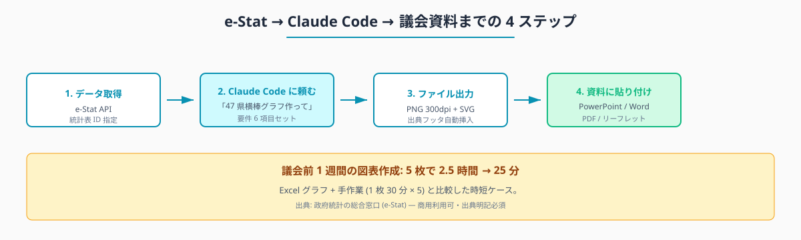
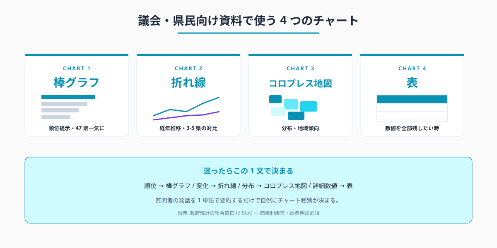
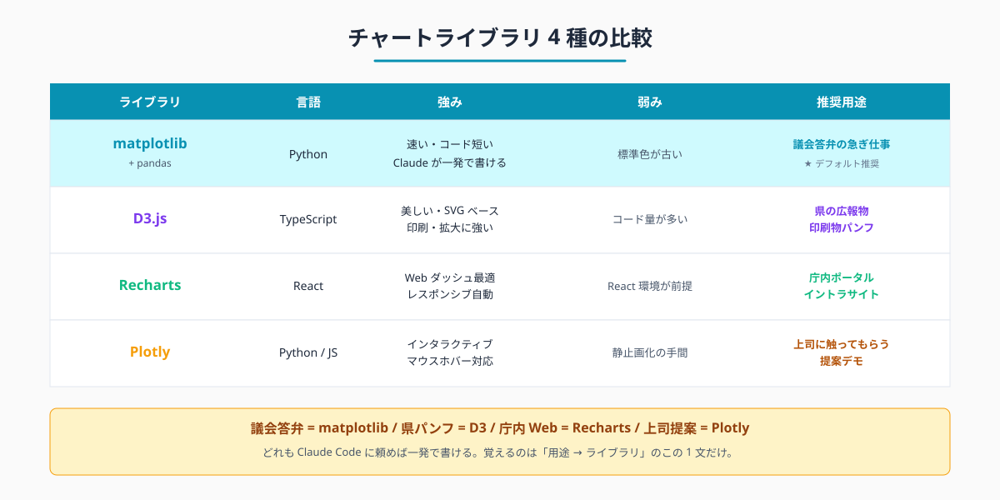

# 議会答弁・県民向けチャートを Claude Code で生成 — D3 / Recharts / matplotlib 使い分け

## はじめに

議会開会の 1 週間前、議会事務局や政策担当のもとに「答弁資料用の図表を 5 種類、明日までに」という依頼が下りる。元データは e-Stat と県の独自統計、出力先はパワーポイントと議員配布の PDF。Excel のグラフ機能で 1 枚 30 分、5 枚で 2 時間半。色も凡例も毎回ばらばら、「前任者のデータが見つからない」で 1 時間消える。

Claude Code に e-Stat を任せると、この作業は「データの統計表 ID と『47 県の順位棒グラフを縦持ち CSV から作って』という頼み方」の組み合わせで 1 枚 5 分に置き換わる。出典表記・カラーアクセシビリティ・PowerPoint 貼り付け前提の解像度といった条件も、頼み方の中に書いておけば毎回守られる。

> **📌 この記事の読み方** — 本記事にはコマンド・設定例・プロンプト例など、やや専門的な記述も出てきます。ですが Claude Code の本質は「それらを自分で覚えること」ではなく、「**やってほしいことを言葉で頼めば、専門的な部分は AI が代わりに用意してくれる**」点にあります。掲載するコマンドや設定は丸暗記の対象ではなく「こう頼めば、こういうものが返ってくる」という地図として読んでください。

執筆者は元自治体職員。Claude Code を使い、47 都道府県の統計サイト stats47.jp (約 2,000 のランキングを毎日自動更新) を個人で開発・運用している。同サイトのチャート (棒グラフ・折れ線・コロプレス地図) は本記事と同じ仕組みで生成している。人口 10-30 万人規模の自治体では、議会前 1 週間に図表作成だけで係長級 1 人が 6-12 時間を消費する事例が珍しくない。本記事は、その時間を 1/10 に圧縮するための「ライブラリ選択と頼み方」のまとめである。

## TL;DR

- 議会・県民向けに必要なチャートは結局 4 種類: 棒グラフ・折れ線・コロプレス地図・表
- 一番速いのは Python の matplotlib + pandas。Claude Code に書かせれば 1 枚 5 分
- 美しさ重視なら D3.js (SVG・印刷物に強い)、Web 公開なら Recharts、上司に触ってもらうなら Plotly
- PowerPoint / Word 貼り付け前提なら PNG 300dpi、印刷物なら PDF / SVG
- 出典「政府統計の総合窓口 (e-Stat) より」をフッタテンプレで自動挿入する


<!-- SVG: flow | データ → Claude Code → SVG/PNG/PDF → 資料挿入 -->

## 背景: なぜ自治体職員にこの課題があるか

民間企業ではダッシュボードツール (Tableau・Looker Studio など) が広く使われており、データソースに接続すれば「ボタンひとつでチャート更新」が定着している。一方、自治体でこれらが使いにくい理由が 3 つある。

- **ライセンス予算** — 議会事務局や政策担当だけのために BI ツールを導入する稟議は通りにくい
- **三層分離** — LGWAN 系と接続できるツールが限られる
- **資料の最終形が PowerPoint / Word / PDF** — 議員に配るのは紙か PDF。インタラクティブな Web ダッシュボードでは要件を満たさない

結果、「Excel でグラフ → スクリーンショット → PowerPoint」というアナログなフローが残る。Excel グラフは凡例の制御が弱く、書式が毎回ばらつき、47 県全部の順位を見せようとすると色が破綻する。

e-Stat のデータは商用利用可で、出典明記が条件 (e-Stat 利用規約: <https://www.e-stat.go.jp/terms-of-use>、アクセス日 2026-05-26)。チャート右下に「政府統計の総合窓口 (e-Stat) より」と入れるだけで規約準拠になる。手書きで毎回書く必要はなく、後述のテンプレで自動挿入できる。

## 手順 / 解説

### Step 1: 4 種類のチャート種別と使い分け

議会答弁・県民向け資料で実際に使うチャートは、4 種類に集約できる。


<!-- SVG: structure | 4 つのチャート種別と用途 -->

| チャート | 主な用途 | 47 県データとの相性 |
|---|---|---|
| 棒グラフ (横棒) | 順位提示 (1 位〜47 位を一気に見せる) | ◎ 縦に 47 行並ぶので可読性が高い |
| 折れ線 | 経年推移・前年比 | ○ 都道府県の絞り込みが必要 (3-5 県まで) |
| コロプレス地図 | 地域分布 (北日本・西日本などの傾向把握) | ◎ 議員・住民の直感に刺さる |
| 表 (ランキング表) | 詳細な数値を残したい時 | ○ 上位 10 + 下位 10 の構成が定型 |

迷ったら **「順位の話 → 棒グラフ」「分布の話 → 地図」「変化の話 → 折れ線」「数字を残したい → 表」**。質問者の発話を 1 単語で要約すると自然に決まる。

### Step 2: ライブラリ選び — 4 候補の比較

代表的なチャートライブラリは 4 つ。それぞれ「速さ」「美しさ」「学習コスト」「Claude Code との相性」が違う。


<!-- SVG: infographic | 4 ライブラリの比較表 -->

| ライブラリ | 言語 | 強み | 弱み | 推奨用途 |
|---|---|---|---|---|
| **matplotlib + pandas** | Python | 速い・コードが短い・Claude が一発で書ける | 標準色が古い | 議会前の急ぎ仕事 |
| **D3.js** | TypeScript | 美しい・SVG で印刷に強い・自由度高 | コード量が多い | 県の広報物・印刷物 |
| **Recharts** | React | Web ダッシュボードに最適 | React 環境が前提 | 庁内ポータル |
| **Plotly** | Python/JS | インタラクティブ (マウスホバー) | 静止画化の手間 | 課長級に触ってもらう用 |

判断の目安はこの 1 文に集約できる: **「議会の答弁資料 = matplotlib、県のパンフレット = D3、庁内 Web = Recharts、上司への提案デモ = Plotly」**。

### Step 3: 一番速い頼み方 — matplotlib で 1 枚 5 分

Claude Code に頼むとき、最初の 1 枚は次のような頼み方で十分通る。

```
e-Stat の人口データ (統計表 ID 0003448237) を取得して、
2023 年の総人口で 47 都道府県の横棒グラフを作って。

要件:
- 縦軸は都道府県名、横軸は人口 (万人単位)
- 1 位の県の色は #0891b2、その他はグレー (#cbd5e1)
- タイトル「都道府県別 総人口 (2023 年)」
- 右下フッタに「出典: 政府統計の総合窓口 (e-Stat)」
- 出力は PNG (300dpi) と SVG の両方
- ファイル名: chart-population-2023.png / .svg
- カラーアクセシビリティ: 赤緑色覚異常配慮 (赤と緑のみで区別しない)
```

ここで重要なのは **「1 位の色を変える」「フッタを入れる」「カラーアクセシビリティ」「PNG と SVG 両方」**を頼み方に書いておく点だ。これらは Excel グラフだと毎回手作業になる部分で、答弁資料の品質差はこの 4 点に集中する。コマンドを暗記する必要はなく、こう頼めばこう返ってくると知っていれば良い。

### Step 4: PowerPoint / Word に綺麗に貼る

紙の答弁資料 (A4 縦 / A3 横) に貼ることを前提にすると、解像度と縦横比に注意がいる。

- **PowerPoint 1 枚に 1 図**: 横幅 1200px × 縦幅 800px、PNG 300dpi
- **PowerPoint 1 枚に 4 図**: 横幅 600px × 縦幅 400px、PNG 300dpi
- **Word 縦置きに貼る**: SVG ベース。Word は SVG をベクタのまま保持する
- **印刷物 (リーフレット)**: SVG または PDF。ラスタライズすると粗くなる

頼むときは「PowerPoint 1 枚に 4 図入れる前提で生成して」と書けば、サイズも自動で決まる。一度うまくいったサイズ感は記事 #10 の skill 化で固定すると、以降毎回同じ品質で出る。

### Step 5: e-Stat 出典の自動挿入

e-Stat 利用規約は「出典の明記」を求める。matplotlib なら 3 行の追記で済む。

```python
plt.figtext(
    0.99, 0.01,
    "出典: 政府統計の総合窓口 (e-Stat) より作成",
    ha="right", va="bottom",
    fontsize=8, color="#64748b",
)
```

これを毎回コピペするより、Claude Code への頼み方に **「右下フッタに『出典: 政府統計の総合窓口 (e-Stat) より作成』を入れて」** と書いておくのが現実的だ。さらに skill 化すれば (記事 #10 参照)、すべてのチャートで自動的に同じフッタが入る。出典漏れの監査指摘もこれで防げる。

ここから先は有料部分:

### Step 6: matplotlib 実装 — 47 県横棒グラフの完成形

ここからは Claude Code が生成するコード例を、コピペで動く形で提示する。Python 3.10 以上、`pip install pandas matplotlib japanize-matplotlib requests` が前提。

```python
import pandas as pd
import matplotlib.pyplot as plt
import japanize_matplotlib  # 日本語フォント自動設定
import requests, os

# --- データ取得 (e-Stat API) ---
API_KEY = os.environ["ESTAT_API_KEY"]
STATS_DATA_ID = "0003448237"  # 国勢調査・人口総数
url = "https://api.e-stat.go.jp/rest/3.0/app/json/getStatsData"
params = {
    "appId": API_KEY,
    "statsDataId": STATS_DATA_ID,
    "lvArea": "2",       # 47 都道府県レベル (cdArea は使わない)
    "metaGetFlg": "Y",
}
resp = requests.get(url, params=params, timeout=30).json()

# --- DataFrame 化 ---
values = resp["GET_STATS_DATA"]["STATISTICAL_DATA"]["DATA_INF"]["VALUE"]
df = pd.DataFrame(values)
df["value"] = pd.to_numeric(df["$"])
df = df[df["@time"] == "2023000000"]  # 2023 年だけ抽出
df = df.sort_values("value", ascending=True)

# --- 描画 ---
fig, ax = plt.subplots(figsize=(8, 12), dpi=300)
colors = ["#cbd5e1"] * len(df)
colors[-1] = "#0891b2"  # 1 位の色を変える

ax.barh(df["@area"], df["value"] / 10000, color=colors)
ax.set_xlabel("人口 (万人)")
ax.set_title("都道府県別 総人口 (2023 年)", fontsize=14, pad=12)
ax.grid(axis="x", linestyle="--", alpha=0.5)
ax.spines["top"].set_visible(False)
ax.spines["right"].set_visible(False)

plt.figtext(
    0.99, 0.01,
    "出典: 政府統計の総合窓口 (e-Stat) より作成",
    ha="right", va="bottom", fontsize=8, color="#64748b",
)

plt.tight_layout()
plt.savefig("chart-population-2023.png", dpi=300, bbox_inches="tight")
plt.savefig("chart-population-2023.svg", bbox_inches="tight")
```

このコードは Claude Code に「上記の頼み方で生成して」と頼めば 1 分以内に出てくる。読者は「こういうコードが返ってくる」と知っていれば十分で、暗記する必要はない。`lvArea=2` で 47 都道府県を一括取得し、`cdArea` で個別指定しないのは e-Stat API のキャッシュ効率を上げる定石である (CLAUDE.md の e-Stat API 規約参照)。

### Step 7: D3.js 実装 — 美しいコロプレス地図

県の広報誌・パンフレットなど印刷物に強いのは D3.js の SVG 出力だ。コードは長くなるが、Claude Code が一発で書ける。

頼み方のテンプレート:

```
TopoJSON 形式の都道府県境界データ (47-prefectures.topojson) と、
都道府県別人口 CSV (prefecture, value の 2 列、47 行) を入力に、
D3.js v7 でコロプレス地図 (chloropleth) の SVG を出力する HTML を作って。

要件:
- カラースケール: d3.scaleSequential(d3.interpolateBlues)
- 凡例 (legend) を右下に配置
- 都道府県名を北海道・本州・四国・九州・沖縄でそれぞれラベル表示
- 出力: standalone HTML (CDN から d3 と topojson-client を読み込む)
- 印刷を想定して背景白・線色 #475569
- フッタに「出典: 政府統計の総合窓口 (e-Stat) より作成」
```

D3 は学習コストが高いが、**Claude Code に書かせる前提なら問題にならない**。stats47.jp のコロプレス表示も同じテンプレで生成している。TopoJSON ファイルは国土数値情報ダウンロードサービス (<https://nlftp.mlit.go.jp/ksj/>、アクセス日 2026-05-26) から県界データを取得して mapshaper で軽量化する流れが定番だ。

### Step 8: 出力フォーマットの選び方

| 用途 | 推奨フォーマット | 理由 |
|---|---|---|
| 議会資料 (A4 紙配布) | PNG 300dpi | 印刷で安全、貼り付けが速い |
| 県広報誌・パンフ | SVG または PDF | 印刷拡大に強い |
| 庁内 Web (イントラ) | SVG (``) | ファイルサイズ小さい |
| メール添付 | PNG (圧縮版) | 受け手の環境を選ばない |
| PowerPoint | SVG (PowerPoint 2016 以降) | サイズ変更しても綺麗 |

「とりあえず PNG と SVG の両方を生成して」と頼んでおくと、後工程で困らない。1 枚あたり 2 ファイルになるが、Claude Code に任せている時点で手作業のコストはゼロだ。

### Step 9: カラーアクセシビリティ (赤緑色覚異常配慮)

成人男性の約 5%、女性の約 0.2% に色覚異常がある (日本眼科医会、<https://www.gankaikai.or.jp/health/53/>、アクセス日 2026-05-26)。議員・住民への配布物では、**「赤と緑だけで意味を区別しない」** ことが品質基準として浸透している。

Claude Code への頼み方に 1 行入れる:

```
カラーアクセシビリティ配慮: 赤と緑だけで区別する配色は使わない。
推奨パレット: #0891b2 (cyan), #f59e0b (amber), #7c3aed (violet), #64748b (slate)
```

このパレットは色覚異常シミュレータ (Color Blindness Simulator など) でも判別できる組み合わせで、stats47.jp のすべてのチャートでも採用している。

### Step 10: 頼み方を skill にして毎回同じ品質に

ここまでの 6 ステップ (要件・カラー・出典・サイズ・PNG/SVG・カラーアクセシビリティ) を毎回書くのは現実的でない。`.claude/skills/assembly-chart/SKILL.md` に一度書いておけば、次回からは「人口データで議会答弁用チャート作って」だけで全部が適用される。skill の作り方の全容は記事 #10 を参照。

## よくあるつまずきと回避策

- **⚠️ matplotlib で日本語が豆腐 (□) になる** → `japanize_matplotlib` を import する。または `matplotlib.font_manager` で Noto Sans CJK JP を指定
- **⚠️ PowerPoint に貼ったら粗い** → PNG の dpi が足りない。`dpi=300` を明示する
- **⚠️ Excel グラフから移行した直後、色がバラバラ** → 頼み方に「カラーパレットは #0891b2 系で統一」と書く。skill 化すれば永続化
- **⚠️ e-Stat の出典忘れで監査指摘** → フッタを skill のテンプレに固定。手作業の漏れをゼロに
- **⚠️ コロプレス地図の北海道だけ大きすぎる** → 北海道だけ別レイヤーでスケールを 0.5 にする頼み方を skill に追加

## 応用 / 次に読むべき記事

- [#08 ベンチマーク表 5 分作成](../08-benchmark-table-5min/draft.md) — 表形式の出力に特化した手順
- [#10 月次集計を 1 コマンド化](../10-claude-skills-routinize/draft.md) — 本記事で説明した頼み方を skill にして永続化
- [#03 47 都道府県データを 1 コマンドで取得](../03-fetch-prefecture-ranking/draft.md) — チャートの元データ取得

stats47.jp の実例も併せてどうぞ。

- 棒グラフの例: <https://stats47.jp/ranking/total-population>
- コロプレス地図の例: <https://stats47.jp/ranking/total-population> (右パネル)
- カテゴリ別ランキング: <https://stats47.jp/category/population>

<!-- circulation-footer:v2 -->

## このシリーズについて

「公務員のための e-Stat × Claude Code 実務ガイド」全 12 本のシリーズ第 09 回。e-Stat 業務の効率化に関心がある方は、マガジン購読がお得です。

▶️ マガジン: 公務員のための e-Stat × Claude Code 実務ガイド
🔗 https://note.com/stats47/m/m1b836e4c8dce

姉妹マガジン「公務員 × Claude Code 実務活用ガイド (全 33 本)」では議事録・議会答弁・条例レビューなど統計以外の業務効率化を扱っています。

▶️ stats47.jp: 本記事で紹介した手順で運用している 47 都道府県統計サイト (約 2,000 のランキングを毎日自動更新)。動いている実例として参考にどうぞ。
🔗 https://stats47.jp
