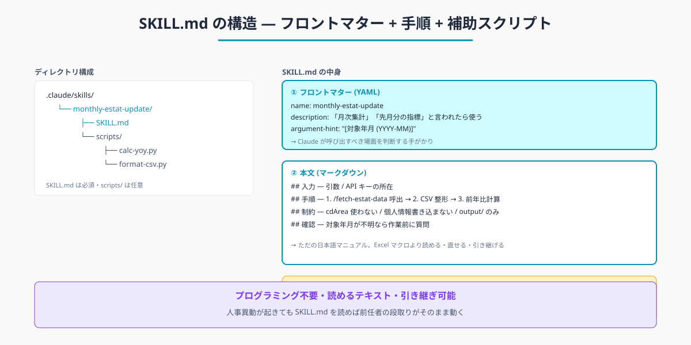
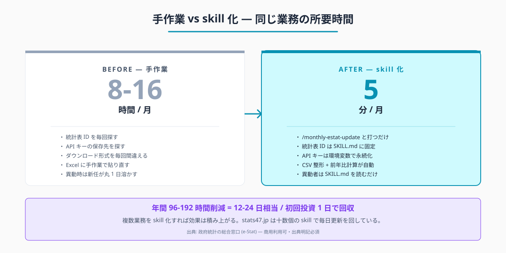
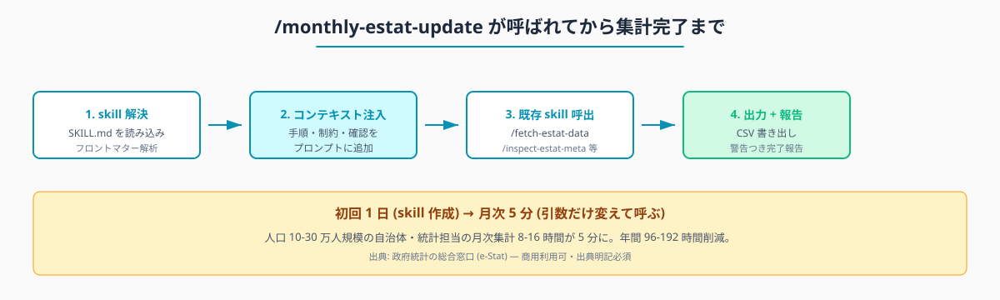

# 月次の e-Stat 集計を .claude/skills で 1 コマンド化する — 定型業務をスキル化する設計

## はじめに

毎月第 1 営業日、統計担当のもとに「先月分の指標を更新して、課内資料に載せて」という依頼が下りる。e-Stat にログインして統計表 ID を覚え直し、API キーをどこに保存したか探し、ダウンロード形式を毎回間違え、Excel に貼り直す。1 回 2-3 時間、毎月発生する。担当者が異動すると、新任者は最初の月だけで丸 1 日溶かす。

Claude Code に同じ手順を `.claude/skills/` 配下のテキストファイル 1 枚として保存しておけば、翌月以降は「`/monthly-estat-update`」と打つだけで全工程が走る。**初回 2-3 時間 → 月次 5 分**。さらに人事異動が起きても skill は職場の資産として残り、新任者は SKILL.md を読むだけで前任者の段取りを引き継げる。

> **📌 この記事の読み方** — 本記事にはコマンド・設定例・プロンプト例など、やや専門的な記述も出てきます。ですが Claude Code の本質は「それらを自分で覚えること」ではなく、「**やってほしいことを言葉で頼めば、専門的な部分は AI が代わりに用意してくれる**」点にあります。掲載するコマンドや設定は丸暗記の対象ではなく「こう頼めば、こういうものが返ってくる」という地図として読んでください。

執筆者は元自治体職員。Claude Code を使い、47 都道府県の統計サイト stats47.jp (約 2,000 のランキングを毎日自動更新) を個人で開発・運用している。同サイトの毎日更新は本記事で説明する「skill 化」が前提で、`/fetch-estat-data` `/inspect-estat-meta` `/search-estat` などの skill を組み合わせて回している。人口 10-30 万人規模の自治体では、統計担当 1 人が月次定型集計に 8-16 時間を費やしている事例が珍しくない。本記事は、その時間を「初回設定 1 日 + 月次 5 分」に圧縮するための skill 設計指針である。

## TL;DR

- `.claude/skills/` は「一度うまくいった頼み方を保存して名前で呼べる」仕組み
- SKILL.md = 「業務マニュアルの頼み方版」。プログラミング不要、中身は日本語
- 月次定型業務 (取得 → 整形 → ダッシュボード更新) を 1 コマンドに集約できる
- 人事異動の引き継ぎが「SKILL.md を読んで」で完結する
- 既存 skill (`/fetch-estat-data` `/inspect-estat-meta`) を組み合わせれば、自前 skill は薄くなる


<!-- SVG: structure | SKILL.md の構造 -->

## 背景: なぜ自治体職員にこの課題があるか

民間ではノーコードツールやワークフロー自動化 (Zapier・Make など) で定型業務を自動化するのが一般的だ。一方、自治体で同様のことが定着しにくい理由が 3 つある。

- **基幹システムが LGWAN 系で隔離** — クラウドツールが直接接続できない
- **属人化の構造** — 「先月の集計どうやった?」が前任者の頭にしか残っていない
- **人事異動でリセット** — 2-3 年で担当が変わり、ノウハウが捨てられる

特に 3 番目が大きい。Excel マクロを書ける職員が異動すると、後任は触れず、結局白紙からのやり直しになる。skill 化された「読めるテキストの業務マニュアル」は、この継承断絶を埋める現実解である。

e-Stat のデータは商用利用可で、出典明記が条件 (e-Stat 利用規約: <https://www.e-stat.go.jp/terms-of-use>、アクセス日 2026-05-26)。skill のテンプレに「出典を必ず挿入」と書いておけば、引き継ぎ後も規約遵守が継続する。

## 手順 / 解説

### Step 1: .claude/skills の正体 — Excel マクロより読みやすい業務マニュアル

`.claude/skills/` は、プロジェクトのルート (またはホームディレクトリ) に置くフォルダ。中に `<skill 名>/SKILL.md` を作ると、Claude Code がそれを「呼び出し可能な手順書」として認識する。

```
.claude/skills/
├── monthly-estat-update/
│   └── SKILL.md            ← これだけで skill が完成
├── fetch-estat-data/
│   └── SKILL.md
└── inspect-estat-meta/
    └── SKILL.md
```

`SKILL.md` の中身は、フロントマター (YAML) + 本文 (マークダウン) という構造。フロントマターは Excel ワークブックのプロパティに、本文は「業務マニュアル」に相当する。

Excel マクロと違って、**読めば内容がわかる・修正できる・引き継げる**。プログラミング知識は不要で、日本語で書く。

### Step 2: SKILL.md のフロントマター 4 項目

最初に覚えるべきは 4 つだけ。

```yaml
---
name: monthly-estat-update
description: 毎月第 1 営業日に走らせる e-Stat 月次集計。
  「月次集計」「先月分の指標」「ダッシュボード更新」と頼まれたら使う。
disable-model-invocation: false
argument-hint: "[対象年月 (YYYY-MM)、省略時は前月]"
---
```

| 項目 | 役割 |
|---|---|
| `name` | skill の名前 (`/monthly-estat-update` で呼ぶ) |
| `description` | Claude Code が「どんなときに使うか」を判断する手がかり。**具体的な使いどころを書く**のが最重要 |
| `disable-model-invocation` | `true` にすると skill を Claude 側から自動呼び出しさせない (人間が `/` で明示呼出のみ) |
| `argument-hint` | `/monthly-estat-update 2026-05` のように引数を取る場合のヒント |

特に `description` の書き方がコツ。「○○の業務」だけでは弱く、「『先月分の指標更新して』と言われたら」のような **発話例を 1-2 個入れる** と、Claude Code がスキルを呼び出す精度が上がる。

### Step 3: 月次集計 skill の骨格

題材は「人口・財政・産業の 3 指標を毎月更新して、ダッシュボード CSV を出力する」業務とする。skill の本文はこうなる。

`.claude/skills/monthly-estat-update/SKILL.md`:

```markdown
---
name: monthly-estat-update
description: 毎月第 1 営業日に走らせる e-Stat 月次集計。
  「月次集計」「先月分の指標」「ダッシュボード更新」と頼まれたら使う。
argument-hint: "[対象年月 (YYYY-MM)、省略時は前月]"
---

# 月次 e-Stat 集計 skill

統計担当の毎月の定型業務。3 指標 (人口・財政・産業) を更新する。

## 入力

- 引数: 対象年月 (省略時は前月)
- API キー: $ESTAT_API_KEY 環境変数から取得

## 手順

1. /fetch-estat-data で次の 3 つの統計表 ID を取得する
   - 人口総数: 0003448237
   - 歳出決算額: 0003411981
   - 製造品出荷額: 0003348423

2. 取得した JSON を CSV (列: 都道府県, 年月, 指標名, 値) に整形する

3. 出力先: `./output/YYYY-MM-monthly-dashboard.csv`
   - フッタに「出典: 政府統計の総合窓口 (e-Stat) より作成」を必ず含める

4. 47 都道府県のうち、当該自治体の県値を抽出して「先月比」「前年比」を計算する

5. 増減 5% 以上の指標があれば「⚠️ 注意」マーカーをつけて報告する

## 制約

- e-Stat API の `cdArea` `cdTimeFrom` は使わない (全国一括取得しメモリでフィルタ)
- 個人情報・決裁前資料は絶対に SKILL.md に書き込まない
- 出力ファイルは `./output/` 配下のみ。庁内システム領域に書き込まない

## 確認

- 対象年月が不明な場合は、作業前に確認する
- API キーが未設定の場合は作業を止めて報告する
```

### Step 4: skill を呼び出す

ここまで作れば、次回からはこれだけ:

```
/monthly-estat-update 2026-05
```

Claude Code が SKILL.md を読み込み、`/fetch-estat-data` で 3 つの統計表を取得し、CSV に整形し、当県値の前年比を計算し、増減 5% 以上があれば警告つきで報告する。月初 5 分で完了する。

第 2 回以降は引数だけ変えて呼ぶ:

```
/monthly-estat-update    # 引数省略時は前月
/monthly-estat-update 2026-06
```

### Step 5: e-Stat 既存 skill との組み合わせ

stats47 では `.claude/skills/estat/` 配下に汎用 skill を 3 つ整備している。

- `/search-estat` — キーワードから統計表 ID を探す
- `/inspect-estat-meta` — 統計表のメタ情報 (時系列・カテゴリ) を確認する
- `/fetch-estat-data` — 統計表データを取得して JSON 化する

自前の `/monthly-estat-update` はこれらを呼ぶだけの薄いラッパーで構成できる。「全部自分で書く」必要はなく、**既存 skill を組み合わせる**のが現実的だ。Lego ブロックを積むのに近い感覚で、組織内で skill を蓄積していけば、新規業務の skill 化コストは下がり続ける。

ここから先は有料部分:

### Step 6: skill 化すべき業務の見分け方 (3 軸)

すべての業務を skill にする必要はない。次の 3 つに当てはまる業務だけを優先する。

| 見分け方 | 例 |
|---|---|
| 毎月以上の頻度で繰り返す | 月次集計・週次レポート・四半期報告 |
| 誰がやっても同じ結果が出るはず | 公用文校正・統計データ取得・前年比計算 |
| 特定の人の頭の中にしかない | 「あの集計のコツ」「議会答弁の作り方」 |

逆に **skill にしないほうがよい** 業務:

- 一度きりで二度とやらない (その場でプロンプトを書けば十分)
- 毎回状況に応じて判断や進め方が大きく変わる (型にはめると窮屈)

迷ったときの目安は **「来月もまた使うか?」**。Yes なら skill にする価値がある。


<!-- SVG: infographic | 手作業 (1 ヶ月 N 時間) vs skill 化 (1 コマンド) -->

### Step 7: skill の動作フロー (内部の仕組み)

`/monthly-estat-update` と打ってから集計完了までの内部処理は、4 段階に整理できる。


<!-- SVG: flow | skill 起動から完了までのパイプライン -->

1. **skill 解決** — Claude Code が `.claude/skills/monthly-estat-update/SKILL.md` を読み込む
2. **コンテキスト注入** — SKILL.md の手順・制約・確認事項を Claude のプロンプトに追加
3. **既存 skill 呼出** — `/fetch-estat-data` 等を順に実行
4. **出力 + 報告** — CSV ファイルを書き、ユーザーに完了報告 + 警告

ユーザーは内部処理を知らなくても良い。「`/monthly-estat-update`」と打てば結果が返る、それだけで業務が回る。これが「skill の本当の価値」である。

### Step 8: 人事異動の引き継ぎを skill で完結させる

自治体最大の課題、**人事異動の引き継ぎ**。skill 化した業務は、引き継ぎ書類に次の 3 つを書くだけで済む。

```markdown
## 月次 e-Stat 集計

- 場所: .claude/skills/monthly-estat-update/SKILL.md
- 呼び出し方: /monthly-estat-update [年月]
- 例: /monthly-estat-update 2026-05

担当者は SKILL.md の「手順」「制約」を読めば全体像がわかる。
不明点は SKILL.md を直接修正してよい (テキストファイルなので)。
```

新任者はターミナルで `/monthly-estat-update` と打つだけで、前任者と同じ集計が走る。前任者の暗黙知 (「あの統計表 ID は 0003448237」「先月比 5% 以上は注意」) は SKILL.md に記述として残っている。

> **重要**: skill には「手順」だけを書く。実際のデータ (住民個人情報・決裁前資料) は絶対に書き込まない。skill はあくまで「やり方の説明書」であり、Excel のひな形と中身のデータが別物なのと同じ感覚で扱う。

### Step 9: 補助スクリプトを skill 配下に置く

skill によっては、`SKILL.md` だけでは収まらず、補助スクリプト (Python・Node.js) が必要になる場合がある。次のように配置する。

```
.claude/skills/monthly-estat-update/
├── SKILL.md
└── scripts/
    ├── calc-yoy.py          # 前年比計算ロジック
    └── format-csv.py        # CSV 整形ロジック
```

SKILL.md の本文に「Step 4 で `scripts/calc-yoy.py` を実行する」と書いておけば、Claude Code が自動でスクリプトを呼ぶ。スクリプトの中身は Claude Code 自身に書かせて良い。

### Step 10: 庁内での運用 — 共有フォルダ + Git の選択肢

skill を組織で共有する方法は 2 通り。

- **共有フォルダ方式** — 課の共有フォルダに `.claude/skills/` 一式をコピー。最も簡単
- **Git リポジトリ方式** — 庁内 Git (GitLab 等) で管理。変更履歴が残り、複数人が同時に編集可能

人口 5 万人未満の自治体なら共有フォルダで十分。人口 10 万人超で複数課が触る場合は Git が現実解になる。stats47 では GitHub プライベートリポジトリで管理しており、skill の修正がそのまま `git log` に残るので「いつ・誰が・どう変えたか」がすぐ追える。

### Step 11: ROI 試算 — 1 自治体での年間効果

人口 10-30 万人規模の自治体で、統計担当が月次集計に 8-16 時間/月 を費やしているとする。skill 化後は月次 5 分 = 0.08 時間。

- 削減時間: (8-16) - 0.08 ≒ 8-16 時間/月
- 年間: 96-192 時間 = 12-24 日相当
- 初回設定: 1 日 (skill の作り込み + 動作確認)
- 投資回収: 約 1 ヶ月

複数業務を skill 化すれば効果は積み上がる。stats47.jp の毎日更新も、十数個の skill の組み合わせで回している。

## よくあるつまずきと回避策

- **⚠️ skill が呼ばれない** → `description` に発話例が足りない。「『月次集計して』と言われたら」のように具体例を 1-2 個追加
- **⚠️ SKILL.md を直したのに反映されない** → Claude Code を再起動 (skill は起動時に読み込む実装が多い)
- **⚠️ 補助スクリプトで個人情報をハードコード** → 絶対に避ける。データは引数で渡し、SKILL.md には「手順」のみ
- **⚠️ skill が肥大化して読めない** → 1 skill 1 業務の原則。複数業務を 1 つの SKILL.md に詰め込まない
- **⚠️ 異動した前任者しか skill の意図がわからない** → SKILL.md の冒頭に「この skill は何のために存在するか」を 2-3 行で明記

## 応用 / 次に読むべき記事

- [#09 議会答弁・県民向けチャート生成](../09-assembly-chart-generation/draft.md) — 本記事のチャート生成ロジックを skill 化する具体例
- [#11 MCP sqlite で自前 DB と e-Stat 連携](../11-mcp-sqlite-search/draft.md) — skill の先、外部システム連携へ
- [#03 47 都道府県データを 1 コマンドで取得](../03-fetch-prefecture-ranking/draft.md) — 月次 skill から呼ぶ既存 skill の使い方

stats47.jp の実例も併せてどうぞ。

- 月次更新の対象指標例: <https://stats47.jp/category/economy>
- 全カテゴリ一覧: <https://stats47.jp/>

<!-- circulation-footer:v2 -->

## このシリーズについて

「公務員のための e-Stat × Claude Code 実務ガイド」全 12 本のシリーズ第 10 回。e-Stat 業務の効率化に関心がある方は、マガジン購読がお得です。

▶️ マガジン: 公務員のための e-Stat × Claude Code 実務ガイド
🔗 {{ESTAT_MAGAZINE_URL}}

姉妹マガジン「公務員 × Claude Code 実務活用ガイド (全 33 本)」では議事録・議会答弁・条例レビューなど統計以外の業務効率化を扱っています。

▶️ stats47.jp: 本記事で紹介した手順で運用している 47 都道府県統計サイト (約 2,000 のランキングを毎日自動更新)。動いている実例として参考にどうぞ。
🔗 https://stats47.jp
