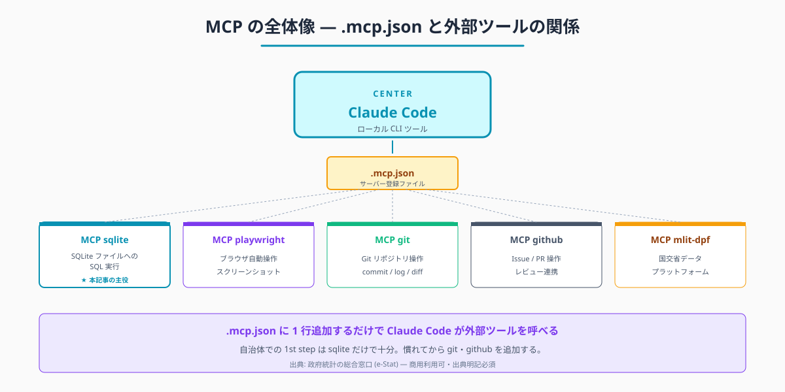
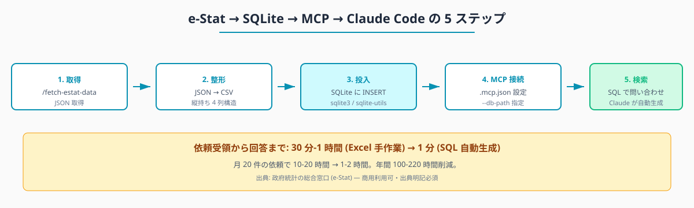
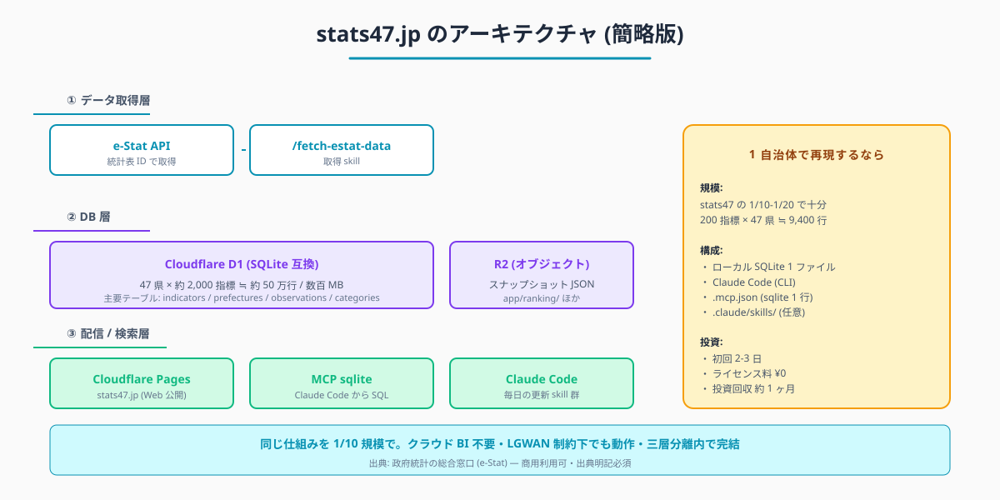

💡 **この記事を書いた私から、Claude Code 学習でひとつだけご紹介させてください（PR）**

この記事を読んでいる方は、Claude Code を業務に取り入れようとしているか、すでに使い始めているのだと思います。

独学でも十分に使えますが、「もっと体系的に学びたい」「詰まったときにすぐサポートを受けたい」という方には、Claude Code に特化した研修プログラムも選択肢のひとつです。

このリンクから申し込んでいただくと、私に紹介料が入ります。それでもお伝えするのは、Claude Code を業務で使いこなしたいすべての方に本当に役立つと思っているからです。

{{AFFILIATE_BANNER:ai_agent_camp}}

▶ Claude Code 特化研修「AI Agent Camp」の詳細はこちら（無料相談あり）

---

---

# MCP sqlite で自前 DB と e-Stat を連携 — stats47 のような統計ダッシュボードを職場で再現

## はじめに

「他自治体との比較資料を作って」「過去 5 年の推移を出して」「議員から特定の県との対比を急ぎで」——統計担当の依頼は、毎回データの切り口が違います。

e-Stat の Web UI を毎回叩き、Excel に貼り、関数を組み立てます。1 回 30 分から 1 時間、月に 20 件で 10-20 時間かかります。

データを 1 度 SQLite に貯めてしまい、Claude Code が SQL で自由に検索できるようにすれば、この作業は「Claude Code に質問を投げる」だけで終わります。所要時間は **依頼受領から回答まで 1 分** です。

本記事は、そのために必要な「MCP」という仕組みと、自前 DB と Claude Code をつなぐ最小構成を解説します。

**こんな方に向けた記事です**

- 依頼のたびに切り口が変わる集計を、e-Stat の Web UI と Excel で毎回さばいている統計担当の職員
- データを 1 度貯めて「何度でも自由に検索できる」状態を職場で作りたい方
- 個人情報に配慮しながら、自前の統計 DB と Claude Code をつなぎたい方

**この記事でわかること**

- MCP sqlite で e-Stat データを SQLite に貯め、Claude Code から SQL で検索できるようにする手順
- stats47 の DB 運用を人口 10-30 万人規模の自治体向けに縮小再現する構成
- 個人情報 DB を接続しないための守秘配慮チェックリスト

> **📌 この記事の読み方** — 本記事にはコマンド・設定例・プロンプト例など、やや専門的な記述も出てきます。ですが Claude Code の本質は「それらを自分で覚えること」ではなく、「**やってほしいことを言葉で頼めば、専門的な部分は AI が代わりに用意してくれる**」点にあります。掲載するコマンドや設定は丸暗記の対象ではなく「こう頼めば、こういうものが返ってくる」という地図として読んでください。

執筆者は元自治体職員です。Claude Code を使い、47 都道府県の統計サイト stats47.jp (約 2,000 のランキングを毎日自動更新) を個人で開発・運用しています。

stats47 の裏側では Cloudflare D1 (SQLite 互換) に約 2,000 のランキングデータが格納されており、MCP sqlite 経由で Claude Code が SQL で検索できる構成になっています。本記事はこの構成を、人口 10-30 万人規模の自治体・統計担当 1-2 人の規模で再現するための最小手順です。


<!-- SVG: structure | .mcp.json と Claude Code の関係図 -->

## 背景: なぜ自治体職員にこの課題があるか

民間ではダッシュボードツール (Tableau, Looker Studio, Power BI) で「データを 1 度貯める → 何度でも切り出す」は当たり前です。自治体でこれが定着しにくい理由が 3 つあります。

- **クラウド BI のライセンス予算** — 統計担当 1-2 人のために導入する稟議は通りにくいです
- **三層分離との接続困難** — クラウド BI は LGWAN 系のデータと直接つながりません
- **e-Stat の Web UI で毎回手作業** — 1 つの依頼ごとに切り口が違い、Excel が積み上がります

ここに「ローカルに SQLite ファイル + Claude Code が SQL で検索」の構成を入れると、ライセンス予算ゼロ・三層分離内・どんな切り口にも対応、の 3 つを同時に満たせます。

e-Stat のデータは商用利用可で、出典明記が条件です (e-Stat 利用規約: <https://www.e-stat.go.jp/terms-of-use>、アクセス日 2026-05-26)。SQLite に貯めたデータを資料に転用する場合も、フッタに「政府統計の総合窓口 (e-Stat) より」と入れれば規約準拠になります。

## 手順 / 解説

### Step 1: MCP の正体 — Claude Code の「外部接続コネクタ」

MCP (Model Context Protocol) は、Anthropic が 2024 年に公開した仕様で、**Claude Code から外部ツール (DB / API / ブラウザ / Git 等) を呼び出すための標準プロトコル** です。

公務員業務に当てはめると、MCP は「コネクタ」のような存在になります。

- **MCP sqlite サーバー** — SQLite ファイルに対して SQL を実行できます
- **MCP playwright サーバー** — ブラウザを自動操作できます
- **MCP git サーバー** — Git リポジトリを操作できます
- **MCP github サーバー** — GitHub の Issue / PR を操作できます

`.mcp.json` というファイルを 1 つ書くだけで、Claude Code がこれらの MCP サーバーを認識し、必要に応じて呼び出します。**コネクタの中身を作るのは Claude Code 自身、利用者は `.mcp.json` を整えるだけ** です。

### Step 2: 最小構成 — .mcp.json に sqlite を 1 行追加

プロジェクトルートに `.mcp.json` を作ります (または既存ファイルに追加します)。

```json
{
  "mcpServers": {
    "sqlite": {
      "command": "npx",
      "args": [
        "-y",
        "@modelcontextprotocol/server-sqlite",
        "--db-path",
        "./data/estat-prefectures.sqlite"
      ]
    }
  }
}
```

`--db-path` の値が、Claude Code に検索させたい SQLite ファイルのパスです。これだけで MCP sqlite サーバーが起動し、Claude Code は SQL を実行できるようになります。

stats47 の実運用では `.mcp.json` に sqlite サーバーを以下のように記述しています (パスは Cloudflare D1 のローカル miniflare レプリカ):

```json
{
  "mcpServers": {
    "sqlite": {
      "command": "npx",
      "args": [
        "-y",
        "@modelcontextprotocol/server-sqlite",
        "--db-path",
        ".local/d1/v3/d1/miniflare-D1DatabaseObject/<hash>.sqlite"
      ]
    }
  }
}
```

自治体で再現するなら、ローカル PC の `./data/estat-prefectures.sqlite` のような単純なパスで十分です。

### Step 3: e-Stat → SQLite のパイプライン

データを SQLite に入れる手順は次の 4 ステップです。


<!-- SVG: flow | e-Stat → SQLite → Claude Code -->

1. **取得** — `/fetch-estat-data` で e-Stat API から JSON を取得します (記事 #03 参照)
2. **整形** — JSON を縦持ち CSV に変換します (列: 都道府県, 年, 指標, 値)
3. **投入** — Python の `sqlite3` モジュールまたは `sqlite-utils` CLI で SQLite に INSERT します
4. **検索** — Claude Code から SQL で自由に問い合わせます

Claude Code に頼む場合の頼み方:

```
e-Stat の人口総数 (統計表 ID 0003448237)、
歳出決算額 (0003411981)、
製造品出荷額 (0003348423) を取得して、
./data/estat-prefectures.sqlite に投入して。

テーブル設計:
- prefecture (都道府県マスタ: code, name)
- indicator (指標マスタ: id, name, unit)
- observation (実測値: prefecture_code, indicator_id, year, value)

その後、北海道・東京・大阪の人口 5 年推移を確認できる SQL を例示して。
```

Claude Code が CSV 投入 → DDL 作成 → 例示 SQL 提示までを通しで実施します。利用者は出来上がった SQLite ファイルと、後で使い回せる SQL を受け取るだけです。

### Step 4: Claude Code から SQL で問い合わせる

SQLite ファイルができたら、以降は「日本語で質問」するだけで Claude Code が SQL を組み立てます。

```
当県と人口規模が近い 3 県 (静岡・茨城・京都) と、
製造品出荷額の前年比を比較して表にして。
```

Claude Code は MCP sqlite 経由で SQL を組み立て、結果を Markdown 表で返します。SQL の知識は不要です。**「データはどこにあるか」「列の意味」を SKILL.md (記事 #10 参照) に書いておけば、毎回同じ精度で SQL が組まれます**。

```sql
-- Claude Code が組み立てた SQL の例
SELECT
  p.name AS 都道府県,
  o.year AS 年,
  o.value AS 製造品出荷額,
  LAG(o.value) OVER (PARTITION BY p.code ORDER BY o.year) AS 前年値,
  ROUND((o.value * 1.0 / LAG(o.value) OVER (PARTITION BY p.code ORDER BY o.year) - 1) * 100, 2) AS 前年比
FROM observation o
JOIN prefecture p ON p.code = o.prefecture_code
JOIN indicator i ON i.id = o.indicator_id
WHERE p.name IN ('静岡', '茨城', '京都')
  AND i.name = '製造品出荷額'
ORDER BY p.name, o.year;
```

このクエリも、Claude Code が自動で生成します。読者は SQL を覚える必要はありません。「こう頼めばこういう SQL が返り、こういう表が出る」と知っていれば十分です。

### Step 5: stats47 の運用例 — 2,000 ランキングを SQLite で回す

stats47.jp の裏側では、**Cloudflare D1 (SQLite 互換) に 47 都道府県 × 約 2,000 指標 ≒ 94,000 行**が格納されています。MCP sqlite 経由で Claude Code が SQL を発行し、ランキング生成・前年比計算・相関分析を自動化しています。

主要テーブル構成（簡略版）は以下のとおりです。

- **`indicators`**: id, key, name, unit（約 2,000 行）
- **`prefectures`**: code, name, name_kana（47 行）
- **`observations`**: indicator_id, prefecture_code, year, value（約 50 万行）
- **`categories`**: id, key, name（数十行）
- **`ai_content`**: indicator_id, title, summary（約 2,000 行）

このデータが SQLite ファイル 1 個に収まります (実測で数百 MB)。`./data/estat-prefectures.sqlite` レベルの個人 PC ローカルでも運用可能です。**1 自治体規模なら、stats47 の 1/10 程度の規模 (200 指標) で十分**な業務カバー率が出ます。

ここから先は有料部分:

### Step 6: 1 自治体規模での再現アーキテクチャ

stats47 のフルセットを自治体で再現する必要はありません。1-2 人の統計担当が日々の依頼を捌くだけなら、シンプルな構成で十分です。


<!-- SVG: infographic | D1 + R2 + Cloudflare Pages の構成 -->

自治体での最小構成:

```
個人 PC ローカル:
├── ./data/estat-prefectures.sqlite     (SQLite ファイル、数百 MB)
├── ./.mcp.json                          (MCP サーバー設定)
├── ./.claude/skills/                    (skill 群)
│   ├── monthly-estat-update/
│   ├── compare-with-other-prefs/
│   └── yoy-analysis/
└── ./scripts/                           (補助スクリプト)
    └── fetch-and-insert.py
```

各層の役割は以下のとおりです。

- **データ層**: SQLite ファイル 1 個。バックアップは Time Machine か共有フォルダコピーで十分です
- **インターフェース**: Claude Code (CLI)
- **共有**: SQLite ファイル + `.claude/skills/` + `.mcp.json` を共有フォルダや庁内 Git に置きます

クラウドサービスは一切不要です。LGWAN 系の制約下でも動作します (Claude Code 自体はインターネット系 PC で動かす必要がありますが、SQLite ファイルは完全にローカルです)。

### Step 7: MCP サーバーの追加・削除

`.mcp.json` を編集するだけです。Claude Code を再起動すると新しい設定が反映されます。

代表的な MCP サーバー (`.mcp.json` 例):

```json
{
  "mcpServers": {
    "sqlite": {
      "command": "npx",
      "args": ["-y", "@modelcontextprotocol/server-sqlite", "--db-path", "./data/estat-prefectures.sqlite"]
    },
    "playwright": {
      "command": "npx",
      "args": ["-y", "@anthropic-ai/mcp-server-playwright"]
    },
    "git": {
      "type": "stdio",
      "command": "uvx",
      "args": ["mcp-server-git", "--repository", "."]
    },
    "github": {
      "type": "http",
      "url": "https://api.githubcopilot.com/mcp/"
    }
  }
}
```

stats47 では上記 4 つに加え、Cloudflare の MCP サーバー (`cloudflare-graphql` / `cloudflare-observability`) や、国土交通データプラットフォーム (`mlit-dpf-mcp`) も併用しています。

自治体での 1st step は **sqlite だけで十分** です。慣れてから git・github を追加するのが現実的です。

### Step 8: 守秘配慮チェックリスト (絶対遵守)

公務員が MCP sqlite を使う場合、**個人情報 DB を MCP に接続しないこと** が絶対条件です。

Claude Code は LLM (大規模言語モデル) との通信を伴うため、住基・税・健康診断など個人特定可能な DB を MCP 経由で見せるのは情報セキュリティポリシー違反になる可能性が高いです。

接続して良い DB と悪い DB の判別は以下のとおりです。

- **接続可**: 集計済み統計データ（個人特定不可）— e-Stat データ、47 県集計値、地域別世帯数（町丁目以上の集計値）
- **接続可**: 公開済みオープンデータ — 県の歳出決算、施設一覧、補助金一覧
- **接続不可**: 個人特定可能なデータ — 住基、税情報、健康診断、相談記録
- **接続不可**: 決裁前資料・職員人事情報 — 起案中の予算・人事案

迷ったら **「この DB の中身が万一流出したらニュースになるか?」** を基準に判断します。Yes なら MCP に接続しません。

技術的な追加防御:

- SQLite ファイルは「個人情報を含まないコピー」を別途用意して MCP 接続用に使います
- ファイル名に `mcp-readonly-` プレフィックスをつけ、誤って本番 DB を接続しないようにします
- `.mcp.json` を Git でコミットする際は、`--db-path` を相対パスにし、絶対パスや認証情報を含めません

### Step 9: MCP の認証情報の扱い

MCP サーバーには認証トークンを要求するものがあります (github 等)。これらは **環境変数経由で渡し、`.mcp.json` に直書きしません**。

```json
{
  "mcpServers": {
    "github": {
      "type": "http",
      "url": "https://api.githubcopilot.com/mcp/",
      "env": {
        "GITHUB_TOKEN": "$GITHUB_TOKEN"
      }
    }
  }
}
```

シェルの環境変数 (`~/.zshrc`, `~/.bashrc` 等) に `export GITHUB_TOKEN=...` を書いておきます。**Git にコミットされるファイルにトークンを書かない**のは公務員 IT 規律として徹底すべきです。

### Step 10: トラブルシュート

- **⚠️ MCP sqlite が起動しない** → `npx -y @modelcontextprotocol/server-sqlite --help` で動作確認します。Node.js 18+ が必要です
- **⚠️ Claude Code が SQL を発行しない** → `.mcp.json` のパスが間違っている可能性があります。絶対パスでも試してみます
- **⚠️ クエリが遅い** → SQLite ファイルに INDEX を張ります。Claude Code に「indicator_id と prefecture_code に INDEX を作って」と頼みます
- **⚠️ 列名が日本語で SQL が書きづらい** → テーブル定義時に英語列名 + 日本語コメントの形にします。Claude Code には「列名は英語、コメントで日本語の意味を併記して」と頼みます
- **⚠️ プロキシ環境で MCP サーバーが落ちる** → `HTTPS_PROXY` / `HTTP_PROXY` 環境変数を設定します (企業ネットワークでよくあるケースです)

### Step 11: 1 自治体での年間効果 (ROI 試算)

統計担当 1 人が、依頼ベースの集計に月 10-20 時間を費やしているとします。MCP sqlite + Claude Code に置き換えた場合の試算は以下のとおりです。

- 月次工数: 10-20 時間 → 1-2 時間 (回答精度確認の時間のみ)
- 年間削減: 100-220 時間 = 12-27 日相当
- 初回構築: 2-3 日 (SQLite 設計 + データ投入 + 動作確認)
- 投資回収: 約 1 ヶ月

複数指標に展開すれば効果は積み上がります。stats47.jp の毎日更新は、この仕組みの 100 倍規模 (約 2,000 指標 × 47 県) で運用しています。1 自治体規模ならその 1/10-1/20 で十分業務がカバーできます。

## よくあるつまずきと回避策

- **⚠️ 個人情報 DB を試しに接続したくなる** → 絶対やりません。集計済データ専用のコピーを作ります
- **⚠️ MCP サーバーが multiple 同時に動いて重い** → 使わない MCP を `.mcp.json` から削除します。`enabled: false` で一時無効化も可能です
- **⚠️ Claude Code が間違った SQL を発行する** → テーブル定義 (DDL) を SKILL.md に書いておきます。列の意味を Claude が誤解しなくなります
- **⚠️ SQLite ファイルが大きくなりすぎる** → `VACUUM` で圧縮、または用途別に分割します (人口系 / 経済系 / 統計年次別)
- **⚠️ 庁内で共有したいが Git が使えない** → 共有フォルダに `.mcp.json` + SKILL.md + SQLite ファイルを丸ごとコピーします。バージョン管理は手動で行います

## 応用 / 次に読むべき記事

- [#10 月次集計を 1 コマンド化](../10-claude-skills-routinize/draft.md) — MCP sqlite を呼ぶ skill の作り方
- [#09 議会答弁・県民向けチャート生成](../09-assembly-chart-generation/draft.md) — SQLite から SQL で抽出 → チャート化の流れ
- [#03 47 都道府県データを 1 コマンドで取得](../03-fetch-prefecture-ranking/draft.md) — SQLite に投入する元データの取得

stats47.jp の実例も併せてどうぞ。

- ランキングの全体像: <https://stats47.jp/>
- カテゴリ別ランキング: <https://stats47.jp/category/economy>
- 個別ランキング (例: 製造品出荷額): <https://stats47.jp/ranking/manufactured-goods-shipment>

<!-- circulation-footer:v2 -->

## このシリーズについて

「公務員のための e-Stat × Claude Code 実務ガイド」全 12 本のシリーズ第 11 回 (最終回)。e-Stat 業務の効率化に関心がある方は、マガジン購読がお得です。

▶️ マガジン: 公務員のための e-Stat × Claude Code 実務ガイド
🔗 https://note.com/stats47/m/m1b836e4c8dce

姉妹マガジン「公務員 × Claude Code 実務活用ガイド (全 33 本)」では議事録・議会答弁・条例レビューなど統計以外の業務効率化を扱っています。

▶️ stats47.jp: 本記事で紹介した手順で運用している 47 都道府県統計サイト (約 2,000 のランキングを毎日自動更新)。動いている実例として参考にどうぞ。
🔗 https://stats47.jp
