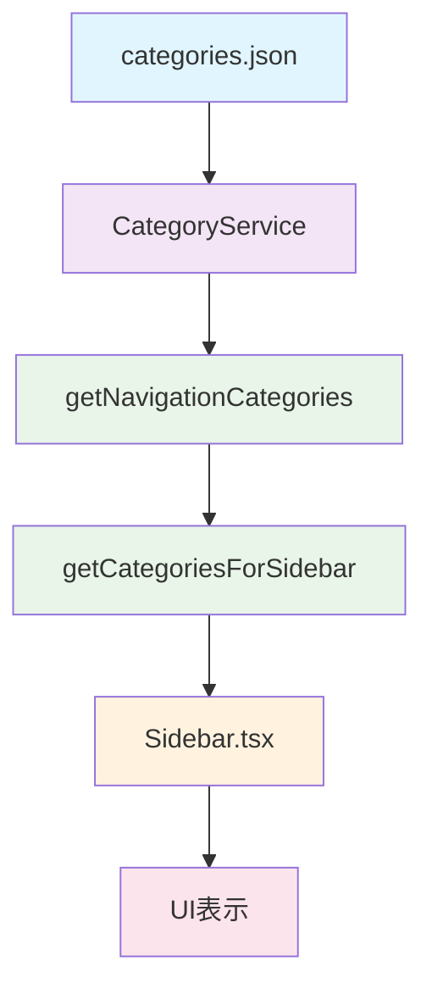

## アーキテクチャの改善

### 責務の分離

| レイヤー               | 責務                               | 実装              |
| ---------------------- | ---------------------------------- | ----------------- |
| **データ管理**         | カテゴリデータの読み込み・管理     | `CategoryService` |
| **ナビゲーション変換** | ナビゲーション用データ形式への変換 | `navigation.ts`   |
| **UI 表示**            | サイドバーのレンダリング           | `Sidebar.tsx`     |

### データフロー



## メリット

### 1. 責務の分離

- **データ管理**: `CategoryService`が統一して担当
- **ナビゲーション変換**: `navigation.ts`が専用で担当
- **UI 表示**: `Sidebar.tsx`がシンプルに担当

### 2. 汎用性の向上

- `getCategoriesForSidebar()`は他のコンポーネントでも利用可能
- ヘッダー、フッター、メニューなどでも同じ関数を利用
- 一貫したカテゴリデータの取得方法を提供

### 3. 保守性の向上

- カテゴリ管理のロジックを一箇所に集約
- 将来的なフィルタ・ソート機能の追加が容易
- アイコンや色の管理が`CategoryService`経由で統一

### 4. テスタビリティの向上

- `navigation.ts`を独立してテスト可能
- `Sidebar.tsx`のテストが簡潔に
- モックデータの管理が容易

## 使用方法

### 基本的な使用方法

```typescript
import { getCategoriesForSidebar } from "@/infrastructure/category";

function MyComponent() {
  const categories = useMemo(() => getCategoriesForSidebar(), []);

  return (
    <div>
      {categories.map((category) => (
        <div key={category.id}>
          <h3>{category.name}</h3>
          <p>Icon: {category.icon}</p>
          <p>Color: {category.color}</p>
          <a href={category.href}>Link</a>
        </div>
      ))}
    </div>
  );
}
```

### カスタムソート・フィルタ

```typescript
import { getNavigationCategories } from "@/infrastructure/category";

function CustomNavigation() {
  const categories = useMemo(() => {
    const allCategories = getNavigationCategories();
    // カスタムフィルタ・ソートを適用
    return allCategories
      .filter((cat) => cat.active)
      .sort((a, b) => a.name.localeCompare(b.name));
  }, []);

  // ...
}
```

## 今後の拡張可能性

### 1. 動的ナビゲーション

- ユーザーの権限に基づくカテゴリフィルタ
- 使用頻度に基づくカテゴリソート
- リアルタイムでのカテゴリ更新

### 2. パフォーマンス最適化

- カテゴリデータのキャッシュ
- 遅延読み込み
- 仮想化による大量データの最適化

### 3. アクセシビリティ向上

- キーボードナビゲーション
- スクリーンリーダー対応
- 高コントラストモード対応

## 関連ドキュメント

- [CategoryService 仕様書](../category/category-service.md)
- [コンポーネント設計ガイド](../components/component-design.md)
- [アーキテクチャ概要](../../00_project_overview/architecture.md)
