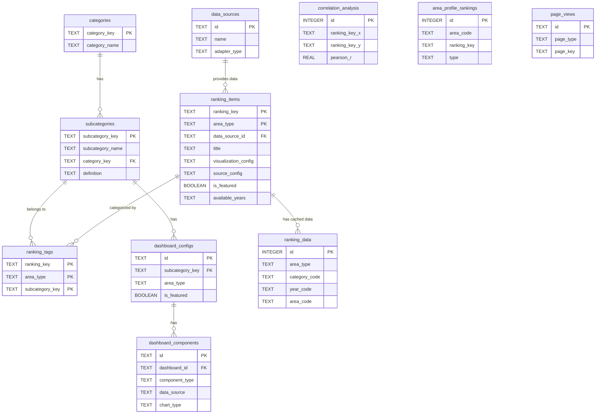

# Database Schema Reference

stats47プロジェクトのデータベーススキーマ定義リファレンス。

> **Note**: このドキュメントは `src/schema/*.ts` (Single Source of Truth) の内容を反映しています。スキーマ変更時は [README.md](./README.md#スキーマ変更のワークフロー) の手順に従ってください。

---

## 📋 目次

- [環境構成](#環境構成)
- [テーブル一覧](#テーブル一覧)
- [1. カテゴリ管理](#1-カテゴリ管理)
- [2. カテゴリタグ管理](#2-カテゴリタグ管理)
- [3. e-Stat API関連](#3-e-stat-api関連)
- [4. データソース管理](#4-データソース管理)
- [5. ランキング管理](#5-ランキング管理)
- [6. アフィリエイト広告](#6-アフィリエイト広告)
- [7. ブログ記事管理](#7-ブログ記事管理)
- [8. ダッシュボード管理](#8-ダッシュボード管理)
- [9. 地域プロファイル](#9-地域プロファイル)
- [10. 相関分析](#10-相関分析)
- [11. バッチ処理](#11-バッチ処理)
- [12. CSVインポート管理](#12-csvインポート管理)
- [13. ページビュー](#13-ページビュー)
- [ER図](#er図)
- [データ型](#データ型)

---

## 環境構成

### 環境別データソース

| 環境            | データソース  | 接続方法                                                      | 用途         |
| --------------- | ------------- | ------------------------------------------------------------- | ------------ |
| **development** | ローカル D1   | `local-d1/data/v3/d1/miniflare-D1DatabaseObject/*.sqlite`   | ローカル開発 |
| **staging**     | リモート D1   | Cloudflare D1 API                                             | 本番前テスト |
| **production**  | リモート D1   | Cloudflare D1 API                                             | 本番運用     |

### ローカルD1データベースファイル

**スキーマ（Single Source of Truth）**:

```
packages/database/
├── src/schema/         # Drizzle TS スキーマ
└── drizzle/            # マイグレーション SQL（drizzle-kit generate 出力）
    ├── 0000_*.sql
    └── ...
```

**データベースファイル（ランタイム）**:

```
.local/d1/              # persist_to の実体（wrangler.toml で指定）
└── v3/d1/miniflare-D1DatabaseObject/
    ├── {database-id}.sqlite      # データベースファイル
    ├── {database-id}.sqlite-shm  # 共有メモリファイル
    └── {database-id}.sqlite-wal  # Write-Ahead Logファイル
```

### wrangler.tomlの設定

`apps/web/wrangler.toml`および`apps/admin/wrangler.toml`で共有パスを指定:

```toml
[dev]
persist_to = "../../.local/d1/data"
```

この設定により、`apps/web`と`apps/admin`の両方が同じデータベースファイルを共有できます。

---

## テーブル一覧

| グループ | テーブル | 説明 |
|---------|---------|------|
| **1. カテゴリ管理** | `categories` | カテゴリマスタ |
| | `subcategories` | サブカテゴリマスタ |
| **2. タグ管理** | `ranking_tags` | ランキング×サブカテゴリ（多対多） |
| **3. e-Stat API** | `estat_metainfo` | 統計表メタデータ |
| | `estat_series_sources` | 政府統計シリーズ出典 |
| **4. データソース** | `data_sources` | 外部データソース設定 |
| **5. ランキング** | `ranking_items` | ランキング項目設定 |
| | `ranking_data` | ランキングデータキャッシュ |
| **6. アフィリエイト** | `affiliate_ads` | アフィリエイト広告 |
| **7. ブログ** | `articles` | MDX記事管理 |
| **8. ダッシュボード** | `dashboard_configs` | ダッシュボード設定 |
| | `dashboard_components` | ダッシュボードコンポーネント |
| **9. 地域プロファイル** | `region_profiles` | 地域プロファイル（旧） |
| | `area_profiles` | 地域プロファイル |
| | `area_profile_rankings` | 地域の強み・弱み |
| **10. 相関分析** | `correlation_analysis` | 相関分析データ |
| | `ranking_metadata_cache` | ランキングメタキャッシュ |
| | `correlation_batch_failures` | バッチ失敗記録 |
| | `correlation_batch_jobs` | バッチジョブ管理 |
| **11. バッチ** | `batch_jobs` | バッチ処理状態管理 |
| **12. アクセス** | `page_views` | ページビュー追跡 |

---

## 1. カテゴリ管理

### categories

カテゴリマスタテーブル（人口・世帯、労働・賃金、企業・家計・経済など）

| カラム名      | データ型 | 制約        | デフォルト値           | 説明         |
| ------------- | -------- | ----------- | ---------------------- | ------------ |
| category_key  | TEXT     | PRIMARY KEY | -                      | カテゴリキー |
| category_name | TEXT     | NOT NULL    | -                      | 表示名       |
| icon          | TEXT     | -           | NULL                   | アイコン     |
| display_order | INTEGER  | -           | 0                      | 表示順       |
| created_at    | DATETIME | -           | CURRENT_TIMESTAMP      | 作成日時     |
| updated_at    | DATETIME | -           | CURRENT_TIMESTAMP      | 更新日時     |

**インデックス**: `display_order`

**実装**: `src/schema/categories.ts`

### subcategories

サブカテゴリマスタテーブル（人口総数、世帯数、労働力人口など）

| カラム名         | データ型 | 制約        | デフォルト値           | 説明                         |
| ---------------- | -------- | ----------- | ---------------------- | ---------------------------- |
| subcategory_key  | TEXT     | PRIMARY KEY | -                      | サブカテゴリキー             |
| subcategory_name | TEXT     | NOT NULL    | -                      | 表示名                       |
| category_key     | TEXT     | NOT NULL FK | -                      | カテゴリキー                 |
| display_order    | INTEGER  | -           | 0                      | 表示順                       |
| definition       | TEXT     | -           | NULL                   | 定義（Markdown形式）         |
| created_at       | DATETIME | -           | CURRENT_TIMESTAMP      | 作成日時                     |
| updated_at       | DATETIME | -           | CURRENT_TIMESTAMP      | 更新日時                     |

**外部キー**: `category_key` → `categories(category_key)` ON DELETE CASCADE

**インデックス**: `category_key`, `display_order`

**実装**: `src/schema/categories.ts`

---

## 2. カテゴリタグ管理

### ranking_tags

ランキング項目とサブカテゴリの関連（多対多）

| カラム名        | データ型 | 制約        | デフォルト値           | 説明                 |
| --------------- | -------- | ----------- | ---------------------- | -------------------- |
| ranking_key     | TEXT     | PRIMARY KEY | -                      | ランキングキー       |
| area_type       | TEXT     | PRIMARY KEY | -                      | 地域タイプ           |
| subcategory_key | TEXT     | PRIMARY KEY | -                      | サブカテゴリキー     |
| is_primary      | BOOLEAN  | -           | 0                      | プライマリフラグ     |
| created_at      | DATETIME | -           | CURRENT_TIMESTAMP      | 作成日時             |

**外部キー**:
- `(ranking_key, area_type)` → `ranking_items(ranking_key, area_type)` ON DELETE CASCADE
- `subcategory_key` → `subcategories(subcategory_key)` ON DELETE CASCADE

**インデックス**: `subcategory_key`, `(ranking_key, area_type)`

**実装**: `src/schema/ranking_tags.ts`

---

## 3. e-Stat API関連

### estat_metainfo

e-Stat統計表メタデータテーブル

| カラム名          | データ型 | 制約        | デフォルト値           | 説明                         |
| ----------------- | -------- | ----------- | ---------------------- | ---------------------------- |
| stats_data_id     | TEXT     | PRIMARY KEY | -                      | 統計表ID                     |
| stat_name         | TEXT     | NOT NULL    | -                      | 統計調査名                   |
| title             | TEXT     | NOT NULL    | -                      | 統計表タイトル               |
| area_type         | TEXT     | NOT NULL    | 'national'             | 地域レベル                   |
| description       | TEXT     | -           | NULL                   | 説明                         |
| cycle             | TEXT     | -           | NULL                   | 調査周期                     |
| survey_date       | TEXT     | -           | NULL                   | 調査日                       |
| last_fetched_at   | DATETIME | -           | NULL                   | 最終取得日時                 |
| created_at        | DATETIME | -           | CURRENT_TIMESTAMP      | 作成日時                     |
| updated_at        | DATETIME | -           | CURRENT_TIMESTAMP      | 更新日時                     |
| item_name_prefix  | TEXT     | -           | NULL                   | 項目名プレフィックス         |
| memo              | TEXT     | -           | NULL                   | メモ                         |
| is_active         | BOOLEAN  | -           | 1                      | アクティブフラグ             |
| category_filters  | TEXT     | -           | NULL                   | カテゴリフィルタ（JSON形式） |

**CHECK**: `area_type IN ('national', 'prefecture', 'city')`

**インデックス**: `stat_name`, `title`, `area_type`, `updated_at`

**実装**: `src/schema/estat.ts`

### estat_series_sources

e-Statシリーズ出典テーブル

| カラム名   | データ型 | 制約        | デフォルト値           | 説明                         |
| ---------- | -------- | ----------- | ---------------------- | ---------------------------- |
| stat_name  | TEXT     | PRIMARY KEY | -                      | 政府統計名                   |
| url        | TEXT     | NOT NULL    | -                      | 出典URL                      |
| created_at | DATETIME | -           | CURRENT_TIMESTAMP      | 作成日時                     |
| updated_at | DATETIME | -           | CURRENT_TIMESTAMP      | 更新日時                     |

**実装**: `src/schema/estat.ts`

---

## 4. データソース管理

### data_sources

外部データソース設定テーブル

| カラム名         | データ型 | 制約        | デフォルト値           | 説明                           |
| ---------------- | -------- | ----------- | ---------------------- | ------------------------------ |
| id               | TEXT     | PRIMARY KEY | -                      | データソースID                 |
| name             | TEXT     | NOT NULL    | -                      | データソース名                 |
| description      | TEXT     | -           | NULL                   | 説明                           |
| adapter_type     | TEXT     | NOT NULL    | -                      | アダプタータイプ               |
| config_schema    | TEXT     | -           | NULL                   | 設定スキーマ（JSON）           |
| is_active        | BOOLEAN  | -           | 1                      | アクティブフラグ               |
| base_url         | TEXT     | -           | NULL                   | ベースURL                      |
| link_template    | TEXT     | -           | NULL                   | リンクテンプレート             |
| attribution_text | TEXT     | -           | NULL                   | 出典表示テキスト               |
| license          | TEXT     | -           | NULL                   | ライセンス                     |
| license_url      | TEXT     | -           | NULL                   | ライセンスURL                  |
| created_at       | DATETIME | -           | CURRENT_TIMESTAMP      | 作成日時                       |
| updated_at       | DATETIME | -           | CURRENT_TIMESTAMP      | 更新日時                       |

**初期データ**:
- `estat`: e-Stat API（政府統計の総合窓口）
- `ssdse`: SSDSE（教育用標準データセット）

**実装**: `src/schema/data_sources.ts`

---

## 5. ランキング管理

### ranking_items

ランキング項目設定テーブル

> [!NOTE]
> **2026-01 設計見直し**: 関連する設定項目をJSON形式のカラム（`value_display_config`, `visualization_config`, `calculation_config`, `source_config`）に集約し、拡張性を向上させました。

#### 基本情報

| カラム名              | データ型 | 制約        | デフォルト値           | 説明                           |
| --------------------- | -------- | ----------- | ---------------------- | ------------------------------ |
| ranking_key          | TEXT     | PRIMARY KEY | -                      | ランキングキー                 |
| area_type            | TEXT     | PRIMARY KEY | -                      | 地域タイプ                     |
| ranking_name         | TEXT     | NOT NULL    | -                      | 正式名称                       |
| title                | TEXT     | NOT NULL    | -                      | 表示タイトル                   |
| subtitle             | TEXT     | -           | NULL                   | サブタイトル                   |
| demographic_attr     | TEXT     | -           | NULL                   | 対象者の属性（例：15歳以上）   |
| normalization_basis  | TEXT     | -           | NULL                   | 正規化の基準（例：人口10万人あたり）|
| unit                 | TEXT     | NOT NULL    | -                      | 基本単位                       |

#### メタ情報

| カラム名              | データ型 | 制約        | デフォルト値           | 説明                           |
| --------------------- | -------- | ----------- | ---------------------- | ------------------------------ |
| annotation            | TEXT     | -           | NULL                   | 注釈・説明文                   |
| definition            | TEXT     | -           | NULL                   | 定義（Markdown形式）           |
| latest_year           | TEXT     | -           | NULL                   | 最新年度情報（JSON: {yearCode, yearName}）|
| available_years       | TEXT     | -           | NULL                   | 利用可能年度一覧（JSON配列）   |
| is_active             | BOOLEAN  | -           | 1                      | アクティブフラグ               |
| is_featured           | BOOLEAN  | -           | 0                      | おすすめフラグ                 |
| featured_order        | INTEGER  | -           | 0                      | おすすめ表示順                 |

#### データソース・設定 (JSON)

| カラム名                 | データ型 | 制約        | デフォルト値           | 説明                           |
| ------------------------ | -------- | ----------- | ---------------------- | ------------------------------ |
| data_source_id           | TEXT     | NOT NULL FK | 'estat'                | データソースID                 |
| source_config            | TEXT     | -           | NULL                   | データ取得設定 (JSON: e-Stat APIパラメータ等)|
| value_display_config     | TEXT     | -           | NULL                   | 数値表示設定 (JSON: conversionFactor, decimalPlaces 等)|
| visualization_config     | TEXT     | -           | NULL                   | 可視化設定 (JSON: colorScheme, isReversed, minValueType 等)|
| calculation_config       | TEXT     | -           | NULL                   | 計算設定 (JSON: isCalculated, type 等)                |
| created_at               | DATETIME | -           | CURRENT_TIMESTAMP      | 作成日時                       |
| updated_at               | DATETIME | -           | CURRENT_TIMESTAMP      | 更新日時                       |

**外部キー**: `data_source_id` → `data_sources(id)`

**CHECK**: `area_type IN ('prefecture', 'city', 'national')`

**インデックス**: `is_active`, `area_type`, `is_featured`

**実装**: `src/schema/ranking_items.ts`

### ranking_data

ランキングデータキャッシュテーブル

| カラム名      | データ型 | 制約        | デフォルト値           | 説明                 |
| ------------- | -------- | ----------- | ---------------------- | -------------------- |
| id            | INTEGER  | PRIMARY KEY | AUTOINCREMENT          | ID                   |
| area_type     | TEXT     | NOT NULL    | -                      | 地域タイプ           |
| area_code     | TEXT     | NOT NULL    | -                      | 地域コード           |
| area_name     | TEXT     | NOT NULL    | -                      | 地域名               |
| year_code     | TEXT     | NOT NULL    | -                      | 年度コード           |
| year_name     | TEXT     | -           | NULL                   | 年度名               |
| category_code | TEXT     | NOT NULL    | -                      | カテゴリコード       |
| category_name | TEXT     | -           | NULL                   | カテゴリ名           |
| value         | REAL     | NOT NULL    | -                      | 値                   |
| unit          | TEXT     | -           | NULL                   | 単位                 |
| rank          | INTEGER  | -           | NULL                   | 順位                 |
| created_at    | TEXT     | -           | CURRENT_TIMESTAMP      | 作成日時             |
| updated_at    | TEXT     | -           | CURRENT_TIMESTAMP      | 更新日時             |

**UNIQUE**: `(area_type, category_code, year_code, area_code)`

**インデックス**:
- `(area_type, category_code, year_code)`
- `(area_code, year_code)`

**実装**: `src/schema/ranking_data.ts`

---

## 6. アフィリエイト広告

### affiliate_ads

| カラム名          | データ型 | 制約        | デフォルト値           | 説明                       |
| ----------------- | -------- | ----------- | ---------------------- | -------------------------- |
| id                | TEXT     | PRIMARY KEY | -                      | 広告ID                     |
| title             | TEXT     | NOT NULL    | -                      | 広告タイトル               |
| html_content      | TEXT     | NOT NULL    | -                      | HTML広告コンテンツ         |
| area_code         | TEXT     | -           | NULL                   | 地域コード (NULL=全地域)   |
| subcategory_key   | TEXT     | -           | NULL                   | サブカテゴリキー           |
| location_code     | TEXT     | NOT NULL    | -                      | 表示位置コード             |
| is_active         | BOOLEAN  | -           | 1                      | アクティブフラグ           |
| priority          | INTEGER  | -           | 0                      | 優先度                     |
| start_date        | TEXT     | -           | NULL                   | 表示開始日 (ISO形式)       |
| end_date          | TEXT     | -           | NULL                   | 表示終了日 (ISO形式)       |
| target_categories | TEXT     | -           | NULL                   | 対象カテゴリ (JSON配列)    |
| ad_file_key       | TEXT     | -           | NULL                   | ファイルベース広告識別子   |
| created_at        | DATETIME | -           | CURRENT_TIMESTAMP      | 作成日時                   |
| updated_at        | DATETIME | -           | CURRENT_TIMESTAMP      | 更新日時                   |

**インデックス**: `area_code`, `subcategory_key`, `location_code`, `is_active`

**実装**: `src/schema/affiliate.ts`

---

## 7. ブログ記事管理

### articles

MDXファイルのfrontmatter管理テーブル

| カラム名      | データ型 | 制約        | デフォルト値           | 説明                  |
| ------------- | -------- | ----------- | ---------------------- | --------------------- |
| category      | TEXT     | NOT NULL    | -                      | カテゴリ              |
| slug          | TEXT     | PRIMARY KEY | -                      | スラッグ              |
| time          | TEXT     | PRIMARY KEY | -                      | 時間                  |
| title         | TEXT     | NOT NULL    | -                      | タイトル              |
| description   | TEXT     | -           | NULL                   | 説明                  |
| tags          | TEXT     | -           | NULL                   | タグ (JSON配列)       |
| file_path     | TEXT     | NOT NULL    | -                      | ファイルパス          |
| file_hash     | TEXT     | -           | NULL                   | ファイルハッシュ      |
| published     | BOOLEAN  | -           | 1                      | 公開状態              |
| og_image_type | TEXT     | -           | NULL                   | OGP画像タイプ         |
| format        | TEXT     | -           | 'md'                   | フォーマット (md/mdx) |
| has_charts    | BOOLEAN  | -           | 0                      | チャート有無          |
| created_at    | DATETIME | -           | CURRENT_TIMESTAMP      | 作成日時              |
| updated_at    | DATETIME | -           | CURRENT_TIMESTAMP      | 更新日時              |

**インデックス**: `category`, `slug`, `time DESC`, `file_path`, `format`

**実装**: `src/schema/blog.ts`

---

## 8. ダッシュボード管理

### dashboard_configs

ダッシュボード基本設定テーブル

| カラム名        | データ型 | 制約        | デフォルト値           | 説明               |
| --------------- | -------- | ----------- | ---------------------- | ------------------ |
| id              | TEXT     | PRIMARY KEY | -                      | ダッシュボードID   |
| subcategory_key | TEXT     | NOT NULL    | -                      | サブカテゴリキー   |
| area_type       | TEXT     | NOT NULL    | -                      | エリアタイプ       |
| display_name    | TEXT     | NOT NULL    | -                      | 表示名             |
| display_order   | INTEGER  | -           | 0                      | 表示順序           |
| is_active       | BOOLEAN  | -           | 1                      | アクティブフラグ   |
| is_featured     | BOOLEAN  | -           | 0                      | おすすめフラグ     |
| featured_order  | INTEGER  | -           | 0                      | おすすめ表示順     |
| created_at      | DATETIME | -           | CURRENT_TIMESTAMP      | 作成日時           |
| updated_at      | DATETIME | -           | CURRENT_TIMESTAMP      | 更新日時           |

**外部キー**: `subcategory_key` → `subcategories(subcategory_key)` ON DELETE CASCADE

**CHECK**: `area_type IN ('national', 'prefecture', 'city')`

**UNIQUE**: `(subcategory_key, area_type)`

**インデックス**: `subcategory_key`, `area_type`, `is_active`, `display_order`

**実装**: `src/schema/dashboard.ts`

### dashboard_components

ダッシュボードコンポーネント設定テーブル

| カラム名                   | データ型 | 制約        | デフォルト値           | 説明                     |
| -------------------------- | -------- | ----------- | ---------------------- | ------------------------ |
| id                         | TEXT     | PRIMARY KEY | -                      | コンポーネントID         |
| dashboard_id               | TEXT     | NOT NULL FK | -                      | ダッシュボードID         |
| component_type             | TEXT     | NOT NULL    | -                      | コンポーネントタイプ     |
| display_order              | INTEGER  | -           | 0                      | 表示順序                 |
| grid_column_span           | INTEGER  | -           | 4                      | グリッド列幅(Desktop)    |
| grid_column_span_tablet    | INTEGER  | -           | NULL                   | グリッド列幅(Tablet)     |
| grid_column_span_sm        | INTEGER  | -           | NULL                   | グリッド列幅(Small)      |
| grid_column_span_mobile    | INTEGER  | -           | NULL                   | グリッド列幅(Mobile)     |
| title                      | TEXT     | -           | NULL                   | コンポーネントタイトル   |
| component_props            | TEXT     | -           | NULL                   | プロパティ (JSON)        |
| ranking_link               | TEXT     | -           | NULL                   | ランキングリンク         |
| is_active                  | BOOLEAN  | -           | 1                      | アクティブフラグ         |
| created_at                 | DATETIME | -           | CURRENT_TIMESTAMP      | 作成日時                 |
| updated_at                 | DATETIME | -           | CURRENT_TIMESTAMP      | 更新日時                 |
| source_link                | TEXT     | -           | NULL                   | ソースリンク             |
| data_source                | TEXT     | -           | 'estat'                | データソース             |
| chart_type                 | TEXT     | -           | NULL                   | チャートタイプ           |

**外部キー**: `dashboard_id` → `dashboard_configs(id)` ON DELETE CASCADE

**CHECK**: `component_type` の許可値（`src/schema/dashboard.ts` 参照）

**CHECK**: `grid_column_span BETWEEN 1 AND 12`

**インデックス**: `dashboard_id`, `component_type`, `display_order`, `is_active`, `ranking_link`

**実装**: `src/schema/dashboard.ts`

---

## 9. 地域プロファイル

### region_profiles (旧)

地域プロファイルデータ（強み・主要指標・レーダーチャート・類似地域）

| カラム名        | データ型 | 制約        | 説明                   |
| --------------- | -------- | ----------- | ---------------------- |
| id              | INTEGER  | PRIMARY KEY | ID                     |
| area_code       | TEXT     | NOT NULL    | 地域コード (01-47)     |
| area_name       | TEXT     | NOT NULL    | 地域名                 |
| area_level      | TEXT     | NOT NULL    | 地域レベル             |
| year            | TEXT     | NOT NULL    | 年度                   |
| strengths       | TEXT     | NOT NULL    | 地域の強み (JSON)      |
| key_indicators  | TEXT     | NOT NULL    | 主要指標 (JSON)        |
| radar_data      | TEXT     | NOT NULL    | レーダーチャート (JSON)|
| similar_regions | TEXT     | NOT NULL    | 類似地域 (JSON)        |
| generated_at    | TEXT     | NOT NULL    | 生成日時               |
| data_source     | TEXT     | -           | データソース           |

**UNIQUE**: `(area_code, year, area_level)`

**インデックス**: `area_code`, `year`, `(area_code, year)`

**実装**: `src/schema/area_profile.ts`

### area_profiles

地域プロファイルデータ（主要指標・レーダーチャート・類似地域）

| カラム名        | データ型 | 制約        | 説明                   |
| --------------- | -------- | ----------- | ---------------------- |
| id              | INTEGER  | PRIMARY KEY | ID                     |
| area_code       | TEXT     | NOT NULL    | 地域コード             |
| area_name       | TEXT     | NOT NULL    | 地域名                 |
| area_level      | TEXT     | NOT NULL    | 地域レベル             |
| year            | TEXT     | NOT NULL    | 年度                   |
| key_indicators  | TEXT     | NOT NULL    | 主要指標 (JSON)        |
| radar_data      | TEXT     | NOT NULL    | レーダーチャート (JSON)|
| similar_regions | TEXT     | NOT NULL    | 類似地域 (JSON)        |
| generated_at    | TEXT     | NOT NULL    | 生成日時               |
| data_source     | TEXT     | -           | データソース           |

**UNIQUE**: `(area_code, year, area_level)`

**インデックス**: `area_code`, `year`, `(area_code, year)`

**実装**: `src/schema/area_profile.ts`

### area_profile_rankings

地域の強み・弱みランキングデータ

| カラム名     | データ型 | 制約        | 説明                     |
| ------------ | -------- | ----------- | ------------------------ |
| id           | INTEGER  | PRIMARY KEY | ID                       |
| area_code    | TEXT     | NOT NULL    | 地域コード               |
| area_name    | TEXT     | NOT NULL    | 地域名                   |
| area_level   | TEXT     | NOT NULL    | 地域レベル               |
| year         | TEXT     | NOT NULL    | 年度                     |
| indicator    | TEXT     | NOT NULL    | 指標名                   |
| subcategory  | TEXT     | NOT NULL    | サブカテゴリ             |
| ranking_key  | TEXT     | NOT NULL    | ランキングキー           |
| type         | TEXT     | NOT NULL    | タイプ (strength/weakness)|
| rank         | INTEGER  | NOT NULL    | 全国順位 (1-47)          |
| value        | REAL     | NOT NULL    | 値                       |
| unit         | TEXT     | NOT NULL    | 単位                     |
| national_avg | REAL     | NOT NULL    | 全国平均                 |
| percentile   | REAL     | NOT NULL    | パーセンタイル (0-100)   |
| created_at   | TEXT     | NOT NULL    | 作成日時                 |

**UNIQUE**: `(area_code, year, area_level, ranking_key, type)`

**インデックス**: `(area_code, year)`, `ranking_key`, `rank`, `indicator`, `type`

**実装**: `src/schema/area_profile.ts`

---

## 10. 相関分析

### correlation_analysis

相関分析データ（事前計算済み）

| カラム名         | データ型 | 制約        | デフォルト値           | 説明                   |
| ---------------- | -------- | ----------- | ---------------------- | ---------------------- |
| id               | INTEGER  | PRIMARY KEY | AUTOINCREMENT          | ID                     |
| ranking_key_x    | TEXT     | NOT NULL    | -                      | X軸ランキングキー      |
| ranking_key_y    | TEXT     | NOT NULL    | -                      | Y軸ランキングキー      |
| year_x           | TEXT     | NOT NULL    | -                      | X軸年度                |
| year_y           | TEXT     | NOT NULL    | -                      | Y軸年度                |
| area_level       | TEXT     | NOT NULL    | 'prefecture'           | 地域レベル             |
| pearson_r        | REAL     | NOT NULL    | -                      | ピアソン相関係数       |
| scatter_data     | TEXT     | NOT NULL    | -                      | 散布図データ (JSON)    |
| data_point_count | INTEGER  | NOT NULL    | -                      | データポイント数       |
| calculated_at    | TEXT     | NOT NULL    | -                      | 計算日時               |

**UNIQUE**: `(ranking_key_x, ranking_key_y, year_x, year_y, area_level)`

**インデックス**:
- `(ranking_key_x, ranking_key_y)`
- `year_x`, `year_y`
- `(ranking_key_x, year_x)`
- `(ranking_key_y, year_y)`

**実装**: `src/schema/correlation.ts`

### ranking_metadata_cache

ランキングメタデータキャッシュ

| カラム名    | データ型 | 制約        | デフォルト値           | 説明                 |
| ----------- | -------- | ----------- | ---------------------- | -------------------- |
| id          | INTEGER  | PRIMARY KEY | AUTOINCREMENT          | ID                   |
| ranking_key | TEXT     | NOT NULL    | -                      | ランキングキー       |
| area_type   | TEXT     | NOT NULL    | -                      | 地域タイプ           |
| metadata    | TEXT     | NOT NULL    | -                      | メタデータ（JSON）   |
| expires_at  | TEXT     | NOT NULL    | -                      | 有効期限             |
| updated_at  | TEXT     | NOT NULL    | -                      | 更新日時             |

**UNIQUE**: `(ranking_key, area_type)`

**インデックス**: `(ranking_key, area_type)`, `expires_at`

**実装**: `src/schema/correlation.ts`

### correlation_batch_failures

相関バッチ失敗記録

| カラム名       | データ型 | 制約        | デフォルト値           | 説明                 |
| -------------- | -------- | ----------- | ---------------------- | -------------------- |
| id             | INTEGER  | PRIMARY KEY | AUTOINCREMENT          | ID                   |
| batch_id       | TEXT     | NOT NULL    | -                      | バッチID             |
| ranking_key_x  | TEXT     | NOT NULL    | -                      | X軸ランキングキー    |
| ranking_key_y  | TEXT     | NOT NULL    | -                      | Y軸ランキングキー    |
| year_x         | TEXT     | NOT NULL    | -                      | X軸年度              |
| year_y         | TEXT     | NOT NULL    | -                      | Y軸年度              |
| area_level     | TEXT     | NOT NULL    | -                      | 地域レベル           |
| error_message  | TEXT     | -           | NULL                   | エラーメッセージ     |
| error_stack    | TEXT     | -           | NULL                   | エラースタック       |
| retry_count    | INTEGER  | -           | 0                      | リトライ回数         |
| last_retry_at  | TEXT     | -           | NULL                   | 最終リトライ日時     |
| created_at     | TEXT     | NOT NULL    | -                      | 作成日時             |

**インデックス**: `batch_id`, `(retry_count, last_retry_at)`

**実装**: `src/schema/correlation.ts`

### correlation_batch_jobs

相関バッチジョブ管理

| カラム名            | データ型 | 制約        | デフォルト値           | 説明                 |
| ------------------- | -------- | ----------- | ---------------------- | -------------------- |
| id                  | INTEGER  | PRIMARY KEY | AUTOINCREMENT          | ID                   |
| batch_id            | TEXT     | UNIQUE      | -                      | バッチID             |
| area_level          | TEXT     | NOT NULL    | -                      | 地域レベル           |
| status              | TEXT     | NOT NULL    | -                      | ステータス           |
| total_combinations  | INTEGER  | NOT NULL    | -                      | 総組み合わせ数       |
| processed_count     | INTEGER  | -           | 0                      | 処理済み数           |
| success_count       | INTEGER  | -           | 0                      | 成功数               |
| skipped_count       | INTEGER  | -           | 0                      | スキップ数           |
| error_count         | INTEGER  | -           | 0                      | エラー数             |
| current_offset      | INTEGER  | -           | 0                      | 現在のオフセット     |
| chunk_size          | INTEGER  | -           | 50                     | チャンクサイズ       |
| started_at          | TEXT     | -           | NULL                   | 開始日時             |
| completed_at        | TEXT     | -           | NULL                   | 完了日時             |
| updated_at          | TEXT     | NOT NULL    | -                      | 更新日時             |
| created_at          | TEXT     | NOT NULL    | -                      | 作成日時             |

**インデックス**: `(status, updated_at)`

**実装**: `src/schema/correlation.ts`

---

## 11. バッチ処理

### batch_jobs

バッチ処理状態管理テーブル

| カラム名   | データ型 | 制約        | デフォルト値 | 説明                           |
| ---------- | -------- | ----------- | ------------ | ------------------------------ |
| batch_id   | TEXT     | PRIMARY KEY | -            | バッチID                       |
| status     | TEXT     | NOT NULL    | 'running'    | ステータス (running/cancelled/completed)|
| created_at | TEXT     | NOT NULL    | now()        | 作成日時                       |
| updated_at | TEXT     | NOT NULL    | now()        | 更新日時                       |

**インデックス**: `status`, `updated_at`

**実装**: `src/schema/batch.ts`

---

## 12. ページビュー

### page_views

ページビュー追跡テーブル

| カラム名   | データ型 | 制約        | デフォルト値 | 説明                           |
| ---------- | -------- | ----------- | ------------ | ------------------------------ |
| id         | TEXT     | PRIMARY KEY | -            | ID                             |
| page_type  | TEXT     | NOT NULL    | -            | ページタイプ ('ranking' / 'dashboard') |
| page_key   | TEXT     | NOT NULL    | -            | ページキー (ranking_key または dashboard_id) |
| viewed_at  | TEXT     | NOT NULL    | -            | 閲覧日時                       |
| user_agent | TEXT     | -           | NULL         | ユーザーエージェント           |
| referer    | TEXT     | -           | NULL         | リファラー                     |

**インデックス**: `(page_type, page_key)`

**実装**: `src/schema/page_views.ts`

---

## ER図



---

## データ型

| 定義     | SQLite型 | 説明                |
| -------- | -------- | ------------------- |
| INTEGER  | INTEGER  | 整数                |
| TEXT     | TEXT     | テキスト            |
| DATETIME | TEXT     | 日時 (ISO8601)      |
| BOOLEAN  | INTEGER  | 真偽値 (0/1)        |
| REAL     | REAL     | 浮動小数点数        |

---

## 設計原則

1. **正規化** - 第3正規形を基本、パフォーマンスとのバランス
2. **インデックス戦略** - 検索頻度の高いカラムに設定
3. **セキュリティ** - プリペアドステートメント、Auth.js認証
4. **パフォーマンス** - 適切なインデックス、R2ストレージ活用
5. **JSON活用** - 柔軟なデータ構造にJSON型を使用

---

## 関連ドキュメント

- **パッケージ使用方法**: [README.md](./README.md) - Drizzle ORMの使い方、スキーマ変更ワークフロー
- **Seed Scripts**: [scripts/README.md](./scripts/README.md) - シードデータ管理
- **統計チャート開発**: [apps/web/src/features/stat-charts/README.md](../../apps/web/src/features/stat-charts/README.md) - 統計チャートコンポーネント実装ガイド
