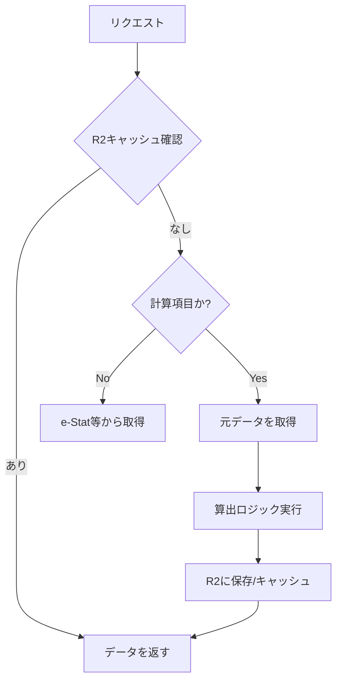

# @stats47/ranking

ランキング機能を提供するパッケージ。ランキングデータの取得、変換、管理を行います。

## 概要

このパッケージは、統計ランキングデータを D1 データベースまたは R2 ストレージから取得し、アプリケーションで使用可能な形式に変換します。

## 主な機能

### 1. データ取得

#### D1データベースからの取得
- 各リポジトリ関数（`findRankingItem`, `listRankingValues` 等）を直接インポートして使用
- リアルタイムなデータ更新に対応

#### R2ストレージからの取得 (推奨)
- `RankingR2Repository`: R2ストレージから事前ビルドされたJSONを取得
- 高速なデータ読み取り、スケーラビリティに優れる

### 3. 計算ランキングアイテム (NEW)

設定に基づいて動的に算出されるランキング機能を提供します。

- **算出タイプ**:
  - `per_capita`: 人口当たりデータ（分子キーワード / 人口）
  - `ratio`: 比率データ（分子キーワード / 分母キーワード）
  - `custom`: 自由数式（将来拡張）
- **オンデマンド計算**: データがストレージに存在しない場合、自動的に元データを取得して計算し、キャッシュを保存します。

## 使い方

### D1データベースから取得

```typescript
import { findRankingItem, listRankingValues } from "@stats47/ranking/server";

// ランキング項目を取得（計算項目かどうかのフラグを含む）
const itemResult = await findRankingItem("gdp-per-capita", "prefecture");
const item = itemResult.data;

// ランキング値を取得（データがなければ自動的に計算・キャッシュされる）
const valuesResult = await listRankingValues("gdp-per-capita", "prefecture", "2021");
const values = valuesResult.data;
```

### 計算ロジックの直接利用

```typescript
import { calculateRankingValues } from "@stats47/ranking/server";

const values = await calculateRankingValues(rankingItem, "2021");
```

## アーキテクチャ

### 計算フロー



## R2ストレージのデータ構造

```
ranking/
├── prefecture/
│   └── annual-sales-amount-per-employee/
│       ├── metadata.json          # ランキングメタデータ
│       ├── 2021/
│       │   └── stats.json         # 2021年度のランキングデータ
│       └── 2020/
│           └── stats.json         # 2020年度のランキングデータ
├── city/
│   └── ...
└── national/
    └── ...
```

## パフォーマンス比較

| 項目 | D1データベース | R2ストレージ |
|:-----|:--------------|:-------------|
| 読み取り速度 | 中速（SQLクエリ） | 高速（静的JSON） |
| スケーラビリティ | 中 | 高 |
| コスト | クエリ課金 | 読み取り無料枠大 |
| データ更新 | リアルタイム | 事前ビルド |
| 推奨用途 | 管理画面 | Webフロントエンド |

## 開発ガイド

### テスト

```bash
# 単体テスト
npm test

# カバレッジ付きテスト
npm run test:coverage

# 特定のテストファイルを実行
npm test -- ranking-r2-repository.test.ts
```

### ビルド

```bash
npm run build
```

## 関連ドキュメント

- [R2ストレージ移行計画](/docs/01_技術設計/08_R2ストレージ移行計画.md)
- [ランキングデータ構造](/docs/01_技術設計/01_システム概要/03_データモデル.md)

## ライセンス

このパッケージはプロジェクト内部で使用されます。
