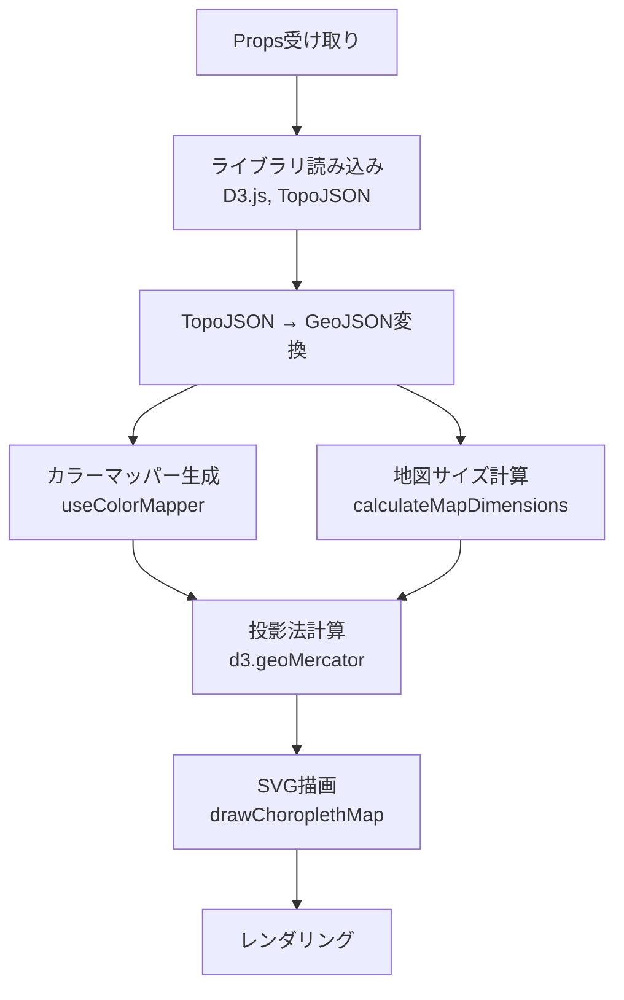

# PrefectureMapChart コンポーネント設計

## 概要

`PrefectureMapChart`は、日本の都道府県をコロプレス図（統計データに基づいて色分けした地図）として表示するReactコンポーネントです。D3.jsを使用してSVGで地図を描画し、統計データに応じて各都道府県の色を動的に決定します。

### 主要な機能

- 都道府県地図の表示（TopoJSON形式の地理データを使用）
- 統計データに基づく色分け表示（順序・発散・カテゴリの3種類のカラースケールに対応）
- レスポンシブ対応（コンテナサイズに応じた自動リサイズ）
- ローディング・エラー状態の表示

## データフロー



## データフロー概要

1. **Props受け取り**: `data`（統計データ）、`colorConfig`（カラースキーム設定）、`topology`（TopoJSONデータ）、`width`/`height`（オプション）を受け取る

2. **ライブラリ読み込み**:
   - D3.jsとTopoJSONクライアントライブラリを動的インポート
   - 並列実行で読み込み時間を短縮

3. **データ準備**:
   - Propsで受け取ったTopoJSONをGeoJSONに変換
   - 都道府県データを正規化
   - 将来的には市区町村TopoJSONなど、他の地理データ形式にも対応可能

3. **カラーマッパー生成** (`useColorMapper`):
   - `colorConfig`に基づいて地域コードから色への変換関数を生成
   - カラースケールタイプ（sequential/diverging/categorical）に応じた処理

4. **地図サイズ計算** (`calculateMapDimensions`):
   - `width`、`height`、`containerWidth`の優先順位で決定
   - デフォルト値: `width: 600`, `aspectRatio: 1.5`

5. **投影法計算**:
   - `d3.geoMercator()`で投影法を設定
   - 中心点: `[137, 38]`、スケール: `2600`
   - 地図サイズに応じて平行移動

6. **SVG描画** (`drawChoroplethMap`):
   - D3.jsでSVG要素を操作
   - `geoPath().projection()`でパスを生成
   - 各都道府県の`<path>`要素を作成し、カラーマッパー関数で色を適用

7. **レンダリング**:
   - ローディング・エラー状態の表示
   - SVG要素のレンダリング

## 主要な関数・フック

### ライブラリ読み込み

コンポーネント内でD3.jsとTopoJSONクライアントライブラリを動的インポートします。TopoJSONデータはPropsで受け取るため、コンポーネント内ではライブラリの読み込みのみを行います。

### `useColorMapper({ d3Module, data, colorConfig })`

統計データとカラースキーム設定から、地域コード（都道府県コード）を色に変換する関数を生成するカスタムフック。

**処理フロー**:
1. `colorConfig`に基づいて`ColorScaleOptions`を構築
2. `createColorScale`でカラースケール関数を生成（sequential/diverging/categorical）
3. `createChoroplethColorMapper`で地域コードから色へのマッパー関数を生成

**戻り値**: `(areaCode: string) => string | null`

### `preparePrefectureFeatures(topojsonModule, topology)`

TopoJSON形式の地理データを都道府県Feature配列に変換・正規化する関数。

**処理**:
1. TopoJSONの`objects`から最初のオブジェクト名を取得
2. `topojson.feature()`でGeoJSONに変換
3. 都道府県情報を正規化
   - 都道府県コード（`prefCode`）を5桁形式に統一（例: `"01000"`）
   - 都道府県名（`prefName`）を統一
   - 複数のプロパティ名（`N03_007`, `prefCode`, `code`など）に対応

### `drawChoroplethMap({ d3Module, svgElement, geojson, projection, getColor, width, height })`

コロプレス地図をSVGに描画する関数。

**処理**:
1. SVG要素をクリア
2. `geoPath().projection()`でパスジェネレーターを作成
3. 各都道府県の`<path>`要素を作成
4. `fill`属性にカラーマッパー関数を適用
5. 境界線のスタイルを設定

## データ構造

### Props

```typescript
interface PrefectureMapProps {
  data: StatsSchema[];              // 統計データ配列
  colorConfig: MapVisualizationConfig; // カラースキーム設定
  topology: TopoJSONTopology;      // TopoJSON形式の地図データ（必須）
  width?: number;                   // 地図の幅（オプション）
  height?: number;                  // 地図の高さ（オプション）
}
```

### データ変換フロー

```
TopoJSONTopology (topologyData)
  ↓ preparePrefectureFeatures
PrefectureFeature[]
  ↓ d3.geoPath().projection()
SVG Path要素
```

### カラーマッピングフロー

```
StatsSchema[] + MapVisualizationConfig
  ↓ useColorMapper
ColorScaleOptions
  ↓ createColorScale
Color Scale Function (value: number) => string
  ↓ createChoroplethColorMapper
Color Mapper Function (areaCode: string) => string
```

## 関連ファイル

- [index.tsx](./index.tsx) - メインコンポーネント
- [index.stories.tsx](./index.stories.tsx) - Storybook定義
- [../../hooks/useColorMapper.ts](../../hooks/useColorMapper.ts) - カラーマッパー生成フック
- [../../utils/geojson/](../../utils/geojson/) - TopoJSON変換・正規化
- [../../utils/color-scale/](../../utils/color-scale/) - カラースケール生成

## 注意事項

- `topology`プロパティは必須です。TopoJSONデータはServer Componentで取得し、Propsで渡してください。
- Composition Patternに従い、データ取得はServer Componentで行うことを推奨します。
