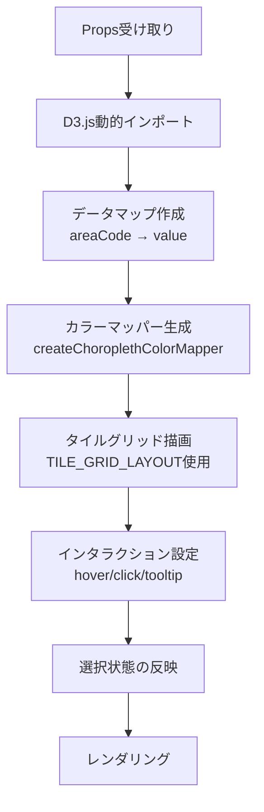

# PrefectureTileGridChartChart コンポーネント設計

## 概要

`PrefectureTileGridChart`は、日本の都道府県を格子状に配置した模式図（タイルグリッドマップ）として表示するReactコンポーネントです。D3.jsを使用してSVGで描画し、統計データに応じて各都道府県の色を動的に決定します。

### 主要な機能

- 都道府県タイルグリッドの表示（定義済みレイアウトを使用）
- 統計データに基づく色分け表示（順序・発散・カテゴリの3種類のカラースケールに対応）
- 都道府県クリック時のコールバック
- 選択状態の視覚的表示
- ツールチップによるデータ表示
- アニメーション付きの初期表示
- レスポンシブ対応（viewBox使用）

## データフロー



## データフロー概要

1. **Props受け取り**: `data`（統計データ）、`colorConfig`（カラースキーム設定）、`onPrefectureClick`（クリックコールバック）、`selectedPrefectureCode`（選択状態）を受け取る

2. **D3.js動的インポート**:
   - クライアントサイドでのみD3.jsを動的インポート
   - SSR対応のため`isClient`フラグで制御

3. **データマップ作成**:
   - `StatsSchema[]`から`Map<prefCode, value>`を作成
   - 5桁形式のareaCode（例: `"01000"`）から2桁のprefCode（例: `1`）を抽出

4. **カラーマッパー生成** (`createChoroplethColorMapper`):
   - `colorConfig.colorSchemeType`に基づいて適切なカラースケールを選択
   - sequential / diverging / categorical の3種類に対応
   - 地域コードから色への変換関数を生成

5. **タイルグリッド描画**:
   - `TILE_GRID_LAYOUT`定数から都道府県の配置情報を取得
   - 各都道府県を矩形（rect）として描画
   - カラーマッパー関数で塗りつぶし色を決定
   - 都道府県名ラベルを中央に配置

6. **インタラクション設定**:
   - `mouseover`: ハイライト表示 + ツールチップ表示
   - `mousemove`: ツールチップ位置更新
   - `mouseout`: 元の色に戻す + ツールチップ非表示
   - `click`: `onPrefectureClick`コールバック実行

7. **選択状態の反映**:
   - `selectedPrefectureCode`と一致する都道府県に黄色の枠線を表示

8. **アニメーション**:
   - 初期表示時にスケールアニメーション（`easeBackOut`）
   - ラベルのフェードインアニメーション

## 主要な関数・設定

### `drawMap()`

タイルグリッド地図を描画するメイン関数。

**処理**:
1. D3.jsを動的インポート
2. SVG要素をクリア
3. データマップとカラーマッパーを作成
4. `TILE_GRID_LAYOUT`からセルデータを生成
5. 各セルを描画（矩形 + ラベル）
6. アニメーションとインタラクションを設定

### `TILE_GRID_LAYOUT`

都道府県の格子配置を定義する定数配列。

**構造**:
```typescript
interface TileGridCell {
  id: number;      // 都道府県コード（1-47）
  name: string;    // 都道府県名
  x: number;       // グリッドX座標
  y: number;       // グリッドY座標
  w?: number;      // セル幅（デフォルト: 1）
  h?: number;      // セル高さ（デフォルト: 1）
}
```

### レイアウト設定

| 設定 | 値 | 説明 |
|------|---|------|
| `cellSize` | 40 | セルサイズ（px） |
| `viewBoxWidth` | 600 | SVG幅 |
| `viewBoxHeight` | 900 | SVG高さ（アスペクト比1.5） |

## データ構造

### Props

```typescript
interface PrefectureTileGridChartProps extends Omit<PrefectureMapProps, 'data' | 'width' | 'height'> {
  data?: StatsSchema[];                           // 統計データ配列（オプション）
  colorConfig: MapVisualizationConfig;            // カラースキーム設定
  onPrefectureClick?: (areaCode: string, areaName?: string) => void; // クリックコールバック
  selectedPrefectureCode?: string | null;         // 選択中の都道府県コード
}
```

### カラーマッピングフロー

```
StatsSchema[] + MapVisualizationConfig
  ↓ colorSchemeType判定
ColorScaleOptions (sequential | diverging | categorical)
  ↓ createChoroplethColorMapper
Color Mapper Function (areaCode: string) => string
```

## PrefectureMapChartとの違い

| 項目 | PrefectureMapChart | PrefectureTileGridChartChart |
|------|-------------------|------------------|
| 表示形式 | 実際の地理的形状 | 格子状の模式図 |
| 地理データ | TopoJSON（外部ファイル） | 定義済みレイアウト |
| クリックイベント | なし | あり |
| 選択状態 | なし | あり |
| ツールチップ | なし | あり |
| アニメーション | なし | あり |

## 関連ファイル

- [index.tsx](./index.tsx) - メインコンポーネント
- [index.stories.tsx](./index.stories.tsx) - Storybook定義
- [../../constants/tile-grid-layout.ts](../../constants/tile-grid-layout.ts) - タイルグリッドレイアウト定義
- [../../hooks/useD3Tooltip.ts](../../hooks/useD3Tooltip.ts) - ツールチップユーティリティ
- [../../utils/color-scale/index.ts](../../utils/color-scale/index.ts) - カラースケール生成
- [../../types/map.ts](../../types/map.ts) - 型定義
